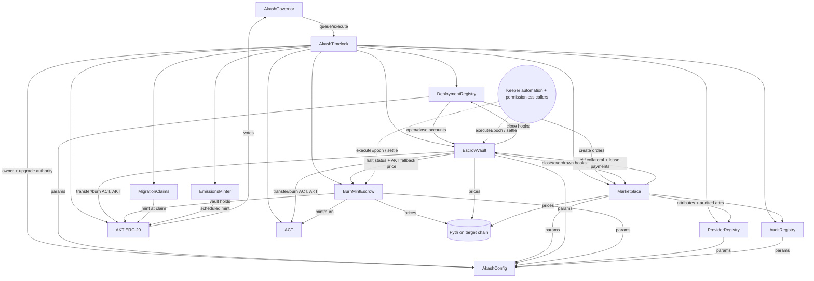

# 04. Ethereum Target Architecture

| | |
|---|---|
| **Document** | 04. Ethereum Target Architecture |
| **Doc ID** | AKASH-MIG-04 |
| **Version** | 0.9 (draft for review) |
| **Date** | 2026-08-10 |
| **Owner** | Overclock Labs |
| **Audience** | Vendor engineering (Solidity/EVM team) |
| **Status** | Normative where marked (MUST/SHALL); informative otherwise |

## Purpose

- Specify the complete EVM target design for the Akash protocol to execution depth: contracts, storage,
  functions, events, errors, invariants, oracle integration, gas/UX posture, and governance wiring.
- Preserve the marketplace and escrow semantics of the current Cosmos chain (per D-09, D-19–D-21,
  D-23, D-24) so that behavior-parity testing in [09](./09-testing-and-verification.md) is meaningful.
- Define the primary deployment variant **B1 (contracts on an existing general-purpose EVM L2, the
  host chain)** and the specified non-default variant **B2 (dedicated Arbitrum Orbit chain)** per D-02.

## In scope

- The full contract suite (§3–§12), per-contract storage layouts, external functions, events, custom
  errors, and invariants.
- Deployment-target structure as a parameter (B1 on a host chain selected per Q-42 against the §1
  criteria; B2 Orbit), with no host chain fixed by this document.
- Pyth oracle integration, keeper automation, gas/fee analysis, AKT-denominated gas UX, reorg posture.
- Governance and parameter management (`AkashConfig`, `AkashGovernor`, `AkashTimelock`).
- Numbered intentional deltas vs the current chain (§16).

## Out of scope

- Migration mechanics (snapshots, Merkle claims, Wind-down Reserve): [05](./05-token-migration.md)
  (the `MigrationClaims` interface appears here in §11 only as consumed by this architecture).
- Non-token state migration and old-chain sunset: [06](./06-state-and-data-migration.md).
- Off-chain services beyond their on-chain interfaces (provider daemon, Console, indexer internals):
  [07](./07-offchain-and-clients.md).
- Key-management ceremonies, audit plan, threat model: [08](./08-security-and-audits.md).
- The Solana design: [03](./03-solana-architecture.md); comparative scoring: [02](./02-target-selection.md).

Cosmos-side terms (modules `x/deployment`, `x/market`, `x/escrow`, `x/bme`, denoms `uakt`/`uact`,
dseq/gseq/oseq) are defined in [01. Current architecture](./01-current-architecture.md). This document
uses "AKT"/"ACT" for the EVM tokens whose base unit (6 decimals) is 1:1 with `uakt`/`uact`.

---

## 1. Deployment target (variant structure per D-02)

### 1.1 Variant B1 (primary): contracts on an existing general-purpose EVM L2 (the host chain)

The primary Ethereum variant deploys the contract suite onto an existing general-purpose EVM L2,
referred to throughout this document as **the host chain**. The host chain is deliberately not fixed
by this architecture: it is selected per open question Q-42 against the criteria of REQ-EVM-071, with
the Gate 0 evidence pack ([02 §4.2](./02-target-selection.md)), and every design element in §2–§14 is
written to hold on any chain that clears those criteria.

**REQ-EVM-001** The contract suite SHALL be written chain-agnostic EVM (Cancun/Prague feature level):
no host-chain-specific predeploys, opcodes, or precompiles MAY be referenced from protocol contracts;
chain-specific integrations (Pyth endpoint address, settlement-stablecoin address, keeper registry, paymaster) MUST be
constructor/initializer parameters or `AkashConfig` entries.

**REQ-EVM-002** The **host chain** is a parameterized deployment decision, resolved per Q-42 with the
Gate 0 evidence pack; it is an input to deployment, not a property of the design. The contract suite
SHALL contain no host-chain-specific dependencies, so that the selected host can change at any point
before G1 at bounded cost: a retarget is confined to deployment scripts, the address book,
oracle/keeper/paymaster endpoint configuration, and re-quoting the §14 fee table. Retargeting MUST
NOT require contract-source changes beyond configuration.

**REQ-EVM-071** Host-chain candidates SHALL be evaluated under Q-42 against the following criteria,
each evidenced in the Gate 0 pack:

1. At least one natively-issued, deeply-liquid stablecoin (issuer-supported, not bridged; settlement-stablecoin criteria per Q-43; D-14).
2. Production Pyth pull-feed deployment (§9).
3. Live ERC-4337 bundler and paymaster infrastructure (§13.2).
4. Keeper-automation coverage: Chainlink Automation or Gelato in production (§12).
5. Median complex-interaction fee within the §14 targets (REQ-EVM-063).
6. Stage 1+ rollup maturity: permissionless fault proofs and forced inclusion (REQ-GEN-014,
   [02](./02-target-selection.md)); no major L2 is at Stage 2 as of 2026-08, so Stage 1 is the
   practical ceiling.
7. A published sequencer-decentralization roadmap.
8. At least two commercial RPC providers with websocket support.
9. Indexer-framework support (the [07](./07-offchain-and-clients.md) stack runs against the chain).
10. Commercial-policy stability: no app-level fee extraction or permissioning, and no unresolved
    revenue/governance realignments affecting deployed applications.

**Candidate landscape (informative; as of 2026-08, re-verify at kickoff per A-07; examples, not a
ranking).** Base and Arbitrum One clear the REQ-EVM-071 criteria as of this draft; Robinhood Chain
requires criteria verification at kickoff per Q-42; the candidate list is open until Q-42 resolves.

| Candidate | Technical posture (as of 2026-08) | Policy notes (as of 2026-08) |
|---|---|---|
| Base | Simple transfers < $0.01, complex interactions $0.01–0.05 (post-Fusaka, blobs at 14/21 target/max); Flashblocks ~200 ms preconfirmations on a 2 s block cadence; 400–500 Mgas/s announced throughput target; Stage 1 fault proofs (Cannon/MIPS); native USDC with Circle Paymaster (A-08); production Pyth | Announced exit from the OP Superchain (Feb 2026), moving off Collective revenue terms: a governance/business realignment, not a change to the execution environment; roadmap set by a single commercial operator |
| Arbitrum One | Comparable complex-interaction fee band; BoLD permissionless validation; native USDC; production Pyth; mature DeFi/custody support | Arbitrum DAO governance; AEP revenue terms apply to Orbit chains (§15), not to contracts deployed on Arbitrum One |
| Robinhood Chain | Arbitrum Orbit-based, launched Jul 2026; brokerage-scale retail distribution (day-one tokenized-asset volume ≈$568M); REQ-EVM-071 criteria verification required at kickoff per Q-42: native stablecoin issuance, Pyth availability, ERC-4337/keeper infrastructure, RPC depth | Single commercial operator (brokerage-affiliated); commercial-policy stability (criterion 10) verified at kickoff per Q-42; the flagship-scale Orbit operating precedent cited in §15 |

**REQ-EVM-003** The Vendor MUST maintain a single address-book artifact (JSON, versioned in the repo)
enumerating every deployed contract/proxy/implementation address per network (host-chain mainnet,
host-chain public testnet, any secondary candidate network exercised for REQ-EVM-002 portability,
local devnet), consumed by [07](./07-offchain-and-clients.md) clients and the indexer.

### 1.2 Variant B2 (specified, non-default): dedicated Arbitrum Orbit chain

B2 moves the identical contract suite onto a dedicated Arbitrum Orbit L2/L3 with AKT as the custom gas
token. It is fully specified in §15 and is NOT a default path (D-02): operating a sequencer/DA/upgrade train
re-creates the consensus-operations burden that is migration driver #2 (see D-02,
[02](./02-target-selection.md)). OP Stack was rejected for B2 because the custom-gas-token feature is
deprecated in the OP Stack spec (fee token must be ETH) and Superchain commercial terms are in flux
following Base's Superchain exit (Feb 2026). B2's revisit trigger is Q-06.

**REQ-EVM-004** All requirements in §2–§14 apply to both B1 and B2 except where §15 states an explicit
B2 override. Requirements marked "(B1 only)" do not apply to B2.

---

## 2. Platform conventions and contract suite

### 2.1 Toolchain and upgradeability

**REQ-EVM-005** Contracts SHALL target Solidity `^0.8.2x` (pin one compiler version repo-wide, ≥0.8.24
for transient-storage and MCOPY availability on Cancun-level chains) and OpenZeppelin Contracts
**v5.x** (`@openzeppelin/contracts` + `@openzeppelin/contracts-upgradeable`). Build/test framework:
Foundry (forge) primary; Hardhat MAY be added for deployment orchestration.

**REQ-EVM-006** All protocol contracts (every contract in Table 2-1 except noted) SHALL be deployed as
**UUPS proxies** (ERC-1967 + OZ `UUPSUpgradeable`), with `_authorizeUpgrade` restricted to
`AkashTimelock` (D-15). Rationale vs alternatives (steelman): *Transparent* proxies cost an extra
admin-check indirection per call and a separate `ProxyAdmin` contract per deployment; more surface,
more gas, no functional gain since we already centralize upgrade authority in one timelock. *Immutable*
contracts are the long-term goal but unacceptable at launch: this is a semantics-parity port of a live
protocol, and a parity defect discovered post-cutover must be fixable faster than a redeploy-and-migrate
of escrow balances. *Beacon* proxies solve a many-instances pattern we do not have (escrow accounts are
storage structs, not clones; D-23). The published path from UUPS to immutability (upgrade to an
implementation whose `_authorizeUpgrade` reverts unconditionally) is specified in
[08](./08-security-and-audits.md).

**REQ-EVM-007** Every upgradeable contract SHALL use **ERC-7201 namespaced storage** (one namespace
struct per contract, id `akash.storage.<ContractName>`), matching the OZ v5 convention. Plain
sequential storage declarations are prohibited in upgradeable contracts. Any shared abstract base
contract that cannot use ERC-7201 MUST reserve a `uint256[50] private __gap`. Storage structs are
append-only: fields are never reordered, retyped, or removed across upgrades (enforced in CI with
`forge inspect storage-layout` diffs; see [09](./09-testing-and-verification.md)).

**REQ-EVM-008** All revert paths SHALL use custom errors (no revert strings); all magnitude/state
fields use explicit sizes chosen in §4–§12; all external functions carry NatSpec sufficient for ABI
documentation generation consumed by [07](./07-offchain-and-clients.md).

**REQ-EVM-009** Events are the **system of record for history** (D-23): every semantic state
transition MUST emit exactly one event carrying enough indexed keys for the indexer to reconstruct the
full entity history without state reads. Storage holds working state only; terminal-state entities are
deleted (storage refund) after their terminal event is emitted, except where a later flow reads them
(exceptions listed per contract).

### 2.2 Contract suite

Table 2-1: contract inventory (names fixed by §5 of the program brief; see
[14](./14-appendix-protocol-mapping.md) for the exhaustive Cosmos→EVM mapping):

| Contract | Proxy | Replaces (Cosmos) | Responsibility |
|---|---|---|---|
| `AKT` | UUPS | `uakt` (bank) + x/mint supply | ERC-20, 6 decimals, EIP-2612 permit, ERC20Votes; mint gated to `MigrationClaims` + `EmissionsMinter` (D-04) |
| `ACT` | UUPS | `uact` (bank, `SendEnabled=false`) | Restricted ERC-20, 6 decimals; transfers only via protocol contracts; mint/burn gated to `BurnMintEscrow` + `EscrowVault` (D-19) |
| `DeploymentRegistry` | UUPS | `x/deployment` | Deployments + groups lifecycle, dseq issuance, SDL hash anchoring, reclamation config |
| `Marketplace` | UUPS | `x/market` | Orders, bids, leases, attribute matching, reclamation windows, relist-on-close |
| `EscrowVault` | UUPS | `x/escrow` | Streaming-payment escrow: accounts, payments, per-second rates, lazy settlement, FIFO depositors, delegated-deposit allowances |
| `BurnMintEscrow` | UUPS | `x/bme` | AKT↔ACT queued epoch swaps, CR circuit breaker, spread, vault |
| `ProviderRegistry` | UUPS | `x/provider` (+ x/cert replacement per D-10) | Provider records, attributes, JWT signing keys, collateral |
| `AuditRegistry` | UUPS | `x/audit` | Auditor-signed provider attributes |
| `AkashConfig` | UUPS | module params + discovery service | Parameter store, client-version registry, address book |
| `MigrationClaims` | UUPS | none (new) | S1/S2 Merkle claims, Wind-down Reserve, vesting re-creation; **interface only here**; spec in [05](./05-token-migration.md) |
| `EmissionsMinter` | UUPS | x/mint inflation (replacement per D-12) | Timelocked, hard-capped emissions to provider-incentives pool + community treasury |
| `AkashGovernor` | UUPS | x/gov | OZ Governor over AKT (ERC20Votes) |
| `AkashTimelock` | none (immutable) | gov execution authority | OZ `TimelockController`; owner/upgrader of everything above |

`AkashTimelock` is deliberately non-upgradeable: it is the root of the upgrade-authority chain, and an
upgradeable root would be circular. Replacing it is a governed migration (re-point every contract's
roles), specified in [08](./08-security-and-audits.md).

### 2.3 Dependency diagram



**REQ-EVM-010** Cross-contract calls SHALL follow the edges above; no other protocol-contract coupling
is permitted without a version bump of this document. All inter-contract references are held as
addresses in each contract's namespaced storage, settable only by `AkashTimelock` (initialization and
re-pointing), and readable via public getters.

**REQ-EVM-011** Reentrancy posture: every state-mutating external function in `DeploymentRegistry`,
`Marketplace`, `EscrowVault`, `BurnMintEscrow`, `ProviderRegistry` SHALL apply checks-effects-
interactions and an OZ `ReentrancyGuardTransient` guard; token transfers use `SafeERC20`. The
settlement stablecoin (an external, issuer-upgradeable token) is treated as untrusted-callable;
AKT/ACT are protocol-owned but guarded identically.

**REQ-EVM-012** Pausability: `EscrowVault.deposit`, `Marketplace.createBid/createLease`,
`DeploymentRegistry.createDeployment`, and all `BurnMintEscrow` swap entrypoints SHALL be pausable by a
guardian role held by the security-council Safe (see §10.3 and [08](./08-security-and-audits.md)).
Settlement, withdrawal, refund, and close paths MUST NOT be pausable (funds-exit paths stay live).

---

## 3. Tokens

### 3.1 `AKT`

**REQ-EVM-013** `AKT` SHALL be an OpenZeppelin v5 upgradeable ERC-20 with: `decimals() == 6` (base
unit 1:1 with `uakt`), `ERC20PermitUpgradeable` (EIP-2612), and `ERC20VotesUpgradeable` with
`clock() == block.timestamp` (ERC-6372 timestamp mode; block numbers are not a stable time base on
L2s). Name `Akash Network`, symbol `AKT` (A-09).

**REQ-EVM-014** Minting SHALL be restricted to exactly two addresses: `MigrationClaims` (claim-window
mints per [05](./05-token-migration.md)) and `EmissionsMinter` (D-04, D-12), enforced via
`MINTER_ROLE` grants administered by `AkashTimelock`. There is no cap in `AKT` itself; the supply
invariant (claims ≤ snapshot totals; emissions ≤ hard cap) is enforced in the two minters where the
accounting lives.

**REQ-EVM-015** `AKT` SHALL expose `burn(uint256)`/`burnFrom(address,uint256)` (ERC20Burnable);
`BurnMintEscrow` uses `burnFrom` on swap execution (§7). No freeze, no blacklist, no transfer hook, no
fee-on-transfer: exchange/DeFi compatibility mirrors D-03's reasoning on the Solana side.

**REQ-EVM-016** `AKT` upgrade authority follows §2.1 but with the timelock's **maximum** delay class
(§10.3): the token is the highest-blast-radius contract. The path to renouncing AKT upgradeability is a
Gate item in [08](./08-security-and-audits.md).

### 3.2 `ACT` (restricted, D-19)

ACT is the protocol's compute-credit unit: every lease is priced in ACT, and ACT only enters/exits
supply through the BME engine. On the current chain `uact` has bank `SendEnabled=false`, so it moves
only through module logic. The EVM mirror:

**REQ-EVM-017** `ACT` SHALL be an ERC-20 (6 decimals, name `Akash Compute Token`, symbol `ACT`,
non-votes, permit included for gasless approvals) whose `_update` override reverts with
`TransfersRestricted()` on any transfer UNLESS at least one of {`msg.sender`, `from`, `to`} is in the
protocol allowlist. Mints (`from == 0`) and burns (`to == 0`) are permitted only for holders of
`MINTER_ROLE`/`BURNER_ROLE`.

**REQ-EVM-018** The ACT allowlist SHALL contain exactly: `EscrowVault`, `BurnMintEscrow`,
`MigrationClaims` (residual-distribution payouts of escrow-held ACT per [05](./05-token-migration.md)).
`MINTER_ROLE` and `BURNER_ROLE` are granted to `BurnMintEscrow` and `EscrowVault` only. Allowlist and
role changes only via `AkashTimelock`.

**REQ-EVM-019** Consequences the Vendor MUST implement and document for clients
([07](./07-offchain-and-clients.md)): tenants acquire ACT only via `BurnMintEscrow.mintACT` (§7);
tenants fund escrow with `approve`/`permit` + `EscrowVault.deposit` (vault executes the pull as an
allowlisted `msg.sender`); providers receive ACT payouts from the vault and can exit only via
`BurnMintEscrow.burnACT` → AKT. Peer-to-peer ACT transfers revert by design (wallet presentation:
Q-16).

### 3.3 The settlement stablecoin (D-14)

**REQ-EVM-020** The settlement stablecoin (**STABLE** in tables below): a natively-issued,
deeply-liquid USD stablecoin on the host chain, selected per Q-43 (candidates e.g. USDC, PYUSD, USDT
where natively issued; decimals normalized if the selected asset is not 6-decimal). STABLE SHALL be
accepted by `EscrowVault` as a first-class deposit/settlement denomination alongside ACT and AKT
(drain order and par rule: §6.6). The stablecoin is external infrastructure: the suite holds its
address as `AkashConfig.settlementStable` (a configurable protocol parameter; the protocol MUST NOT
hard-depend on a single issuer), never assumes mint/burn authority, and treats it as a denom
identifier `DENOM_STABLE` alongside `DENOM_AKT`, `DENOM_ACT` (uint8 enum used in all escrow structs).

---

## 4. `DeploymentRegistry`

Purpose: port of `x/deployment`. A **deployment** is a tenant's declared workload (identified by
`(owner, dseq)`), holding the SDL manifest hash and 1..N **groups** (placeable resource bundles with
ACT pricing). Creating a deployment opens one escrow account and one `Marketplace` order per group.

### 4.1 Storage (namespace `akash.storage.DeploymentRegistry`)

| Field | Type | Notes |
|---|---|---|
| `nextDseq` | `mapping(address owner => uint64)` | Per-tenant dseq counter, starts at 1 (delta Δ1, Q-12: current chain derives dseq from block height) |
| `deployments` | `mapping(bytes32 deploymentKey => Deployment)` | `deploymentKey = keccak256(abi.encode(owner, dseq))` |
| `groups` | `mapping(bytes32 groupKey => Group)` | `groupKey = keccak256(abi.encode(owner, dseq, gseq))` |
| `groupCount` | `mapping(bytes32 deploymentKey => uint32)` | Number of groups created for the deployment (gseq high-water) |
| `activeGroupCount` | `mapping(bytes32 deploymentKey => uint32)` | Non-closed groups; deployment storage deletable when 0 and closed |
| `marketplace`, `escrowVault`, `config` | `address` | Wired contracts (REQ-EVM-010) |

```solidity
struct Deployment {            // mirrors v1.Deployment (RESEARCH-modules §1.1)
  address owner;               // ID.Owner
  uint64  dseq;                // ID.DSeq
  DeploymentState state;       // 1=Active, 2=Closed   (enum mirrors active|closed)
  bytes32 sdlHash;             // Deployment.Hash: SHA-256 of the SDL manifest (ADR-002); SDL itself stays off-chain (D-09)
  uint64  createdAt;           // block.timestamp (current chain stores height; Δ3)
  uint32  reclamationMinWindow;// seconds; 0 = reclamation not offered (mirrors Reclamation *{MinWindow})
}
struct Group {                 // mirrors v1beta4.Group
  GroupState state;            // 1=Open, 2=Paused, 3=InsufficientFunds, 4=Closed
  bytes32 specHash;            // keccak256 of canonical GroupSpec encoding (name, requirements, resources)
  uint96  price;               // ACT base units/second, WAD-scaled by EscrowVault at payment creation (§6.2)
  uint64  createdAt;
  GroupSpec spec;              // full spec retained on-chain while non-terminal; needed for re-list + bid matching
}
struct GroupSpec {
  string  name;
  PlacementRequirements requirements;  // { address[] signedByAllOf; address[] signedByAnyOf; Attribute[] attributes; }
  ResourceUnit[] resources;            // { ResourceValues cpu/memory/storage/gpu; uint32 endpointCount; uint32 count; uint96 pricePerBlockDenomACT→ per-second (Δ2) }
}
struct Attribute { string key; string value; }   // shared with ProviderRegistry/AuditRegistry
```

**REQ-EVM-021** Group specs SHALL be bounded to keep matching gas-bounded, using the cross-path parity
bounds (A-18, validated by Q-38): ≤ 4 resource units per group, ≤ 24 requirement attributes, ≤ 4
entries per signedBy list, key/value strings ≤ 64 bytes each
(config-adjustable caps in `AkashConfig`; the current chain bounds these only implicitly via gas; see
Δ10).

### 4.2 External functions

| Function | Args | Access | Checks → state transitions → events |
|---|---|---|---|
| `createDeployment` | `GroupSpec[] groups, bytes32 sdlHash, DepositInput deposit, uint32 reclamationMinWindow` | tenant (any EOA/AA) | groups 1..N (N ≤ 8, A-18); **every group price denominated ACT; AKT deposits revert** (`InvalidDepositDenom`; mirrors `x/deployment/handler/server.go:60-62,93`); deposit denom ∈ {ACT, STABLE} (§3.3), per-denom ≥ `AkashConfig.minDeposits[denom]`; `reclamationMinWindow` within market min/max (1h–720h, D-24) or 0; assigns `dseq = nextDseq[owner]++`; stores Deployment(Active) + Groups(Open, gseq = 1..N); `EscrowVault.accountCreate(scope=Deployment, key, owner, deposit)`; per group `Marketplace.createOrder(groupKey, spec, reclamationMinWindow)` → `DeploymentCreated`, N× `OrderCreated` (gas est. §14) |
| `depositDeployment` | `bytes32 deploymentKey, DepositInput deposit` | anyone (self or delegated §6.4) | deployment Active; forwards to `EscrowVault.deposit`, **the only path that accepts AKT top-ups** (mirrors `MsgAccountDeposit`) → `AccountDeposited` |
| `updateDeployment` | `deploymentKey, bytes32 newSdlHash` | owner | Active only; `newSdlHash != sdlHash` (`HashUnchanged`); updates hash → `DeploymentUpdated` |
| `closeDeployment` | `deploymentKey` | owner | Active only; `EscrowVault.accountClose(key)`; ALL group/order/lease closure cascades via the escrow close hook (§6.7), mirroring `MsgCloseDeployment` → `DeploymentClosed` (+cascade events) |
| `closeGroup` | `groupKey` | owner | group Open/Paused; sets Closed; `Marketplace.onGroupClosed(groupKey)` → `GroupClosed` |
| `pauseGroup` | `groupKey` | owner | group Open; sets Paused; `Marketplace.onGroupClosed(groupKey)` (closes open order/bids) → `GroupPaused` |
| `startGroup` | `groupKey` | owner | group Paused/InsufficientFunds; sets Open; `Marketplace.createOrder(...)` with deployment's reclamation window → `GroupStarted`, `OrderCreated` |
| `onBidClosed` | `groupKey` | `Marketplace` only | pauses group when its active bid/lease closes without funds exhaustion (mirrors `keeper.go:421-427`) → `GroupPaused` |
| `onAccountClosed` | `deploymentKey, bool overdrawn` | `EscrowVault` only | escrow close hook: if deployment Active → Closed; each non-terminal group → Closed, or InsufficientFunds when overdrawn (mirrors `x/market/hooks/hooks.go` OnEscrowAccountClosed) → `DeploymentClosed`, per-group `GroupClosed` |

**REQ-EVM-022** `createDeployment` SHALL enforce, atomically in one transaction, the full current-chain
create semantics listed above; partial creation is impossible (any group/order/escrow failure reverts
the whole call).

**REQ-EVM-023** dseq SHALL be a per-tenant monotonically increasing counter starting at 1, never
reused, assigned by the contract (not caller-supplied). gseq/oseq numbering mirrors the current chain:
gseq = 1..N at create; oseq starts at 1 per group and increments on each re-list (§5.4).

**REQ-EVM-024** Deployment and group storage SHALL be deleted (`delete`) when the deployment is Closed
and `activeGroupCount == 0` and its escrow account is settled-and-closed, after emitting terminal
events (D-23). The indexer is the only source of closed-entity history.

### 4.3 Events, errors, invariants

Events (all carry `indexed owner`, `indexed dseq`, and gseq where applicable; one per current-chain
typed event): `DeploymentCreated(owner, dseq, sdlHash, groupCount)`, `DeploymentUpdated(owner, dseq,
newSdlHash)`, `DeploymentClosed(owner, dseq)`, `GroupClosed(owner, dseq, gseq)`, `GroupPaused(owner,
dseq, gseq)`, `GroupStarted(owner, dseq, gseq)`.

Custom errors: `DeploymentExists()`, `DeploymentNotActive()`, `GroupNotOpen()`, `GroupNotPaused()`,
`InvalidDepositDenom()`, `DepositBelowMinimum(uint8 denom, uint256 min)`, `InvalidGroupPriceDenom()`,
`ReclamationWindowOutOfBounds()`, `HashUnchanged()`, `SpecBoundsExceeded()`, `Unauthorized()`.

Invariants (asserted in Foundry invariant suite, [09](./09-testing-and-verification.md)):
I-DR-1 a deployment is Active iff its escrow account is Open; I-DR-2 `activeGroupCount(d)` equals the
number of stored groups of `d` not in Closed; I-DR-3 every Open group of an Active deployment has
exactly one non-Closed order or one active/reclaiming lease in `Marketplace`; I-DR-4 dseq values per
owner are strictly increasing with no gaps.

---

## 5. `Marketplace`

Purpose: port of `x/market`. Each Open group has one **order**; providers post **bids** (each backed by
its own escrow account as collateral); the tenant matches one bid into a **lease**, which opens a
streaming escrow payment at the bid price. Provider-initiated graceful shutdown uses the reclamation
window (D-24).

### 5.1 Storage (namespace `akash.storage.Marketplace`)

| Field | Type | Notes |
|---|---|---|
| `orders` | `mapping(bytes32 orderKey => Order)` | `orderKey = keccak256(abi.encode(owner,dseq,gseq,oseq))` |
| `bids` | `mapping(bytes32 bidKey => Bid)` | `bidKey = keccak256(abi.encode(owner,dseq,gseq,oseq,provider,bseq))`; `bseq` MUST be 0 at creation (reserved, mirrors `server.go:29-136`) |
| `leases` | `mapping(bytes32 bidKey => Lease)` | lease id == winning bid id (mirrors LeaseID == BidID) |
| `openBidKeys` | `mapping(bytes32 orderKey => bytes32[])` | Enumeration needed for losing-bid closure; length ≤ `orderMaxBids` |
| `nextOseq` | `mapping(bytes32 groupKey => uint32)` | Increments on each re-list; starts at 1 |
| `deploymentRegistry`, `escrowVault`, `providerRegistry`, `auditRegistry`, `config` | `address` | REQ-EVM-010 |

```solidity
struct Order {                 // mirrors v1beta5.Order
  OrderState state;            // 1=Open, 2=Active(matched), 3=Closed
  bytes32 groupKey;            // back-reference; spec read from DeploymentRegistry.groups[groupKey].spec
  uint64  createdAt;
  uint32  reclamationMinWindow;// copied from deployment at order creation (0 = none)
}
struct Bid {                   // mirrors v1beta5.Bid
  BidState state;              // 1=Open, 2=Active, 3=Lost, 4=Closed
  address provider;
  uint256 priceWad;            // ACT base units/second, 1e18-scaled (Δ2: current chain DecCoin/block)
  uint64  createdAt;
  uint32  reclamationWindow;   // seconds; provider's offered window, ≥ order.reclamationMinWindow
  ResourcesOffer[] offer;      // { ResourceValues resources; uint32 count; }. MUST cover the group spec
}
struct Lease {                 // mirrors v1.Lease
  LeaseState state;            // 1=Active, 2=InsufficientFunds, 3=Closed, 4=Reclaiming
  uint256 priceWad;
  uint64  createdAt;
  uint64  closedOn;
  uint32  closedReason;        // enum values preserved: 0 Invalid, 1 Owner, 10000 Unstable, 10001 Decommissioned, 10002 Unspecified, 10003 ManifestTimeout, 20000 InsufficientFunds
  uint32  reclamationWindow;   // seconds
  uint64  reclamationStartedAt;// 0 until startReclaim
  uint64  reclamationDeadline; // startedAt + window
}
```

### 5.2 External functions

| Function | Args | Access | Checks → state transitions → events |
|---|---|---|---|
| `createOrder` | `groupKey, oseq?` (internal seq), `reclamationMinWindow` | `DeploymentRegistry` only | assigns `oseq = nextOseq[groupKey]++`; stores Order(Open) → `OrderCreated` |
| `createBid` | `orderKey, uint256 priceWad, DepositInput deposit, ResourcesOffer[] offer, uint32 reclamationWindow` | registered provider | mirrors `x/market/handler/server.go:29-136`, in order: per-denom deposit ≥ `bidMinDeposits` (default 500000 base units AKT and ACT); `openBidKeys.length < orderMaxBids` (default 20) else `TooManyBids`; caller has no existing bid on this order (bseq is always 0); order Open; **`priceWad ≤ order price`** (group spec price); offer covers spec (§5.3); provider exists in `ProviderRegistry`; attribute + audited-attribute match (§5.3); `reclamationWindow == 0 ? order.reclamationMinWindow == 0 : reclamationWindow ∈ [max(order.reclamationMinWindow, minReclamationWindow), maxReclamationWindow]`; stores Bid(Open); `EscrowVault.accountCreate(scope=Bid, bidKey, provider, deposit)` (collateral) → `BidCreated` |
| `createLease` | `bidKey` | order owner (tenant) | bid Open, order Open, group Open; `EscrowVault.paymentCreate(deploymentAccountKey, leaseKey=bidKey, provider, DENOM_ACT, bid.priceWad)`; Lease(Active, reclamationWindow = bid.reclamationWindow); order → Active; bid → Active; **every other open bid → Lost + `EscrowVault.accountClose(otherBidKey)` (collateral refund)**; bounded loop ≤ 19 (mirrors `server.go:209-283`) → `LeaseCreated`, k× `BidClosed(lost)` |
| `closeBid` | `bidKey, uint32 reason` | bid provider | Open bid: bid → Closed + `accountClose(bidKey)`. Active bid (lease exists): **reclamation gate** (lease Active ∧ `reclamationWindow != 0` ⇒ `ReclamationNotStarted`; lease Reclaiming ∧ `now < reclamationDeadline` ⇒ `ReclamationWindowNotElapsed`); then `DeploymentRegistry.onBidClosed(groupKey)` (pauses group), lease → Closed(reason), bid → Closed, order → Closed, `EscrowVault.paymentClose(leaseKey)`, `accountClose(bidKey)` (mirrors `server.go:138-192`) → `BidClosed`, `LeaseClosed`, `OrderClosed` |
| `createLease` follow-ups | none | none | provider fetches manifest off-chain; on-chain nothing further (D-09; manifests never on-chain, A-10) |
| `closeLease` | `leaseKey, uint32 reason=1(Owner)` | tenant (order owner) | lease Active/Reclaiming; lease → Closed(Owner), bid → Closed, order → Closed, `EscrowVault.paymentClose`; **if group still Open: `createOrder` re-list with oseq+1** (mirrors `server.go:285-336`) → `LeaseClosed`, `BidClosed`, `OrderClosed`, [`OrderCreated`] |
| `withdrawLease` | `leaseKey` | anyone (payout to provider) | `EscrowVault.paymentWithdraw(leaseKey)` (settle + payout; mirrors `MsgWithdrawLease`) → `PaymentWithdrawn` |
| `startReclaim` | `leaseKey, uint32 reason` | lease provider | lease Active; `reclamationWindow != 0`; `reclamationStartedAt == 0`; sets startedAt=now, deadline=now+window, state → Reclaiming (mirrors `MsgLeaseStartReclaim`, `server.go:338-379`) → `LeaseReclaimStarted` |
| `onGroupClosed` | `groupKey` | `DeploymentRegistry` only | closes the group's open order + all open bids (with collateral refunds) or, when a lease is active, closes lease/bid/order + payment (mirror of market.OnGroupClosed cascade) |
| `onPaymentClosed` | `leaseKey, bool overdrawn` | `EscrowVault` only | escrow hook (mirrors `hooks.go` OnEscrowPaymentClosed): if bid Active: order → Closed, bid → Closed, lease → InsufficientFunds/reason 20000 when overdrawn, else Closed/reason 10002 → events |

**REQ-EVM-025** `createBid` SHALL enforce every check in the table above in the stated order; the
matching truth table for attributes and resource offers is normative in
[14](./14-appendix-protocol-mapping.md) and MUST reproduce `pkg.akt.dev/go` `MatchGSpec` /
`MatchResourcesRequirements` / attribute-matching behavior, with audited attributes resolved from
`AuditRegistry` and provider self-attributes taking precedence order "self-attributes prepended"
(mirrors `server.go:72`).

**REQ-EVM-026** `orderMaxBids` (default **20**, hard validation cap 500; mirrors
`market/v1beta5/params.go`) SHALL bound `openBidKeys` per order; `createLease`'s losing-bid loop and
`onGroupClosed`'s bid-closure loop are therefore gas-bounded by 20 iterations.

**REQ-EVM-027** Reclamation windows port 1:1 (D-24): config bounds `minReclamationWindow = 3600 s`,
`maxReclamationWindow = 2,592,000 s` (720 h); `closeBid` on an active lease MUST pass the reclamation
gate exactly as specified above.

**REQ-EVM-028** Bid collateral: every bid SHALL have its own escrow account funded at creation with at
least `bidMinDeposits` per supplied denom; collateral is refunded via `accountClose` on Lost/Closed
without lease, and on lease close after payment closure. Collateral slashing is NOT ported (none exists
on the current chain); provider-registry collateral (§8) is a separate mechanism.

**REQ-EVM-029** Terminal-state storage: Lost/Closed bids and Closed orders/leases SHALL be deleted
after their terminal event, except a Closed lease's struct is retained until its escrow payment is
Closed-and-withdrawn, then deleted (D-23).

### 5.3 Matching (informative summary; normative table in 14)

A bid matches an order iff: (a) every `Attribute` in the group's `requirements.attributes` is present
(key and value equal) in the provider's effective attribute set (self-attributes from
`ProviderRegistry` prepended, then audited attributes from `AuditRegistry`); (b) if
`signedByAllOf`/`signedByAnyOf` are non-empty, the required attributes must be attested by all/at least
one of the listed auditor addresses respectively; (c) the `ResourcesOffer` covers every `ResourceUnit`
(resource vector and count) of the group spec. Loops are bounded by REQ-EVM-021 caps.

### 5.4 Events, errors, invariants

Events (mirror the current chain's typed events 1:1): `OrderCreated(owner, dseq, gseq, oseq)`,
`OrderClosed(...)`, `BidCreated(owner, dseq, gseq, oseq, provider, priceWad)`, `BidClosed(..., state)`,
`LeaseCreated(owner, dseq, gseq, oseq, provider, priceWad)`, `LeaseClosed(..., reason)`,
`LeaseReclaimStarted(..., deadline, reason)`.

Custom errors: `OrderNotOpen()`, `BidNotOpen()`, `BidExists()`, `TooManyBids()`, `BidOverOrderPrice()`,
`OfferMismatch()`, `AttributeMismatch()`, `UnknownProvider()`, `InvalidBseq()`,
`ReclamationNotStarted()`, `ReclamationWindowNotElapsed()`, `ReclamationAlreadyStarted()`,
`ReclamationNotOffered()`, `LeaseNotActive()`, `Unauthorized()`.

Invariants: I-MK-1 an order is Active iff exactly one of its bids is Active iff a non-Closed lease
exists for that bid; I-MK-2 every non-Lost/Closed bid has an Open escrow account (scope Bid); I-MK-3
`openBidKeys[order].length ≤ orderMaxBids`; I-MK-4 a Reclaiming lease has
`0 < reclamationStartedAt ≤ now` and `reclamationDeadline = startedAt + window`; I-MK-5 lease price
equals the matched bid price forever.

---

## 6. `EscrowVault`

Purpose: port of `x/escrow`, a generic streaming-payment escrow used by deployments (funds accounts)
and bids (collateral accounts). Accounts hold multi-denomination funds with an ordered depositor list;
payments drain at a fixed rate; **settlement is fully lazy** (computed on interaction; no periodic
sweep; mirrors `x/escrow/keeper/keeper.go`, EndBlocker removed), plus a permissionless `settle`
(D-21).

### 6.1 Denominations, precision, time basis

**REQ-EVM-030** The vault SHALL support denoms `DENOM_AKT(1)`, `DENOM_ACT(2)`, `DENOM_STABLE(3)`
(uint8). All internal fund/rate/balance accounting is **WAD-scaled** (base units × 1e18), mirroring the
18-fractional-digit `LegacyDec` used on the current chain; external transfers truncate to integer base
units (mirror of `TruncateInt`), leaving dust in the WAD field.

**REQ-EVM-031** Rates are **per second** (D-21/D-21.a, Δ2). Migration-time conversion from per-block rates
uses the exact rational **×2/13 (= ÷6.5 exactly**; 1 block = 6.5 s, `util/network/network.go:8`**)**, applied at S1 by the tooling in
[06](./06-state-and-data-migration.md); this contract only ever sees per-second WAD rates. Accrual is
`rateWad × (block.timestamp − settledAt)`.

### 6.2 Storage (namespace `akash.storage.EscrowVault`)

| Field | Type | Notes |
|---|---|---|
| `accounts` | `mapping(bytes32 accountKey => Account)` | `accountKey = keccak256(abi.encode(scope, xidKey))`; scope ∈ {Deployment=1, Bid=2}; single-key lookup (Δ12: current chain probes 3 state-prefixed keys) |
| `funds` | `mapping(bytes32 => mapping(uint8 denom => int256))` | WAD; **negative value = overdrawn marker** (mirrors negative `Funds`) |
| `transferred` | `mapping(bytes32 => mapping(uint8 => uint256))` | Cumulative WAD settled out, per denom |
| `depositors` | `mapping(bytes32 => Depositor[])` | FIFO order preserved; length ≤ `maxDepositors` (DAO-config `escrow.max_depositors`, initial value 16 per [13](./13-open-questions-and-assumptions.md); D-21 bounded array; current chain effectively owner + 1 grant depositor) |
| `payments` | `mapping(bytes32 paymentKey => Payment)` | `paymentKey = keccak256(abi.encode(accountKey, leaseKey))` |
| `activePayments` | `mapping(bytes32 accountKey => bytes32[])` | Non-Closed payments; length ≤ 8 (max groups per deployment, A-18) |
| `depositAllowances` | `mapping(address granter => mapping(address grantee => Allowance))` | §6.4 |
| `deploymentRegistry`, `marketplace`, `bme`, `config`, token addresses | `address` | REQ-EVM-010 |

```solidity
struct Account {               // mirrors AccountState (escrow/types/v1)
  address owner;
  AccountState state;          // 1=Open, 2=Closed, 3=Overdrawn
  uint64  settledAt;           // unix seconds (current chain: height; Δ3)
  uint8   scope;               // Deployment | Bid
}
struct Depositor {             // mirrors Depositor{Owner, Height, Source, Balance}
  address owner;
  uint64  depositedAt;         // ordering key (FIFO by array order)
  uint8   source;              // 1=Balance, 2=Allowance (mirrors balance|grant)
  uint8   denom;
  uint256 balanceWad;
}
struct Payment {               // mirrors PaymentState
  address owner;               // provider
  PaymentState state;          // 1=Open, 2=Closed, 3=Overdrawn
  uint8   denom;               // DENOM_ACT for leases
  uint256 rateWad;             // per second
  uint256 balanceWad;          // accrued, unwithdrawn
  uint256 unsettledWad;        // debt carried while overdrawn
  uint256 withdrawn;           // integer base units paid out to owner
}
struct Allowance {             // replaces authz DepositAuthorization (D-21)
  uint256[4] limitWad;         // per denom (index = denom), 0 = none
  uint8   scopes;              // bitmask: 1=Deployment, 2=Bid (mirrors Scopes[])
  uint64  expiresAt;           // 0 = no expiry
}
```

### 6.3 External functions

| Function | Args | Access | Checks → state transitions → events |
|---|---|---|---|
| `accountCreate` | `scope, accountKey, owner, DepositInput` | `DeploymentRegistry` (Deployment) / `Marketplace` (Bid) only | key unused; resolves + pulls deposits (§6.4); Account(Open, settledAt=now); funds credited; depositors appended → `AccountCreated`, `AccountDeposited` |
| `deposit` | `accountKey, DepositInput` | anyone whose sources authorize it | account Open or Overdrawn-recoverable? **Open only** (mirror: closed accounts reject; overdrawn accounts are terminal on current chain); pulls deposits; **settles first iff account had negative funds** (mirror `AccountDeposit` settles only when overdrawn) → `AccountDeposited` |
| `settle` | `accountKey` | **anyone** (permissionless, D-21) | runs §6.5; no-op if already settled this second → `AccountSettled` [+ `PaymentOverdrawn`/`AccountOverdrawn` cascade] |
| `paymentCreate` | `accountKey, leaseKey, owner, denom, rateWad` | `Marketplace` only | settle first; account Open (not Overdrawn); rate > 0; Payment(Open) appended to `activePayments` → `PaymentCreated` |
| `paymentWithdraw` | `paymentKey` | anyone (payout to `payment.owner`) | settle account; transfer `⌊balanceWad⌋` to owner; `withdrawn += amount`; `balanceWad -= amount·1e18` (mirrors `paymentWithdraw` `keeper.go:1187-1209`; **no take/fee; provider receives 100%**, parity with take-module removal) → `PaymentWithdrawn` |
| `paymentClose` | `paymentKey` | `Marketplace` only | settle; payment → Closed; final withdraw; remove from `activePayments`; fire `Marketplace.onPaymentClosed` **after** payment persisted (ordering fix d7d0205d) → `PaymentClosed` |
| `accountClose` | `accountKey` | `DeploymentRegistry`/`Marketplace` only | settle; close all payments (as `paymentClose`); refund depositors (§6.7); account → Closed; hooks → `AccountClosed` |
| `grantDepositAllowance` | `grantee, uint256[4] limits, uint8 scopes, uint64 expiresAt` | granter (any) | overwrite-or-create → `DepositAllowanceGranted` |
| `revokeDepositAllowance` | `grantee` | granter | delete → `DepositAllowanceRevoked` |

`DepositInput = { DepositSource[] sources }`, `DepositSource = { uint8 denom; uint256 amount; uint8
sourceType; address granter; }`.

**REQ-EVM-032** Deposit resolution SHALL walk `sources` in caller order (mirrors `AuthorizeDeposits`,
`keeper.go:176-345`): `sourceType=Balance` → `safeTransferFrom(caller → vault, amount)`;
`sourceType=Allowance` → require allowance of (`granter` → caller) covers `amount` in `denom` and scope
bit matches the account scope and not expired; decrement `limitWad`; `safeTransferFrom(granter →
vault, amount)` (granter must have ERC-20-approved the vault); record `Depositor{granter, …,
source=Allowance}`. Any unsatisfied remainder reverts (`InvalidDeposit`). Depositor entries with the
same (owner, source, denom) merge into the existing entry (bounded array, `maxDepositors` initial
value 16, DAO-config-adjustable); exceeding the bound reverts `TooManyDepositors`.

### 6.4 Delegated-deposit allowances (authz replacement)

The current chain funds deployments/bids on behalf of users through `x/authz`
`DepositAuthorization` grants (Console fee sponsorship). There is no authz on EVM, so the seam becomes
vault-native state (D-21): the `Allowance` struct above, consumed at deposit time, **restored on
refund** (§6.7). Semantics preserved: partial spends decrement limits; refunds credit the granter's
wallet AND restore the surviving allowance's limit (mirror of `keeper.go:1050-1075`); a revoked
allowance is not resurrected by a later refund (funds still return to the granter's wallet).

### 6.5 Settlement algorithm (normative)

**REQ-EVM-033** `_settle(accountKey)` SHALL implement, in order (mirrors `accountSettle`
`keeper.go:535-604` + `accountSettleFullBlocks` `:1282-1333`):
1. Revert `AccountClosed()` if state Closed.
2. `elapsed = block.timestamp − settledAt`; if any `funds[denom] < 0` the account is already in
   overdrawn resolution: skip accrual (`elapsed` treated as 0; `settledAt` frozen; mirror).
3. Else set `settledAt = block.timestamp`.
4. Settle set = all Overdrawn payments ∪ (all Open payments if `elapsed > 0`).
5. Per payment: `owedWad = state==Overdrawn ? unsettledWad : rateWad × elapsed`; deduct via §6.6;
   credited amount → `balanceWad`; shortfall → payment state Overdrawn, `unsettledWad = shortfall`.
6. AKT-fallback pass (§6.8) if account has any negative funds.
7. If any `funds[denom]` still negative: zero the negative markers into `unsettledWad` bookkeeping,
   set account → Overdrawn, force every payment → Overdrawn, run `paymentWithdraw` for each, then the
   §6.7 refund-and-close path with `overdrawn=true` hooks. Overdrawn is terminal (no reopen, parity;
   the v1.1.0 upgrade repaired historical violations of this).

**REQ-EVM-034** `_deduct(accountKey, denom, owedWad)` SHALL drain the depositor array in FIFO order
filtered by `denom` (mirrors `deductFromBalance` `keeper.go:1211-1280`): decrement
`Depositor.balanceWad`, accumulate `transferred[denom]`, delete zero-balance entries preserving order;
subtract the full `owedWad` from `funds[denom]` even on shortfall (negative funds = overdrawn marker);
return (credited, shortfall).

**REQ-EVM-035** Settlement MUST be triggered inside: `accountClose`, `deposit` (only when funds
negative), `paymentCreate`, `paymentWithdraw`, `paymentClose`, and public `settle`; this is exactly the
current chain's trigger set plus the now-permissionless `settle`. Keeper automation (§13) calls
`settle` on accounts predicted to exhaust within the next epoch so overdrawn detection does not depend
on user interaction (replaces the implicit EndBlocker-era guarantee, D-21).

### 6.6 Denomination drain order (D-14 extension)

**REQ-EVM-036** For ACT-denominated payments the deduction denom order SHALL be: `ACT`, then `STABLE` at
the governed parity `stable_act_parity_bps` (default **10000** = par: 1 STABLE-base-unit = 1 ACT-base-unit;
USD-denominated units, decimals normalized if the selected asset is not 6-decimal; ACT is the USD-denominated
compute credit; see §7; held in `AkashConfig` as
`escrow.stableActParityBps`, D-14.a). AKT funds are NEVER drained for ACT payments except via the §6.8 fallback.
The stable-par rule is new relative to the current chain (which had no stablecoin denom in v2 escrow) and is flagged
for governance ratification (Q-22 in [13](./13-open-questions-and-assumptions.md)).

### 6.7 Refunds, close, hooks

**REQ-EVM-037** On close/overdrawn (mirrors `saveAccount` `keeper.go:1022-1104`): for each remaining
depositor with `balanceWad > 0`, transfer `⌊balanceWad⌋` base units to `Depositor.owner`; if
`source==Allowance` and the (granter→original grantee) allowance still exists, ALSO restore
`limitWad[denom]` by the refunded amount; zero `funds`; delete the depositor array; then invoke
exactly one hook: `DeploymentRegistry.onAccountClosed(xid, overdrawn)` for Deployment scope (cascades
deployment/group closure); Bid-scope closes have no hook (collateral refund only). Payment closure
invokes `Marketplace.onPaymentClosed(leaseKey, overdrawn)` (lease/bid/order cascade). Hook ordering:
payments persisted before account hooks fire (d7d0205d parity).

### 6.8 AKT fallback settlement (BME-halt path)

**REQ-EVM-038** Mirroring `settleFromAktFallback` (`keeper.go:609-687`): iff (a) the account is
overdrawn on ACT, (b) `funds[AKT] > 0`, (c) `BurnMintEscrow.mintStatus() >= HALT_CR`, and (d) the Pyth
AKT/USD price is positive and fresh (§9), the vault SHALL convert each payment's ACT
`unsettledWad` to AKT at `aktOwedWad = unsettledWad / price_AKT_USD`, deduct from `funds[AKT]` (FIFO
depositors), transfer AKT directly to `payment.owner`, clear `unsettledWad`, and return the payment to
Open. Debt is not carried beyond available AKT (funds zeroed if exhausted; parity). This path exists
so leases keep settling in AKT when the BME engine is halted; it is inert while BME is healthy.

### 6.9 Events, errors, invariants

Events (Δ4: the current chain's escrow emits NO events; the indexer needs them as system of record,
REQ-EVM-009): `AccountCreated(scope, accountKey, owner)`, `AccountDeposited(accountKey, depositor,
denom, amount, source, granter)`, `AccountSettled(accountKey, settledAt)`,
`AccountOverdrawn(accountKey)`, `AccountClosed(accountKey)`, `DepositRefunded(accountKey, depositor,
denom, amount, allowanceRestored)`, `PaymentCreated(accountKey, paymentKey, owner, denom, rateWad)`,
`PaymentWithdrawn(paymentKey, amount)`, `PaymentOverdrawn(paymentKey, unsettledWad)`,
`PaymentClosed(paymentKey)`, `AktFallbackSettled(paymentKey, aktAmount, priceUsed)`,
`DepositAllowanceGranted/Revoked(granter, grantee)`.

Custom errors: `AccountExists()`, `AccountNotOpen()`, `AccountClosed()`, `AccountOverdrawnErr()`,
`PaymentExists()`, `PaymentNotOpen()`, `InvalidDeposit()`, `InvalidDenom()`, `TooManyDepositors()`,
`AllowanceInsufficient()`, `AllowanceScopeMismatch()`, `AllowanceExpired()`, `InvalidRate()`,
`Unauthorized()`.

Invariants: I-EV-1 (solvency) per denom, vault ERC-20 balance ≥ Σ max(funds,0) + Σ payment
`balanceWad`, all in truncated base units; I-EV-2 per Open account and denom, Σ depositor balances ==
`funds[denom]` when non-negative; I-EV-3 `transferred` is monotone non-decreasing; I-EV-4 an Open
payment's account is Open; I-EV-5 for every payment, `withdrawn·1e18 + balanceWad + unsettledWad` ==
total ever deducted for it; I-EV-6 depositor array length ≤ `maxDepositors` and FIFO order is
insertion order.

---

## 7. `BurnMintEscrow`

Purpose: port of `x/bme`, the two-token engine. Users burn AKT to mint ACT (and back) at the Pyth
AKT/USD price; swaps are **queued** and executed in **epoch batches**; a **collateral-ratio (CR)
circuit breaker** gates ACT minting; a mint spread accrues to the vault. The module account becomes
this contract's AKT balance ("the vault"), seeded at S1 from the migrated `bme` module account via the
Wind-down Reserve ([05](./05-token-migration.md)).

### 7.1 Storage (namespace `akash.storage.BurnMintEscrow`)

| Field | Type | Mirrors |
|---|---|---|
| `status` | `Status { uint8 mintStatus; uint8 previousStatus; uint64 epochDurationSec; }` | status Item (`x/bme/keeper/key.go`); MintStatus enum preserved: 0 Unspecified, 1 Healthy, 2 Warning, 3 HaltCR, 4 HaltOracle |
| `nextEpochAt` | `mapping(bytes32 kind => uint64)` | epochs Map ("mint","burn" → next execution time; Δ6 time-based) |
| `pending` | `mapping(uint256 id => PendingSwap)` + `firstPendingId/nextPendingId` per direction (FIFO queue) | ledgerPending; LedgerRecordID(height,seq) → monotonic uint256 id |
| `pendingBalance` | `mapping(uint8 denom => uint256)` | ledgerPendingBalances: in-flight escrowed coins, excluded from CR |
| `totalBurned`, `totalMinted` | `mapping(uint8 denom => uint256)` | totals |
| `remintCredit` | `mapping(uint8 denom => uint256)` | remintCredits (spread credit accounting; exact semantics mirrored per [01](./01-current-architecture.md)/[14](./14-appendix-protocol-mapping.md)) |
| `params` | in `AkashConfig` (§10.1) | Params |

```solidity
struct PendingSwap {           // mirrors LedgerPendingRecord
  address owner;               // burner
  address to;                  // mint recipient
  uint8   fromDenom;           // AKT or ACT
  uint8   toDenom;
  uint256 amount;              // escrowed at request time
  uint8   attempts;            // cancel at maxPendingAttempts (default 3)
}
```

Executed and canceled records are NOT stored (Δ: current chain keeps `ledger`/`ledgerCanceled` maps);
they are emitted as events (`SwapExecuted` carries every `LedgerRecord` field: burned/minted coin +
price, spread, remint credit issued/accrued) and live in the indexer (D-23).

### 7.2 External functions

| Function | Args | Access | Checks → state transitions → events |
|---|---|---|---|
| `requestSwap` | `to, uint8 fromDenom, uint8 toDenom, uint256 amount` | anyone | mirrors `RequestBurnMint` (`x/bme/keeper/keeper.go:786-865`): only AKT↔ACT; fresh positive Pyth price for BOTH legs (§9); AKT→ACT requires `amount·price ≥ minMint` (10_000_000 ACT base units) and `mintStatus ∈ {Healthy, Warning}`; **ACT→AKT allowed under HaltCR but NOT under HaltOracle** (D-20 halt_cr-allows-ACT-burns rule); `safeTransferFrom(caller → this, amount)` (ACT leg uses allowlisted pull); enqueue PendingSwap; `pendingBalance[fromDenom] += amount` → `SwapQueued(id, owner, to, fromDenom, toDenom, amount)` |
| `mintACT` | `to, uint256 aktAmount` | anyone | sugar for `requestSwap(to, AKT, ACT, aktAmount)` (mirrors `MsgMintACT`) |
| `burnACT` | `to, uint256 actAmount` | anyone | sugar for `requestSwap(to, ACT, AKT, actAmount)` (mirrors `MsgBurnACT`) |
| `cancelPending` | none | none (no user cancel; parity: current chain has none; cancellation only via retry exhaustion) | none |
| `fundVault` | `uint256 aktAmount, address source` | `AkashTimelock` only | mirrors gov-gated `MsgFundVault`: pulls AKT from `source` (non-protocol address) into the vault → `VaultFunded(source, amount)` |
| `executeBurnEpoch` | `uint256 maxRecords` | anyone (keeper-automated, §13) | `now ≥ nextEpochAt["burn"]`; process up to `min(maxRecords, maxRecordsPerExecution=50)` ACT→AKT swaps FIFO (§7.3); `nextEpochAt["burn"] = now + epochDuration` → per-swap `SwapExecuted`/`SwapCanceled`, `EpochExecuted("burn", n)` |
| `executeMintEpoch` | `uint256 maxRecords` | anyone | `now ≥ nextEpochAt["mint"]`; recompute CR + status first (§7.4); if status just recovered from ≥HaltCR to ≤Warning, only reschedule (mirror of breaker-reset behavior); else if Healthy/Warning process AKT→ACT swaps FIFO, **aborting the batch if CR trips mid-loop** (post-condition check per record, CacheContext parity via per-record try/effects-revert) → events as above, `MintStatusChanged` on change |
| `updateStatus` | none | anyone | recompute CR + status without executing (mirrors per-EndBlock `mintStatusUpdate`); keeper-automated each epoch → `MintStatusChanged` on change |

**REQ-EVM-039** Per-swap execution SHALL mirror the EndBlocker semantics (`x/bme/keeper/abci.go:35-213`):
price both legs from Pyth (AKT/USD spot for staleness gating; **EMA price as the TWAP replacement**, Δ7);
AKT→ACT: `minted = amount·price·(10000−mintSpreadBps)/10000`, burn AKT (`AKT.burnFrom(this)`), mint
ACT to `to`, spread accounting to `remintCredit`; ACT→AKT: `minted = amount/price` (settleSpreadBps=0
default), burn ACT, transfer AKT from vault to `to`; success → totals updated, `pendingBalance`
decremented, `SwapExecuted`; **retriable failure** (stale price, transient) → `attempts++`, re-queue,
cancel with refund at `maxPendingAttempts=3` (`SwapCanceled(reason=MaxAttempts)`); **fatal failure**
(vault insolvent for the leg) → immediate cancel + refund of the escrowed coin.

**REQ-EVM-040** Epoch scheduling SHALL be time-based (Δ6, D-20): `minEpochDuration` default **65 s**
(mirror of `MinEpochBlocks=10` × 6.5 s). CR-based backoff mirrors `calculateCR` backoff:
`epochDuration = minEpochDuration × (1 + backoffPercent/100)^steps`, `steps = (warnBps − crBps)/10`,
capped at **93,600 s** (mirror of 14,400 blocks × 6.5 s). `executeBurnEpoch`/`executeMintEpoch` are
permissionless; keeper automation (§13) is a liveness convenience, never an authorization gate.

### 7.3 Collateral ratio and circuit breaker

**REQ-EVM-041** CR SHALL be computed as (mirrors `calculateCR` `keeper.go:742-784`):

```
CR_bps = (AKT.balanceOf(vault) − pendingBalance[AKT]) × price_AKT_USD × 10000
         ────────────────────────────────────────────────────────────────────
                              ACT.totalSupply()
```

with a zero/stale price forcing `HaltOracle`. Status transitions (defaults carried over, D-20):
`CR ≥ 9500` Healthy; `9000 ≤ CR < 9500` Warning (epoch backoff active); `CR < 9000` HaltCR (minting
halted; ACT→AKT burns still allowed); oracle failure HaltOracle (everything halted). Every transition
emits `MintStatusChanged(previous, new, crBps)`.

**REQ-EVM-042** Vault AKT SHALL be reachable only via swap execution, the §6.8 escrow fallback (which
reads but never spends vault funds; fallback pays from the escrow account's own AKT), and
governance `fundVault`. No withdraw function exists. `ACT.totalSupply()` is the true CR denominator
because ACT mint/burn is exclusively BME/EscrowVault-gated (REQ-EVM-018).

### 7.4 Events, errors, invariants

Events: `SwapQueued`, `SwapExecuted(id, burner, minter, burnedDenom, burnedAmount, priceWadBurn,
mintedDenom, mintedAmount, priceWadMint, spread, remintCreditIssued, remintCreditAccrued)`,
`SwapCanceled(id, reason)`, `MintStatusChanged(previous, new, crBps)` (mirrors
`EventMintStatusChange`), `VaultFunded(source, amount)` (mirrors `EventVaultFunded`),
`EpochExecuted(kind, processed, remaining, nextEpochAt)`.

Custom errors: `UnsupportedPair()`, `BelowMinMint()`, `MintingHalted(uint8 status)`,
`OracleHalted()`, `EpochNotDue()`, `StalePrice()`, `NothingPending()`, `Unauthorized()`.

Invariants: I-BME-1 `AKT.balanceOf(this) ≥ pendingBalance[AKT]` and
`ACT.balanceOf(this) == pendingBalance[ACT]`; I-BME-2 status==HaltOracle iff last price read failed
freshness/positivity; I-BME-3 mint execution never occurs with `CR_bps < haltThreshold` at record
post-condition; I-BME-4 Σ minted ACT (net of burns) == `ACT.totalSupply()` attributable to BME +
escrow-migration mints per [05](./05-token-migration.md); I-BME-5 queue FIFO per direction.

---

## 8. `ProviderRegistry` and `AuditRegistry`

### 8.1 `ProviderRegistry`

Purpose: port of `x/provider` (registry of compute providers: host URI, self-declared attributes,
contact info) EXTENDED per D-10 with on-chain **JWT signing keys** (replacing the x/cert x509
registry, which is not ported) and per Q-08 with **registration collateral** (partial replacement for
staking-era Sybil resistance).

Storage (namespace `akash.storage.ProviderRegistry`):

| Field | Type | Notes |
|---|---|---|
| `providers` | `mapping(address owner => Provider)` | one provider per address (mirrors single-map `x/provider` store); the `owner` address is the cold owner authority (per D-10.a / 07) |
| `signingKeys` | `mapping(address owner => SigningKey[])` | bounded ≤ `maxSigningKeys` (default 3, parity with 03); rotating operator hot keys for JWT signing (per D-10.a / 07) |
| `tlsSpkiHashes` | `mapping(address owner => bytes32[])` | provider TLS SPKI hash anchors, bounded ≤ 8 (per D-10.a / 07) |
| `collateral` | `mapping(address owner => Collateral { uint256 amount; uint64 unlockAt; })` | AKT |

```solidity
struct Provider {              // mirrors provider/v1beta4.Provider
  ProviderState state;         // 1=Active, 2=Deregistering, 3=Deregistered
  string  hostURI;             // provider gateway URI
  Attribute[] attributes;      // self-declared; ≤ maxProviderAttributes (default 24, A-18)
  string  email; string website; // Info{EMail, Website}
  uint64  registeredAt;
}
struct SigningKey {            // D-10; no Cosmos equivalent (x/cert replaced)
  bytes32 keyId;               // JWK kid
  uint8   algorithm;           // 1=ES256K (secp256k1; matches current `akash auth jwt` keyring signing), 2=Ed25519
  bytes   publicKey;           // 33/32 bytes
  uint8   status;              // 1=Active, 2=Revoked
  uint64  addedAt; uint64 revokedAt;
}
```

| Function | Access | Behavior |
|---|---|---|
| `registerProvider(hostURI, attributes, email, website)` | anyone, once per address | pulls `providerMinCollateral` AKT (config; **initial value 0 until Q-08 ratified**; mechanism normative, number open); stores Provider(Active) → `ProviderCreated` (mirrors `MsgCreateProvider`) |
| `updateProvider(hostURI, attributes, email, website)` | provider | mirrors `MsgUpdateProvider`; NO active-lease check (parity: check removed in v0.32.0 for gas and not reintroduced) → `ProviderUpdated` |
| `addSigningKey(keyId, algorithm, publicKey)` / `revokeSigningKey(keyId)` | provider | bounded; revocation immediate → `ProviderSigningKeyAdded/Revoked` |
| `beginDeregister()` | provider | requires **no active or reclaiming leases** (query via `Marketplace` provider-lease counter); state → Deregistering; `unlockAt = now + collateralCooldown` (default 604800 s = 7 d) → `ProviderDeregistering` |
| `finalizeDeregister()` | provider | `now ≥ unlockAt`; refunds collateral; deletes provider + keys → `ProviderDeregistered` |
| `slashCollateral(owner, amount, recipient)` | `AkashTimelock` only | governance slashing per Q-08 conditions → `ProviderCollateralSlashed` |

**REQ-EVM-043** `Marketplace` SHALL maintain `activeLeaseCount[provider]`
(increment on `LeaseCreated`, decrement on lease terminal states) so `beginDeregister` can enforce the
no-active-leases rule in O(1). This implements the behavior `MsgDeleteProvider` was supposed to have
(on the current chain it reverts `NOTIMPLEMENTED`, `x/provider/handler/server.go:74-88`) and is an
intentional delta (Δ8).

**REQ-EVM-044** JWT trust chain (normative interface for [07](./07-offchain-and-clients.md)): provider
gateways sign JWTs with a registered Active `SigningKey`; verifiers (tenants, Console) resolve keys by
`(providerAddress, keyId)` from this registry (directly or via indexer with on-chain fallback) and
MUST reject tokens signed by Revoked keys, honoring revocation within ≤ 60 s of the revoking
transaction's sequencer confirmation. mTLS remains transport-level between tenant and provider with
keys anchored here (D-10).

Custom errors: `ProviderExists()`, `ProviderNotFound()`, `ProviderNotActive()`, `ActiveLeases()`,
`CooldownActive()`, `TooManyKeys()`, `KeyNotFound()`, `CollateralInsufficient()`, `Unauthorized()`.
Invariants: I-PR-1 a provider with `activeLeaseCount > 0` cannot leave Active; I-PR-2 collateral
refunds only at Deregistered; I-PR-3 key arrays bounded.

### 8.2 `AuditRegistry`

Purpose: port of `x/audit`. Auditors attest provider attribute sets; `Marketplace` matching treats
audited attributes first-class (REQ-EVM-025).

Storage: `mapping(bytes32 => Attribute[]) auditedAttributes` keyed by
`keccak256(abi.encode(provider, auditor))` (mirrors the `(owner, auditor)` composite store key), plus
`mapping(address provider => address[]) auditorsOf` (bounded ≤ 32) for matching enumeration.

| Function | Access | Behavior |
|---|---|---|
| `signProviderAttributes(provider, Attribute[] attrs)` | any auditor address | upsert full set for (provider, auditor) (mirrors `MsgSignProviderAttributes`) → `AuditorAttributesSigned(provider, auditor)` (mirrors `EventTrustedAuditorCreated`) |
| `deleteProviderAttributes(provider, string[] keys)` | the auditor | delete listed keys, or entire record when `keys` empty (mirrors `MsgDeleteProviderAttributes`) → `AuditorAttributesDeleted` |
| `getProviderAttributes(provider, auditor)` / `getAuditors(provider)` | view | used by `Marketplace` matching |

**REQ-EVM-045** Audited attribute sets SHALL be bounded (≤ 64 attributes per (provider, auditor),
REQ-EVM-021 string caps) and readable in a single view call for matching. There is no on-chain auditor
allowlist (parity: any address may sign; trust is expressed by orders naming auditors in
`signedByAllOf/AnyOf`).

Custom errors: `NotAuditor()`, `NoAttributes()`, `BoundsExceeded()`. Invariant: I-AR-1
`auditorsOf[p]` contains exactly the auditors with a non-empty attribute set for `p`.

---

## 9. Oracle integration (Pyth, D-13)

On the current chain, Pyth prices reach consensus through a CosmWasm contract pushing
`MsgAddPriceEntry` into `x/oracle`, which aggregates TWAP+median with staleness/deviation health
(single authorized source on mainnet). On EVM this entire pipeline collapses (D-22) to direct reads of
the **Pyth pull oracle** deployed on the target chain (a production Pyth deployment is a REQ-EVM-071
host-chain criterion; Base and Arbitrum One carry one as of 2026-08; availability on Robinhood Chain
is verified at kickoff per Q-42).

**REQ-EVM-046** A thin internal library `PythAdapter` (not a deployed contract) SHALL wrap
`IPyth` for all consumers (`BurnMintEscrow`, `EscrowVault` fallback): read via
`getPriceNoOlderThan(feedId, maxStaleness)` with `maxStaleness = 30 s` (mirrors oracle param
`MaxPriceStalenessPeriod=30s`); reject non-positive prices; reject when
`conf × 10000 / price > maxConfBps` with `maxConfBps = 150` (mirrors `MaxPriceDeviationBps=150`);
normalize `expo` to WAD. Parameters live in `AkashConfig` (§10.1).

**REQ-EVM-047** Price freshness is the caller's responsibility (pull model): every transaction that
needs a fresh price (swap request, epoch execution, fallback settlement) SHALL support fee-forwarded
`IPyth.updatePriceFeeds(updateData)` in the same transaction (Hermes-sourced update blobs supplied by
the caller/keeper; `msg.value` covers `getUpdateFee`). Keeper jobs (§13) bundle price updates with
epoch executions. Consumers MUST NOT assume a pusher keeps the feed warm.

**REQ-EVM-048** BME swap/CR pricing SHALL use Pyth's EMA price (`getEmaPriceNoOlderThan`) as the
replacement for the current chain's 1 h TWAP; escrow AKT-fallback uses the spot price (mirrors direct
`GetAggregatedPrice` use). Both apply REQ-EVM-046 gating. The AKT/USD feed id is configuration:
`[TO-VERIFY: Pyth AKT/USD feed id and its availability on the candidate host chains at kickoff]`.

**REQ-EVM-049** Fallback feed policy: if Pyth AKT/USD is stale > `oracleGraceWindow` (default 3600 s),
BME enters `HaltOracle` (automatic via REQ-EVM-041) and stays there. There is NO secondary oracle at
launch (parity: the current chain is single-source, `oparams.Sources` = one contract,
`upgrades/software/v2.1.0/upgrade.go:66`). `AkashConfig` reserves a `fallbackFeed` slot (address +
feed id, default unset) so governance can wire a second pull oracle (e.g. Chainlink, if an AKT feed
exists) without an upgrade; when set, consumers read it only while Pyth is stale, and cross-check
divergence ≤ `maxConfBps`. Wiring a fallback is a governance action, not a launch deliverable.

---

## 10. `AkashConfig`, governance, and parameters

### 10.1 Parameter inventory

`AkashConfig` is the single parameter store (replaces per-module params) and the client-version
registry (replaces the Akash Discovery service). All writes are `AkashTimelock`-only; every change
emits `ParamUpdated(bytes32 key, bytes oldValue, bytes newValue)`.

**REQ-EVM-050** `AkashConfig` SHALL hold at minimum the following typed parameters with these launch
defaults (carried from module params; validation rules mirror the source params where noted):

| Key | Default | Mirrors / notes |
|---|---|---|
| `deployment.minDeposits[denom]` | ACT 500000; STABLE 500000; AKT 500000 (top-up min) | `deployment/v1beta4/params.go:32-38` (`500000uakt, 500000uact`); per-denom validation, missing denom = deposit rejected |
| `deployment.maxGroupsPerDeployment` | 8 | new explicit bound (Δ10, A-18) |
| `market.bidMinDeposits[denom]` | AKT 500000; ACT 500000 | `market/v1beta5/params.go:16-58` |
| `market.orderMaxBids` | 20 (validation cap 500) | same |
| `market.minReclamationWindow` | 3600 s | 1 h (D-24) |
| `market.maxReclamationWindow` | 2,592,000 s | 720 h (D-24) |
| `escrow.maxDepositors` | 16 | DAO-config `escrow.max_depositors`, initial value 16 per 13; D-21 bounded array (new) |
| `escrow.maxActivePayments` | 16 | new explicit bound |
| `escrow.stableActParityBps` | 10000 | governed `stable_act_parity_bps` par rule (D-14.a; ratification Q-22, §6.6) |
| `bme.circuitBreakerWarnBps` | 9500 | `bme/v1/params.go`; validation warn > halt, both ≤ 10000 |
| `bme.circuitBreakerHaltBps` | 9000 | same |
| `bme.mintSpreadBps` | 25 | validation ≤ 1000 |
| `bme.settleSpreadBps` | 0 | validation ≤ 1000 |
| `bme.minEpochDuration` | 65 s | `MinEpochBlocks=10` × 6.5 s (Δ6) |
| `bme.epochBackoffPercent` | 10 | same |
| `bme.maxEpochDuration` | 93,600 s | backoff cap (14,400 blocks × 6.5 s) |
| `bme.maxRecordsPerExecution` | 50 | `MaxEndblockerRecords=50` |
| `bme.minMint` | 10,000,000 (ACT base units) | `MinMint=10,000,000uact` |
| `bme.maxPendingAttempts` | 3 | same |
| `oracle.pyth` | chain-specific address | none |
| `oracle.aktUsdFeedId` | `[TO-VERIFY]` | REQ-EVM-048 |
| `oracle.maxStaleness` | 30 s | `MaxPriceStalenessPeriod=30s` |
| `oracle.maxConfBps` | 150 | `MaxPriceDeviationBps=150` |
| `oracle.graceWindow` | 3600 s | REQ-EVM-049 |
| `oracle.fallbackFeed` | unset | REQ-EVM-049 |
| `provider.minCollateral` | 0 (pending Q-08) | mechanism per §8.1 |
| `provider.collateralCooldown` | 604,800 s | 7 d |
| `provider.maxAttributes` / `provider.maxSigningKeys` | 24 / 3 | bounds (A-18, parity with 03) |
| `tokens.settlementStable` | chain-specific address | settlement-stablecoin address, selected per Q-43 (§3.3); D-14 |
| `gas.trustedPaymaster` | address (informational) | §13.2 |

Parameters NOT carried, with disposition: staking/slashing/mint/distribution/crisis params (sovereign
consensus ends; D-06, D-12; emissions replacement in §11); gov params (re-expressed as Governor
settings, §10.3); `awasm.BlockedAddresses` (no CosmWasm, D-22); oracle multi-source aggregation
params `MinPriceSources/TwapWindow/PriceRetention/PruneEpoch/...` (collapsed into §9); take params
(module dead on current chain; providers keep 100%; preserved).

### 10.2 Client version registry (Discovery replacement)

The current chain serves `GET /akash/discovery/v1/info` (chain id, node version,
`min_client_version`, per-API module version map) that `chain-sdk`/CLI use to negotiate API versions.
On EVM there is no node-attached service to extend, so the registry moves on-chain:

**REQ-EVM-051** `AkashConfig` SHALL expose `clientRegistry()` returning
`{ string protocolVersion; string minClientVersion; ApiVersion[] apis; }` where
`ApiVersion = { string api; string version; }` seeded with the migrated API map (deployment v1beta4 →
`deployments/1`, market v1beta5 → `market/1`, escrow, provider, audit, bme, oracle equivalents; the
authoritative table is [14](./14-appendix-protocol-mapping.md) §versions), plus an event
`ClientVersionUpdated`. Clients hard-fail when their version < `minClientVersion` (same contract as
today's discovery negotiation); the indexer republishes this registry over the Console API shape
([07](./07-offchain-and-clients.md)).

### 10.3 Governance wiring (D-11, D-15)

**REQ-EVM-052** `AkashGovernor` SHALL be OZ Governor (v5.x: `GovernorSettings`,
`GovernorCountingSimple`, `GovernorVotes`, `GovernorVotesQuorumFraction`,
`GovernorTimelockControl`) over `AKT` votes (timestamp clock, REQ-EVM-013) with launch settings:
voting delay 86,400 s (1 d), voting period 259,200 s (3 d; mirrors gov.VotingPeriod), proposal
threshold 2,500 AKT-equivalent (2,500,000,000 base units; mirrors gov.MinDeposit 2,500 AKT), quorum
10% of total supply. The quorum figure is NOT a mirror (Cosmos quorum was 20% of *bonded, mostly
delegated* stake; EVM delegation rates differ); calibration is a new open question (Q-23) with 10%
as the launch default (D-11.a).

**REQ-EVM-053** `AkashTimelock` (OZ `TimelockController`) SHALL be the `owner`/upgrade authority/param
authority for every contract in Table 2-1. Roles: `PROPOSER_ROLE` = `AkashGovernor` only;
`EXECUTOR_ROLE` = open (`address(0)`); `CANCELLER_ROLE` = the security-council **Safe** (D-11).
Delay classes: standard operations (params, config) `minDelay = 172,800 s` (48 h); contract upgrades
and token-role changes SHALL be scheduled with ≥ 259,200 s (72 h) delay (enforced by convention +
monitoring at launch, by a delay-enforcing timelock extension if the audit prefers; decision
delegated to [08](./08-security-and-audits.md)).

**REQ-EVM-054** The security-council Safe (composition, signer policy, and the guardian
pause role of REQ-EVM-012) is specified in [08](./08-security-and-audits.md); this document fixes only
its two powers: cancel queued timelock operations, and pause the REQ-EVM-012 entrypoints. It can
neither propose, execute, nor upgrade.

---

## 11. `EmissionsMinter` and `MigrationClaims` (interfaces)

### 11.1 `EmissionsMinter` (D-12)

Sovereign inflation ends at halt H. The replacement schedule mints AKT to (a) the provider-incentives
pool and (b) the community treasury. The curve itself is a modeling deliverable (Q-01,
[11. SOW](./11-scope-of-work.md) WS-1); the mechanism is fixed:

**REQ-EVM-055** `EmissionsMinter` SHALL implement: an epoch-based drip
(`claimEmissions()` permissionless, computes elapsed epochs since last mint and mints per the stored
schedule), a schedule representation `Segment[] { uint64 startTime; uint64 endTime; uint256
ratePerSecond; uint16 providerPoolBps; }` mutable only by `AkashTimelock`, an immutable
`HARD_CAP` (total post-migration emissions ceiling, set at deployment from the ratified model), and
recipients (provider-incentives pool address, community treasury = timelock) held in `AkashConfig`.
Invariant I-EM-1: cumulative minted ≤ `HARD_CAP` regardless of schedule contents. Events:
`EmissionsMinted(epoch, providerPoolAmount, treasuryAmount)`, `ScheduleUpdated`.

### 11.2 `MigrationClaims` (interface only; normative spec in [05](./05-token-migration.md))

Consumed by this architecture as follows: it is the only AKT minter besides `EmissionsMinter`
(REQ-EVM-014); it operates the S1 Merkle distribution, the Wind-down Reserve, weekly residual
distributions, S2, and vesting re-creation (D-05, D-06). Interface surface this document depends on:

```solidity
interface IMigrationClaims {
  function claim(uint256 index, address account, uint256 amount, bytes32[] calldata proof) external;      // S1 liquid
  function claimResidual(uint256 distributionId, uint256 index, address account, uint256 amount, bytes32[] calldata proof) external;
  function claimVesting(uint256 index, address account, VestingSchedule calldata s, bytes32[] calldata proof) external; // re-created vesting
  function windDownReserveBalance() external view returns (uint256);
  event Claimed(uint256 indexed index, address indexed account, uint256 amount);
  event ResidualDistributionPublished(uint256 indexed id, bytes32 merkleRoot, uint256 total);
}
```

**REQ-EVM-056** The BME vault seed (D-20) SHALL be executed as a `MigrationClaims`-originated transfer
of the migrated `bme` module-account AKT from the Wind-down Reserve into `BurnMintEscrow` via
`fundVault` at activation (one governance transaction bundle; exact amounts per
[05](./05-token-migration.md) supply accounting).

---

## 12. Keeper automation

Two recurring jobs replace EndBlocker behavior: (a) BME epoch execution + status refresh (§7), (b)
escrow settlement sweeps over soon-to-exhaust accounts (§6.5). Both are permissionless on-chain; the
keeper is a liveness backstop, not an authority.

**REQ-EVM-057** Primary keeper: **Chainlink Automation** (time-based + custom-logic upkeeps).
Justification vs Gelato (the credible alternative; coverage by at least one of the two is a
REQ-EVM-071 host-chain criterion): Chainlink's keeper network has
the longer production track record for exactly this shape of job (conditional epoch execution),
decentralized execution across independent node operators rather than a single operator's
infrastructure, and native `checkUpkeep/performUpkeep` fits `executeMintEpoch`/`executeBurnEpoch`
gating with no adapter. Gelato SHALL be wired as the documented secondary (both target
`AutomationCompatibleInterface`-shaped entrypoints; migration between vendors is a registry
re-registration, not a code change). If the selected host chain carries only one of the two networks
in production, that network is primary. `[TO-VERIFY: Chainlink Automation and Gelato service coverage
on the selected host chain at kickoff]`. Liveness requirement: BME epochs execute within `minEpochDuration + 120 s` p95;
escrow overdrawn detection lag ≤ 300 s p95 (test targets in
[09](./09-testing-and-verification.md)).

**REQ-EVM-058** Keeper jobs MUST be stateless and replayable: anyone (provider daemons, Overclock ops,
community bots) can execute the same entrypoints; the contracts enforce idempotence (`EpochNotDue`,
no-op settles). Keeper funding/ownership is an operations item (Q-07).

---

## 13. Transaction semantics and UX

### 13.1 Nonces and ordering

The current chain enables **unordered transactions** (`authkeeper.WithUnorderedTransactions(true)`,
`app/types/app.go:279`); EVM EOAs are strictly nonce-ordered.

**REQ-EVM-059** Client guidance
(normative for [07](./07-offchain-and-clients.md)): provider daemons submitting concurrent
transactions (bids, withdrawals, settles) SHALL use either a local nonce manager with gap recovery or
an ERC-4337 smart account with 2D nonces (parallel keys per workflow); tenant flows default to smart
accounts (§13.2). No protocol contract may assume cross-transaction ordering beyond its own state
checks (Δ15).

### 13.2 AKT-denominated gas (paymasters) and meta-tx posture

Gas on the B1 host chain is ETH (true of Base and Arbitrum One; verified per candidate, incl.
Robinhood Chain, under Q-42). Users holding only AKT (the
current chain's UX) are served via account abstraction.
ERC-4337 + EIP-7702 are production-normal as of 2026-08 (~200M cumulative smart wallets; MetaMask/
Rabby/Trust/OKX support 7702 upgrades), and D-14 context applies: users MAY simply hold ETH; AKT-gas
is a UX layer, not protocol.

**REQ-EVM-060** The Vendor SHALL integrate an **ERC-20 paymaster** (Pimlico/Alchemy/Biconomy-class;
selection at kickoff) accepting AKT (and the settlement stablecoin via an issuer paymaster, e.g.
Circle Paymaster for USDC, where available, else a generic ERC-20 paymaster; A-08) so that every §14 flow is
executable by an account holding only AKT: 7702-delegated EOAs or 4337 smart accounts submit
UserOperations; the paymaster charges AKT at oracle rate + published margin. Contracts MUST remain
plain-EOA compatible (no `msg.sender == tx.origin` assumptions; ERC-2771 trusted forwarders are NOT
used; AA replaces meta-tx; the only sender abstraction is ERC-4337/7702).

**REQ-EVM-061** Sponsorship parity: today Console sponsors deposits via authz+feegrant. On EVM,
deposit sponsorship uses §6.4 allowances; **fee** sponsorship uses a sponsoring paymaster policy
(Console-operated, per-user quotas). Operational ownership: Q-07.

### 13.3 Reorg and finality posture (B1)

The host chain is an Ethereum L2 with the standard confirmation ladder: `unsafe`
(sequencer-confirmed) → `safe` (batch on L1) → `finalized` (L1 finality, ~13 min typical). Some
candidates add sub-block preconfirmations below `unsafe` (e.g. Flashblocks on Base, ~200 ms). Reorg
risk on L2 is sequencer equivocation/restart before batch posting (rare but non-zero); there is no
PoW/PoS reorg lottery at the L2 tip.

**REQ-EVM-062** Confirmation policy (normative for clients/indexer/daemon;
[07](./07-offchain-and-clients.md)):

| Tier | Latency | Operations that act on it |
|---|---|---|
| Preconfirmation (where the host chain offers it) | sub-second (e.g. Flashblocks on Base, ~200 ms) | UI optimistic display only (bid lists, order status) |
| L2 unsafe (sequencer block) | one L2 block (sub-second to ~2 s across candidates) | All marketplace actions: provider bid engine reacts to `OrderCreated`; provider starts provisioning on `LeaseCreated` (exposure is bounded by the streaming rate to seconds of compute, mirroring today's instant-at-commit behavior); keeper epochs |
| L2 safe (batched to L1) | minutes | Indexer marks records `safe`; provider treats lease **close** and large `PaymentWithdrawn` as settled for accounting |
| L1 finalized | ~13 min | Exchange crediting, treasury operations, `MigrationClaims` root publications ([05](./05-token-migration.md)) |

Where the host chain provides preconfirmations (e.g. Flashblocks on Base), the preconfirmation tier
MAY be used as shown; on a host chain without them, that tier is unused and its surfaces act on L2
unsafe inclusion plus a client-configured confirmation depth (default 0).
The indexer (D-16) MUST track and expose per-record confirmation tier and re-emit corrected
state on the (rare) unsafe-head reorg; the provider daemon MUST tolerate event replay (idempotent
handlers).

## 14. Gas and fee analysis (B1)

Assumptions (state them with every re-quote; re-verify against the selected host chain at kickoff per
A-07): ETH = $1,917; post-Fusaka blob capacity 14/21 keeps host-chain DA amortization < 15% of tx
cost; representative L2 fee levels (example figures as of 2026-08) of **calm 0.01 gwei**, **typical
0.05 gwei**, and **elevated 0.5 gwei** effective L2 gas price (all-in, execution + amortized DA).
Cost = gas × price × $1,917/10⁹. Gas figures are design estimates ±40%, to be replaced by measured
figures in [09](./09-testing-and-verification.md) M2 benchmarks.

Table 14-1: representative L2 fee levels (example figures as of 2026-08):

| # | Flow (tx) | Est. gas | Calm | Typical | Elevated |
|---|---|---|---|---|---|
| 1 | `createDeployment` (1 group: deployment+group+escrow account+order) | ~480k | $0.009 | $0.046 | $0.46 |
| 2 | `createBid` (matching + collateral account) | ~350k | $0.007 | $0.034 | $0.34 |
| 3 | `createLease` (payment create + close 5 losing bids; worst 19) | ~700k (worst ~2.1M) | $0.013 (0.040) | $0.067 (0.20) | $0.67 (2.01) |
| 4 | `withdrawLease` (settle + payout) | ~180k | $0.003 | $0.017 | $0.17 |
| 5 | `depositDeployment` (ACT top-up) | ~150k | $0.003 | $0.014 | $0.14 |
| 6 | `closeDeployment` (1 group, active lease: cascade + refunds) | ~450k | $0.009 | $0.043 | $0.43 |
| none | `requestSwap` (BME) / per-swap epoch execution (keeper-paid) | ~200k / ~120k | $0.004 / $0.002 | $0.019 / $0.012 | $0.19 / $0.12 |

**REQ-EVM-063** Fee acceptance targets: at the *typical* scenario, the six flows above SHALL each cost
≤ $0.10, and a provider's per-lease weekly operating overhead (1 withdraw + amortized keeper settles)
SHALL be ≤ $0.05, comfortably inside the fee band the REQ-EVM-071 criteria require of the host chain
(simple < $0.01, complex $0.01–0.05, verified across the current candidates as of 2026-08). If
measured costs on the selected host chain exceed 3× these targets at Gate 2, the Q-06 revisit trigger
for B2 fires. Paymaster-served UserOperations add a bundler+paymaster overhead of ~42k gas +
margin; include in Console cost modeling.

**REQ-EVM-064** Protocol-side recurring cost (keeper upkeeps: BME epochs ~1,330/day at 65 s cadence
when active, status refreshes, settlement sweeps) SHALL be modeled and budgeted in
[11](./11-scope-of-work.md); design ceiling $500/month at typical fees.

## 15. Variant B2: dedicated Arbitrum Orbit chain (specified, non-default)

B2 exists so the program can pivot without a redesign if B1 economics or policy fail (trigger: Q-06).
Everything in §2–§12 deploys unchanged; this section lists only the deltas.

**Chain shape.** An Arbitrum Orbit chain settling to Arbitrum One (L3). Settling to Ethereum L1
(L2) is costlier and buys nothing for this workload. Nitro stack, permissioned validator set at
launch, BoLD when Orbit-supported. Under the Arbitrum Expansion Program (AEP), operating an Orbit
chain owes **10% of protocol net revenue** (8% Arbitrum DAO / 2% developer guild; as of 2026-08,
license terms re-verified at kickoff). "Net revenue" under AEP is fee revenue net of settlement/DA
costs: with AKT as the gas token, the levy is effectively a 10% tax on the chain's AKT fee take,
payable per AEP terms; model it against B1's zero platform tax, and note the flagship-scale
precedent (Robinhood Chain, Jul 2026) demonstrates enterprise Orbit operation is viable, not free.

**REQ-EVM-065** B2 SHALL use **AKT as the native gas token** (Orbit supports custom gas tokens;
FROM-TRAINING, re-verify; OP Stack's equivalent is deprecated, which is why OP Stack is rejected for
B2, D-02). Consequences: §13.2 gas abstraction becomes unnecessary (delete paymaster dependency);
`AKT` deploys as the chain's native-token representation rather than a plain ERC-20 (the ERC-20
contract of §3.1 still exists on the parent chain as the bridged/canonical form); EIP-2612/Votes
behavior on a native-token wrapper needs an explicit wrapped-AKT (`WAKT`) for Governor voting.
`[TO-VERIFY: Orbit custom-gas-token support for 6-decimal tokens (decimal-scaling behavior) as of
kickoff]`.

**REQ-EVM-066** Data availability: launch as **AnyTrust** (DAC, ≥ 7 members incl. Overclock + RaaS +
2 independent operators) rather than a full rollup; Akash's event volume is modest but settlement
sweeps are chatty, and AnyTrust cuts DA cost ~10–100×; the trust delta (DAC honesty for data
withholding) is acceptable for a marketplace whose funds-exit paths are on the same chain. A
governance-approved migration path AnyTrust → rollup MUST be documented.

**REQ-EVM-067** Operations: B2 SHALL be run through a RaaS operator (Conduit/Caldera-class; both run
production Orbit/OP chains as of 2026-08) under an SLA covering sequencer uptime ≥ 99.9%, batch
posting lag ≤ 15 min p95, DAC quorum monitoring, and Nitro upgrade trains. The Vendor MUST still
staff, and the SOW MUST price, the residual owner-side burden the RaaS cannot absorb: Nitro/BoLD
upgrade review and sign-off, chain fee-parameter tuning (AKT-denominated gas schedule vs AKT/USD
volatility, a pricing loop B1 simply doesn't have), canonical-bridge and DAC monitoring, key
custody for the chain-owner role (behind `AkashTimelock` on the parent chain), and an incident
runbook incl. sequencer-outage user comms. Order of magnitude: ~0.5–1 FTE + $10–25k/month RaaS+DA.
This standing burden re-creates the consensus-operations load that migration driver #2 eliminates,
and is the core reason B2 is not a default path (D-02).

**REQ-EVM-068** Token plumbing: on B2 the canonical `AKT` ERC-20 (§3.1) SHALL be deployed on the
**parent chain** (Arbitrum One) and registered as the Orbit chain's native gas token; `MigrationClaims`
executes on the parent chain (claims mint parent-chain AKT; claimants bridge in via the canonical
bridge, which the claim UI wraps as one flow). On the Orbit chain, native AKT is the gas/value token;
a canonical `WAKT` wrapper provides the ERC-20 interface required by `EscrowVault`, `BurnMintEscrow`
(vault balances), and `AkashGovernor` voting. All §3–§12 references to "AKT (ERC-20)" resolve to
`WAKT` on B2. ACT is unchanged (chain-local restricted ERC-20).

**REQ-EVM-069** Bridging/withdrawal UX (new user-facing surface B1 does not have): deposits
parent→Orbit are minutes; trustless withdrawals inherit the fraud-proof challenge window
(~7 days Orbit default) plus Arbitrum One's own exit path when exiting to L1; the Vendor SHALL
integrate at least one fast-exit liquidity provider for AKT and document the two-hop exit honestly in
client UX ([07](./07-offchain-and-clients.md)). Exchange integrations MUST be scoped: venues list
assets on Arbitrum One or L1, so exchange flows remain parent-chain AKT and are unaffected by the
Orbit chain itself, but Console/wallet flows now include a bridge step.

**What changes vs B1 (summary).**

| Area | B1 (host chain) | B2 (Orbit) |
|---|---|---|
| Gas token | ETH (+AKT via paymaster) | AKT native (REQ-EVM-065) |
| Platform tax | none | AEP 10% of net revenue |
| Fees | shared-chain market rates (§14) | self-set (near-zero marginal); floor = DA + AEP |
| Bridging UX | none needed (assets live on the host chain) | canonical bridge appears: AKT/settlement-stablecoin deposit-withdrawal flows in Console/wallets (REQ-EVM-069); exchanges keep listing parent-chain AKT; the settlement stablecoin is bridged unless its issuer supports native issuance on the Orbit chain `[TO-VERIFY: native-issuance support for Orbit chains (e.g. Circle CCTP for USDC)]` |
| Fee mechanics | ETH gas at market rates; paymaster margin for AKT UX | AKT gas at owner-set schedule; chain owner must actively re-tune the AKT gas schedule against AKT/USD volatility so fees track a stable fiat target, an operational pricing loop with no B1 equivalent |
| Governance surface | Governor + timelock over contracts only | same, PLUS parent-chain chain-owner role (Nitro upgrades, gas schedule, DAC membership) held by `AkashTimelock` on Arbitrum One |
| Oracle | Pyth on the host chain | Pyth contract must be deployed/served on the Orbit chain `[TO-VERIFY: Pyth Orbit-chain support]` |
| Keepers | Chainlink/Gelato registries live | self-run keeper bots at launch (vendor networks arrive later, if ever) |
| Reorg posture | §13.3 | same tiers; `safe` = batch on Arbitrum One, plus Arbitrum One's own posting to L1 (two-hop finality) |
| Throughput/isolation | shared blockspace | dedicated blockspace, no noisy neighbors |
| Ops burden | none (use the chain) | REQ-EVM-067 standing burden |

**Revisit trigger.** Q-06 (owner: Vendor + Overclock, needed by G1) defines the threshold that
reopens D-02 in favor of B2. Proposed starting definition for that work: (a) measured B1 costs
exceed 3× the REQ-EVM-063 targets sustained over 30 days, or (b) the host chain introduces app-level
fee extraction/permissioning affecting the suite, or (c) Akash transaction volume is throttled by
host-chain sequencer policy. Absent a trigger, B2 artifacts are maintained as deployment scripts + this section
only; no standing testnet.

## 16. Deltas vs the current chain (intentional, exhaustive)

**REQ-EVM-070** The following are the ONLY intended behavioral differences from the current chain
(everything else is a parity bug; this is the test oracle for [09](./09-testing-and-verification.md)):

| Δ | Difference | Justification |
|---|---|---|
| Δ1 | dseq is a per-tenant counter, not block-height-derived | no block-height identity on EVM; Q-12 confirms no tooling depends on dseq==height |
| Δ2 | Escrow/bid/lease rates per **second** (WAD), not per block | blocks are not a stable time unit (D-21/D-21.a); conversion ×2/13 (= ÷6.5 exactly) at S1 |
| Δ3 | Timestamps replace block heights in all state (`createdAt`, `settledAt`, epochs) | same basis change |
| Δ4 | Escrow emits a full event set (current x/escrow emits none) | events are the indexer's system of record (D-23, REQ-EVM-009) |
| Δ5 | authz `DepositAuthorization` → vault-native delegated-deposit allowances with restore-on-refund | no authz module on EVM (D-21) |
| Δ6 | BME epochs time-based, executed by permissionless calls + keeper automation, not EndBlocker | no EndBlocker (D-20) |
| Δ7 | x/oracle multi-source TWAP/median aggregation → direct Pyth pull (EMA for BME, spot for fallback) with staleness/conf gates | D-13/D-22; current mainnet was single-source anyway |
| Δ8 | Provider deregistration implemented (no-active-leases + cooldown) where `MsgDeleteProvider` was `NOTIMPLEMENTED`; optional collateral (Q-08) | close a known gap; Sybil resistance post-staking |
| Δ9 | x/cert x509 registry dropped; JWT signing keys in `ProviderRegistry` | D-10 |
| Δ10 | Explicit size bounds (groups ≤8, resource units ≤4, attrs ≤24, depositors ≤16, bids ≤20 enforced structurally; A-18/Q-38) | EVM gas-bounded loops need hard caps; Cosmos bounded implicitly by gas |
| Δ11 | Settlement stablecoin as first-class escrow denom with governed `stable_act_parity_bps` par drain rule (default 10000) | D-14/D-14.a; par-rule ratification Q-22 |
| Δ12 | Single-key storage with state field (no state-in-key 3-probe lookups) | EVM mappings; behavior-neutral |
| Δ13 | BME executed/canceled ledger and oracle price history not stored on-chain (events only) | D-23 working-state-only |
| Δ14 | ACT bank `SendEnabled=false` → transfer-restricted ERC-20 with protocol allowlist | D-19 |
| Δ15 | Unordered txs → EVM nonces (2D via ERC-4337) | platform constraint (§13.1) |
| Δ16 | Discovery service → on-chain client-version registry in `AkashConfig` | REQ-EVM-051 |
| Δ17 | Cosmos gov (deposit/quorum-of-bonded) → OZ Governor over ERC20Votes with timelock; quorum basis changes to fraction-of-supply | D-11/D-11.a; calibration Q-23 |
| Δ18 | Known current-chain defects NOT ported: crisis invariants unwired, `ContractDebugMode=true`, min-gas-price disagreement, ACT `Display: uact` metadata, gov-hook nil-deref ordering hazard | defects, not features (research pack §9) |

## Cross-references

- [01. Current architecture](./01-current-architecture.md): source semantics for every mirror cited here.
- [02. Target selection](./02-target-selection.md): D-01/D-02 rationale and Gate 0.
- [03. Solana architecture](./03-solana-architecture.md): sibling design; shared decisions D-19..D-24.
- [05. Token migration](./05-token-migration.md): `MigrationClaims` normative spec, S1/S2, Wind-down Reserve, BME vault seed.
- [06. State & data migration](./06-state-and-data-migration.md): rate conversion (Δ2) and export tooling.
- [07. Off-chain & clients](./07-offchain-and-clients.md): indexer, JWT verification, paymaster/client guidance (REQ-EVM-044/059/060/062).
- [08. Security & audits](./08-security-and-audits.md): timelock/Safe key management, upgrade-to-immutability path.
- [09. Testing](./09-testing-and-verification.md): parity suite driven by §16 and per-contract invariants.
- [13. Open questions](./13-open-questions-and-assumptions.md): Q-06/Q-07/Q-08/Q-12/Q-16/Q-42 + new Q-22/Q-23.
- [14. Protocol mapping](./14-appendix-protocol-mapping.md): exhaustive Msg/query/event/param → function/contract tables; matching truth tables.

## Feeds into

- [05](./05-token-migration.md)/[06](./06-state-and-data-migration.md): mint gating, vault seed, S1 conversion constants.
- [07](./07-offchain-and-clients.md): ABIs, events, confirmation tiers, client registry.
- [08](./08-security-and-audits.md): roles, upgrade authority, pause surface defined here.
- [09](./09-testing-and-verification.md): REQ-EVM-* and invariants I-* are its acceptance basis.
- [11](./11-scope-of-work.md): workstream decomposition of §3–§12; keeper/paymaster ops budgets.
- [14](./14-appendix-protocol-mapping.md): EVM column source of truth.


