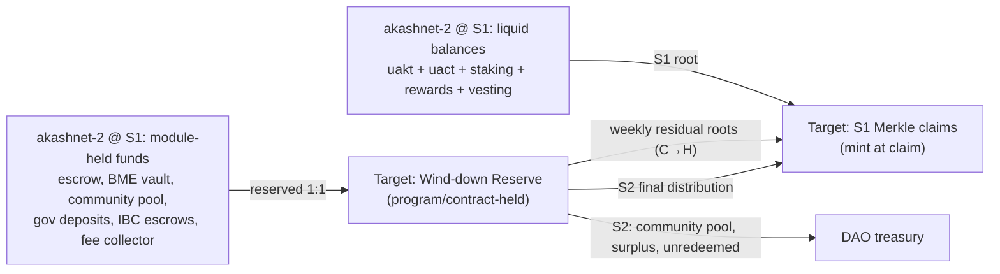

# 05. Token Migration: AKT/ACT Supply Accounting, Claims, Exchanges, Emissions

| | |
|---|---|
| **Document** | 05. Token migration |
| **Doc ID** | AKASH-MIG-05 |
| **Version** | 0.9 (draft for review) |
| **Date** | 2026-08-10 |
| **Owner** | Overclock Labs |
| **Audience** | Vendor engineering; exchange/custodian integration teams; community reviewers |
| **Status** | Normative where marked (MUST/SHALL); informative otherwise |

## Purpose

- Specify, to execution depth, how every micro-unit of AKT (`uakt`) and ACT (`uact`) on the Cosmos
  chain (`akashnet-2`) is accounted for, snapshotted, and represented on the target chain under the
  dual-snapshot mechanism (D-05).
- Define the claims system (Merkle distribution, Cosmos-key verification, vesting re-creation,
  multisig support) the Vendor MUST build for either target path (D-01).
- Define the Wind-down Reserve, weekly residual distributions (C→H), S2 final distribution, exchange
  coordination, emissions replacement mechanism (D-12), and unclaimed-funds policy.

## In scope

- Supply enumeration at S1: every value category on the old chain, its export source, and its
  target-chain disposition; the conservation invariant and the reconciliation artifact.
- ACT-specific handling: non-transferable representation, BME vault seeding, in-flight swap-queue
  cancellation.
- Claims design: tree format, sign-doc, on-chain verification (Solana and EVM), wallets, multisig,
  edge cases; vesting re-creation (D-06); IBC-out AKT (D-07); exchange playbook; emissions
  replacement mechanism; treasury migration; unclaimed policy.

## Out of scope

- Non-token state (marketplace records, provider registry, archives): [06](./06-state-and-data-migration.md).
- Target-chain protocol design (escrow, BME engine runtime behavior): [03](./03-solana-architecture.md),
  [04](./04-ethereum-architecture.md).
- Cutover scheduling and governance proposals: [10](./10-rollout-and-cutover.md); the program calendar and
  communications plan are maintained client-side, outside this technical set.
- The numeric emissions curve: modeled under WS-1 in [11](./11-scope-of-work.md) (Q-01).

---

## 1. Migration model and conservation invariant

Terminology (fixed in [13](./13-open-questions-and-assumptions.md), D-05): **C** = cutover, the
governance-scheduled height at which the sunset upgrade activates on `akashnet-2`. **S1** = the supply
snapshot taken from the state export at height C. **H** = C+90d, the final halt height. **S2** = the
residual snapshot taken from the final export at H. **Wind-down Reserve** = the target-chain pool,
held by the claims program/contract (`akash-claims` / `MigrationClaims`), that backs all value held by
module accounts at S1 and pays it out as the old chain resolves it.

A *module account* is a Cosmos address owned by chain code rather than a keypair (escrow pool, BME
vault, community pool; see [01](./01-current-architecture.md)). Module-held funds cannot be
attributed to one end user at S1; they are attributed as the old chain resolves them (weekly residual
distributions C→H) or at S2 from the final state.



**REQ-TOK-001** The S1 snapshot SHALL be derived from a full deterministic state export of
`akashnet-2` at exactly height C, produced by the tooling specified in
[06](./06-state-and-data-migration.md), and independently reproducible byte-for-byte by any party
running the exporter against an archive node.

**REQ-TOK-002** Every micro-unit of `uakt` and of `uact` in the S1 export's bank supply MUST be
classified into exactly one row of the supply accounting table (§2). The classification MUST be
exhaustive and disjoint: `Σ(row totals per denom) == bank TotalSupply(denom) @ S1`, with zero
unexplained remainder.

**REQ-TOK-003 (conservation, AKT)** Cumulative migration-minted AKT on the target chain MUST equal
`TotalSupply(uakt) @ S1`, decomposed as `liquid@S1 + reserved@S1 == total`, where `liquid@S1` is the
sum of all S1 Merkle-claimable entitlements and `reserved@S1` is the Wind-down Reserve. The Reserve
MUST be fully allocated (to residual claims, the S2 distribution, or the treasury) by S2 + the
publication of the S2 root. Old-chain inflation minted after C is NOT part of the conservation base
and MUST NOT be honored on the target chain.

**REQ-TOK-004 (conservation, ACT)** Cumulative migration-minted ACT MUST equal
`TotalSupply(uact) @ S1` (measured after the pre-export BME queue cancellation, §3.3), decomposed the
same way. ACT minted post-launch by the target BME engine (D-20) and AKT minted by the emissions
program (D-12) are outside these budgets and governed by their own caps (§9).

**REQ-TOK-005** The claims program/contract MUST enforce the migration mint budgets on-chain: a
per-denom counter of migration-minted supply that can never exceed the S1 totals baked in at
deployment. Emissions minting MUST use a separate authority and separate cap; no code path may mint
migration AKT against the emissions budget or vice versa.

**REQ-TOK-006 (reconciliation artifact)** The Vendor SHALL publish, alongside the S1 root, a
machine-verifiable reconciliation artifact: (a) the raw export hash and height; (b) per-category
totals per §2; (c) the full leaf dataset (address, amounts, vesting tuple); (d) the Merkle root and
tree parameters; (e) an open-source generator that reproduces (b)–(d) from (a) deterministically.
Acceptance (see [09](./09-testing-and-verification.md)) requires two independent regenerations, one by
a non-Vendor party, matching bit-for-bit.

---

## 2. Supply accounting at S1: the disposition table

S1 treatments: **Claim-S1** = in the S1 Merkle tree, individually claimable; **Reserve** = minted into
the Wind-down Reserve, paid via residual roots or S2; **Vesting** = re-created vesting (§5);
**Refund-pre-export** = unwound by the sunset upgrade before the export is taken; **Out-of-scope** =
not AKT/ACT supply (handled separately).

| # | Category | Export source (akashnet-2 state) | S1 treatment | Target representation |
|---|---|---|---|---|
| 1 | Liquid `uakt`, externally-owned accounts | `bank.balances[].coins["uakt"]` minus module/contract addresses | Claim-S1 | AKT minted to claimant at claim |
| 2 | Liquid `uact`, externally-owned accounts (bank-send disabled but holdable: `SendEnabled[uact]=false`, `cmd/akash/cmd/genesis.go:121-130`) | `bank.balances[].coins["uact"]` minus module/contract addresses | Claim-S1 | ACT (non-transferable per D-19) minted to claimant at claim |
| 3 | Bonded stake (delegations; physically in `bonded_tokens_pool`) | `staking.delegations[]` shares × validator `tokens/shares` from `staking.validators[]` | Claim-S1 (liquid, per D-06) | AKT, folded into claimant leaf |
| 4 | Unbonding entries (in `not_bonded_tokens_pool`) | `staking.unbonding_delegations[].entries[].balance` | Claim-S1 (liquid, per D-06; residual unbonding periods NOT honored) | AKT, folded into claimant leaf |
| 5 | Redelegations | `staking.redelegations[]` | No value row: funds remain bonded, counted in row 3 | none |
| 6 | Unwithdrawn delegator rewards accrued ≤ C | `distribution` state; exporter runs the withdraw-all computation virtually per delegator at C | Claim-S1 (per D-06) | AKT, folded into claimant leaf |
| 7 | Unwithdrawn validator commission ≤ C | `distribution.validator_accumulated_commissions` | Claim-S1 (to operator account) | AKT, folded into operator leaf |
| 8 | Community pool | `distribution.fee_pool.community_pool` | Reserve | S2: DAO treasury (§10), minus validator wind-down budget (§6.5) and any pre-authorized DEX-liquidity carve-out (§8.4) |
| 9 | Gov deposits on proposals active at C | `gov.deposits[]` | Reserve | Refunds honored via residual roots; deposits burned on-chain (veto) → treasury at S2 |
| 10 | Vesting accounts: locked portion at S1 (Base/Delayed/Continuous, stock `x/auth/vesting`) | `auth.accounts[]` typed `*VestingAccount`: `original_vesting`, `start_time`, `end_time`, `delegated_vesting`, `delegated_free` | Vesting (§5); vested-but-unspent portion → Claim-S1 | Re-created vesting schedule holding AKT (and ACT if held) |
| 11 | Escrow: deployment accounts, `uact` funds | `escrow.accounts[]` (`Scope=deployment`) `State.Funds["uact"]`, `Deposits[]` | Reserve | Refunds/settlements honored as ACT via residual roots / S2 |
| 12 | Escrow: deployment accounts, `uakt` funds (top-ups via `MsgAccountDeposit`) | same, `State.Funds["uakt"]` | Reserve | Honored as AKT |
| 13 | Escrow: bid accounts (provider collateral) | `escrow.accounts[]` (`Scope=bid`), both denoms | Reserve | Refunded to provider at bid close; honored via residual roots / S2 |
| 14 | Escrow: payment accrued balances (settled-but-unwithdrawn + virtual accrual to C per REQ-TOK-008) | `escrow.payments[].State.Balance` (+ computed `Rate × (C − SettledAt)`) | Reserve | Provider earnings honored via residual roots / S2, in denom of payment |
| 15 | Escrow module surplus: module bank balance − Σ(account funds + payment balances); includes the 427,414,453 uakt moved distribution→escrow by the v2.1.0 upgrade (`upgrades/software/v2.1.0/upgrade.go:88-108`) and accumulated decimal-truncation dust | `bank.balances[escrow module addr]` minus escrow ledger totals | Reserve | S2: DAO treasury. See REQ-TOK-009 |
| 16 | BME vault collateral (`uakt` in `bme` module account backing ACT) | `bank.balances[bme module addr]["uakt"]` after queue cancellation (§3.3) | Reserve (earmarked) | Seeds the target BME vault (§3.2) |
| 17 | BME in-flight swap queue (`ledgerPendingBalances`, both directions, escrowed in module account) | `bme.ledger.pending_records[]` | Refund-pre-export (§3.3); collapses into rows 1–2 | none |
| 18 | IBC transfer escrow, per channel (`uakt` backing vouchers on counterparty chains) | bank balance of each ICS-20 escrow address (derived per port/channel from `ibc.transfer` state); cross-check `transfer.total_escrowed` `[TO-VERIFY: live channel list and per-channel balances]` | Reserve (earmarked per channel) | Foundation redemption process for voucher holders (§7); unredeemed → treasury |
| 19 | Fee collector | `bank.balances[fee_collector]` | Reserve | S2: folded into validator wind-down budget (§6.5, Q-13) |
| 20 | Mint module account (transient minting buffer) | `bank.balances[mint module addr]` (≈0) | Reserve | S2: treasury (dust) |
| 21 | CosmWasm contract accounts (pyth/pyth_pro/pyth_vaa/wormhole oracle-fee balances; the only contracts on chain, locked down per D-22) | `bank.balances[contract addrs]` from `wasm` export | Reserve | S2: treasury |
| 22 | Any other module/orphan balance not enumerated above | catch-all diff | Reserve | S2: treasury; MUST be itemized in the reconciliation artifact, target zero |
| 23 | Non-native denoms held on Akash (IBC vouchers, e.g. IBC USDC) | `bank.balances[].coins[ibc/*]` | Out-of-scope for AKT/ACT accounting | Cannot be minted on target. Policy: §7.4 |

**REQ-TOK-007** Rows 1–2 SHALL exclude every module account (`app/mac.go:15-27`), every ICS-20 escrow
address, and every CosmWasm contract address. The exclusion list MUST be emitted as part of the
reconciliation artifact.

**REQ-TOK-008 (virtual settlement)** The exporter SHALL NOT require an on-chain settle-all at C.
Instead it MUST compute, per escrow payment, the virtual accrual `Rate × (C − SettledAt)` (clamped to
available account funds, replicating `x/escrow/keeper/keeper.go` `accountSettle`/FIFO semantics
exactly) so that row 14 reflects earned-but-unsettled value at C. Divergence between this off-chain
computation and subsequent on-chain settlements during C→H MUST be zero by construction (same
deterministic formula); [09](./09-testing-and-verification.md) requires a replay test proving it.

**REQ-TOK-009 (module surplus precedent)** Row 15 exists because module bank balances and module
ledger state can legitimately diverge: the v2.1.0 upgrade moved 427,414,453 uakt from the
`distribution` module account to the `escrow` module account imperatively, without creating escrow
ledger entries (community-pool spend precedent). The reconciliation MUST compute surplus = bank
balance − ledger total per module account, allocate surpluses to the treasury at S2, and treat any
negative surplus (ledger > bank) as a blocking defect that halts cutover (gate criterion in
[10](./10-rollout-and-cutover.md)).

**REQ-TOK-010** Post-C behavior of already-snapshotted liquid balances: coins in rows 1–2 remain
spendable on the old chain for wind-down utility only (gas, escrow top-ups, BME burns per D-08/D-18)
and carry **no further target-chain value**. The claim portal, wallet comms, and exchange notices
MUST state this prominently: *value moves at S1; the old chain's liquid coins are already represented
by your claim*.

---

## 3. ACT handling

### 3.1 User-held ACT

**REQ-TOK-011** User `uact` balances at S1 (row 2) SHALL be represented as ACT credits in the same
S1 Merkle leaf as the address's AKT entitlement, minted at claim into the target's non-transferable
ACT form (D-19: Token-2022 NonTransferable on Solana; transfer-restricted ERC-20 on EVM). A leaf MAY
have `uakt == 0, uact > 0`; ACT-only claims MUST work (e.g. providers that only ever earned ACT).

### 3.2 BME vault seeding and the collateral-ratio check

The current BME engine (`x/bme`, [01](./01-current-architecture.md)) backs ACT with vault AKT at a
collateral ratio `CR = (vault_uakt − pending_uakt) × (P_AKT/P_ACT) / TotalSupply(uact)` with
warn/halt thresholds 9500/9000 bps (D-20).

**REQ-TOK-012** The Wind-down Reserve slice from row 16 SHALL seed the target BME vault. Because
`pending_uakt == 0` after queue cancellation (§3.3) and the ACT migration budget equals
`TotalSupply(uact)@S1` (REQ-TOK-004), seeding the vault with exactly `vault_uakt@S1` yields, at
unchanged oracle prices, a fully-diluted post-migration CR identical to the pre-migration CR.
**Acceptance check (MUST, automated):** at S1 execution, assert
`vault_seed × P_AKT / P_ACT / ACT_migration_budget ≥ CR_old@S1` using the same oracle price pair for
both sides; abort cutover on failure. ACT that is never claimed only raises the effective CR, so the
check is conservative.

**REQ-TOK-013** The vault seed SHALL transfer from the Reserve to the BME program/contract vault
account at S1 as an earmarked allocation, recorded in the reconciliation artifact. Old-chain BME
burns during C→H pay out old-chain vault AKT (dead coins, not honored; see §6.3) and MUST NOT reduce
the target vault seed.

### 3.3 In-flight BME queue cancellation

The BME module account escrows coins for queued swap requests at any moment (`ledgerPendingBalances`,
`ledgerPending` records; `x/bme/keeper/key.go:12-26`).

**REQ-TOK-014** The sunset upgrade handler at C SHALL, before any state relevant to the export is
read: (a) iterate all `ledgerPending` records in both directions (uakt→uact and uact→uakt); (b)
refund each record's `CoinsToBurn` from the module account to `Owner`; (c) write a
`LedgerCanceledRecord` with a new cancellation reason (`BMCancelReasonMigration`) and emit
`EventLedgerRecordCanceled`; (d) zero `ledgerPendingBalances`. The module account balance then equals
vault collateral only. This mirrors the existing `cancelBurnMint` path (`x/bme/keeper/abci.go`) and
MUST be exercised in the migration dry-runs ([09](./09-testing-and-verification.md)).

**REQ-TOK-015** BME cumulative counters (`totalBurned`, `totalMinted`, `remintCredits`) SHALL be
carried into the target BME engine's genesis state per [06](./06-state-and-data-migration.md) and
[14](./14-appendix-protocol-mapping.md); they are bookkeeping, not coins, and do not appear in §2.

---

## 4. Claims design

### 4.1 Merkle tree format

**REQ-TOK-016** The S1 distribution SHALL be a binary Merkle tree with: leaf hash
`H(0x00 ‖ leaf_bytes)`, internal node `H(0x01 ‖ sorted(L, R))` (sorted-pair, OpenZeppelin-compatible),
`H = SHA-256` (native syscall on Solana; precompile 0x02 on EVM). Domain-separation bytes are
mandatory (second-preimage hardening). Residual roots (§6) use the same format with a distinct leaf
domain tag per root.

**REQ-TOK-017** Leaf serialization (fixed-width, big-endian concatenation; no varints):

```
leaf_bytes = tag(1) ‖ addr(20) ‖ uakt(8) ‖ uact(8) ‖ vest_locked_uakt(8) ‖ vest_locked_uact(8)
             ‖ vest_start(8) ‖ vest_end(8) ‖ vest_type(1)
```

where `tag` = 0x01 for S1 leaves; `addr` = the 20-byte bech32 payload of the `akash1` address;
amounts are micro-units; `vest_type` ∈ {0 = none, 1 = continuous, 2 = delayed, 3 = base}; vesting
fields zero when `vest_type = 0`. One leaf per address covers AKT, ACT, and vesting: exactly one
claim transaction per address.

**REQ-TOK-018** Per-address S1 entitlement composition: `uakt = rows 1+3+4+6(+7 for operators)` of
§2; `uact = row 2`; the vesting tuple encodes the locked-at-S1 portion (§5), which is a *subset* of
the leaf totals, not an addition.

### 4.2 Claim flow: Cosmos key names a target address

The claimant proves control of the `akash1` address by signing an offline sign-doc naming the
destination target-chain address. No Cosmos transaction is broadcast; the old chain plays no part
in claiming.

**REQ-TOK-019** The sign-doc SHALL be an ADR-036 amino `StdSignDoc`
(`account_number "0"`, `chain_id ""`, zero fee, empty memo, single `sign/MsgSignData` msg) whose
`data` field is the base64 of the canonical claim payload:

```json
{"schema":"akash-mig-claim-v1","root":"<hex S1 or residual root>",
 "target_chain":"solana|evm","target_chain_id":"<genesis-hash or EIP-155 id>",
 "claims_address":"<claims program id | MigrationClaims address>",
 "recipient":"<base58 pubkey | 0x address>"}
```

ADR-036 is the only arbitrary-signing format supported across Keplr, Leap, Cosmostation, and the
Ledger Cosmos app; its fixed StdSignDoc envelope makes on-chain reconstruction constant-template
string concatenation (constant segments + signer + data), never general JSON serialization.

**REQ-TOK-020** On-chain verification MUST establish the full chain of custody: (1) reconstruct the
exact sign-doc bytes from the claim arguments (constant template + supplied recipient);
(2) `digest = SHA-256(sign_doc_bytes)`; (3) recover/verify the secp256k1 signature (64-byte `r‖s`,
low-S enforced) against the digest; (4) derive `addr = RIPEMD-160(SHA-256(compressed_pubkey))`;
(5) require `addr == leaf.addr` and a valid Merkle proof against the active root; (6) mint/credit
strictly to the `recipient` named *inside the signed payload*, never to the transaction sender,
so a stolen claim transaction cannot redirect funds.

**REQ-TOK-021** Replay/domain separation: the signed payload binds root, target chain id, and claims
address, so a signature for a testnet deployment, the non-selected target path, or a residual root MUST
NOT verify against any other deployment or root. Each leaf is claimable exactly once per root
(claim-bitmap or per-leaf receipt account); partial claims are NOT supported.

### Solana specifics

**REQ-TOK-022** Verification SHALL use the `secp256k1_recover` syscall on the SHA-256 digest, with a
client-supplied recovery id (both values MAY be attempted). The Solana *secp256k1 native program* is
unsuitable unmodified (it assumes keccak digests of eth-formatted messages), hence the syscall
path. RIPEMD-160 has no syscall and SHALL be implemented in-program (pure Rust, one 20-byte digest
per claim; budget ≤ 30k CU, benchmarked per [09](./09-testing-and-verification.md)). Claim receipts:
per-leaf PDA (rent refunded at close after §11 sweep) or claim bitmap; Vendor selects on a measured
rent/CU trade-off at design review.

### Ethereum specifics

**REQ-TOK-023** Verification SHALL use precompiles: SHA-256 (0x02) for the digest, `ecrecover` (0x01)
for signature recovery, RIPEMD-160 (0x03) for address derivation. Cosmos signatures are 64-byte
`r‖s` over SHA-256 (not keccak, and with no recovery id), so the contract MUST accept a claimant-
supplied `v` and fall back to trying both `{27, 28}` ("recovery-id search"). Because `ecrecover`
returns a keccak-derived Ethereum address rather than the public key, the claimant MUST supply the
uncompressed 64-byte pubkey; the contract verifies (a)
`ecrecover(digest, v, r, s) == address(uint160(uint256(keccak256(pubkey_uncompressed))))`, and (b)
`ripemd160(sha256(compress(pubkey))) == leaf.addr`, compressing in-contract from the y-parity.

### 4.3 Wallet and signer support

**REQ-TOK-024** The claim portal (web) MUST support Keplr, Leap, and Cosmostation via
`signArbitrary` (ADR-036), including their Ledger paths (the Ledger Cosmos app signs amino
StdSignDocs; verify on hardware at kickoff, Ledger app version matrix in
[07](./07-offchain-and-clients.md)). A CLI claimer MUST support air-gapped flows: emit sign-doc →
sign offline (keyring or Ledger) → submit signature from a connected machine. The portal MUST render
the recipient address exactly as signed and warn on clipboard mismatch (top phishing vector; see
[12. Risk register](./12-risk-register.md) and [08](./08-security-and-audits.md)).

### 4.4 Cosmos multisig accounts

Cosmos multisigs are `LegacyAminoPubKey` threshold keys (k-of-n secp256k1 members); the address is
derived from the amino-encoded composite pubkey (first 20 bytes of its SHA-256 `[TO-VERIFY: exact
legacy-amino encoding bytes; produce test vectors from live akashnet-2 multisigs]`), so member keys
are not recoverable from the address alone.

**REQ-TOK-025** The claims program/contract SHALL support threshold claims: the claimant supplies
`{threshold k, ordered member pubkey list}` plus ≥ k member signatures over the *identical* sign-doc
(collected off-chain, e.g. via the portal's coordination page or file exchange). On-chain: (a)
re-derive the multisig address from the supplied composite key and match `leaf.addr`; (b) verify each
signature per §4.2 against its member key; (c) require ≥ k valid signatures from distinct members.
The portal MUST provide a multisig coordination flow (export/import partial signatures) and the CLI
MUST support it headlessly.

### 4.5 Edge cases

| Case | Handling |
|---|---|
| Module-owned addresses | Excluded from the tree (REQ-TOK-007); value flows via Reserve |
| CosmWasm contract addresses | Excluded; balances → Reserve → treasury (row 21). The only contracts are the locked-down oracle set; no user-fund contracts exist (D-22) |
| Addresses with only `uact` | Valid leaves; ACT-only claim (REQ-TOK-011) |
| Accounts with no known pubkey that never signed (incl. any relics of the ICA feature added v0.18.0 / removed v0.20.0) | Leaves exist; claimable only if the owner can produce the key. Counted in unclaimed policy (§11). `[TO-VERIFY: count of balance-holding accounts with no on-chain pubkey]` |
| Dust | Excluded below `DUST_MIN` per REQ-TOK-026 below |
| Exchange omnibus/deposit addresses | Ordinary leaves; handled via the exchange playbook (§8), claimed programmatically by the venue |
| Vesting accounts | §5; single leaf carries the tuple |
| Same address claiming twice | Rejected (REQ-TOK-021) |

**REQ-TOK-026** Leaves with `uakt + uact < DUST_MIN` (default 10,000 micro-units combined, i.e. 0.01
tokens; value ratified with the S1 governance proposal) and no vesting tuple SHALL be excluded from
the tree; their aggregate MUST be reported in the reconciliation artifact and allocated to the
treasury at S2 (legal posture: Q-02).

**REQ-TOK-027** The Vendor SHALL operate a public claims telemetry dashboard: % of S1 supply claimed,
per-category residual balances, Reserve balance vs allocation, updated at least daily, the input to
assumption A-04 monitoring and the unclaimed sweep (§11).

---

## 5. Vesting re-creation (D-06)

Only stock `x/auth/vesting` types exist on akashnet-2 (created via `akash genesis add-account`,
`cmd/akash/cmd/genaccounts.go:24-110`); the live inventory MUST be read from the export (Q-19).

**REQ-TOK-028** For each vesting account, the exporter SHALL compute `locked@S1` per the SDK's own
vesting math and split the leaf: `locked@S1` → re-created vesting; the remainder → liquid.
Bonded/unbonding/reward amounts (rows 3/4/6) folded into the leaf get the same split:
`delegated_vesting`/`delegated_free` from the export drive the attribution, so locked stake cannot
escape the schedule by having been delegated at S1.

**REQ-TOK-029** Re-created schedules MUST preserve the *remaining* schedule exactly (same end time,
same release slope) per this normative mapping:

| Cosmos type | Old semantics | `locked@S1` | Target schedule |
|---|---|---|---|
| ContinuousVestingAccount | Linear release `start_time → end_time` over `original_vesting` | `OV × (end − max(S1,start)) / (end − start)`, = `OV` if `S1 < start` | Linear release of `locked@S1` from `max(S1, start)` to `end`: identical slope `OV/(end−start)` by construction; a future `start_time` acts as a cliff, preserved |
| DelayedVestingAccount | Everything locked until `end_time` | `OV` if `S1 < end`, else 0 | Cliff: 100% releasable at `end_time` |
| BaseVestingAccount (bare) | As delayed: locked until `end_time` | same as delayed | Cliff at `end_time` |

Accounts whose `end_time ≤ S1` have no tuple (fully vested → liquid). PeriodicVesting and
PermanentLocked types do not exist on akashnet-2; if the export reveals any, cutover blocks until
this table is extended by change control.

### Solana specifics

**REQ-TOK-030** The `akash-claims` program SHALL vest in place: the claim instruction mints the full
entitlement, transfers `locked@S1` into a per-claimant vesting sub-account (PDA-owned token account
carrying the schedule) and the remainder to the recipient. A permissionless `release` instruction
transfers the vested tranche per on-chain Clock; the PDA closes (rent refunded to the claimant) when
drained. Claimant pays rent (~one token account + schedule account); refundable at close.

### Ethereum specifics

**REQ-TOK-031** `MigrationClaims` SHALL deploy one EIP-1167 minimal-proxy clone per vesting claimant
of an audited `VestingWallet`-derived implementation (OpenZeppelin), parameterized
`start = max(S1, start_time)`, `duration = end_time − start` (delayed/base: `start = end_time`,
`duration = 0`), beneficiary = recipient. Claimant pays claim gas including clone deployment
(~50–80k gas marginal; cents on candidate host chains, e.g. Base, as of 2026-08); the protocol MAY sponsor via the paymaster
service in [07](./07-offchain-and-clients.md) (Q-07). ACT vesting positions use the same clone with
the restricted-token release path.

---

## 6. Wind-down Reserve and residual distributions

### 6.1 Reserve instantiation

**REQ-TOK-032** At S1 the claims program/contract SHALL mint the Reserve in full:
`reserved@S1 = Σ(rows 8, 9, 11–16, 18–22)` in AKT, plus the ACT-denominated reserve
(`Σ uact in rows 11, 13, 14`) as a mint *budget* (ACT mints lazily at payout, like claims). Earmarks
(vault seed, per-channel IBC slices, community pool) are recorded on-chain as labeled sub-balances,
so the telemetry dashboard (REQ-TOK-027) proves earmark discipline.

### 6.2 Honored flows: the definition

During C→H the old chain runs under the sunset message allow-list (D-18, Q-17). The Reserve honors
**only flows out of module accounts to user accounts that are attributable to value locked before C**:

1. Escrow payment withdrawals (provider earnings), in the denom received (`uact`, or `uakt` via the AKT-fallback path when BME is halted; D-21).
2. Escrow account refunds to depositors at account/bid close, per FIFO depositor order.
3. Gov deposit refunds for proposals that were active at C.

**REQ-TOK-033 (FIFO attribution)** Escrow deposits are consumed FIFO and each `Depositor` record
carries its deposit `Height` (`x/escrow` state). Honored amounts per account are capped at the
principal of deposits with `Height < C`. Flows funded by post-C top-ups are old-chain-local and MUST
NOT be honored; otherwise an address could re-spend its already-claimed S1 balance into escrow and
mint duplicate target AKT via a self-lease (unbounded issuance attack). This cap is what makes
REQ-TOK-003 an equality rather than an aspiration.

**REQ-TOK-034 (not honored)** The following post-C flows MUST NOT create target-chain credits: BME
burn payouts (§3.3 note: burners keep their S1 ACT claim, so nothing is forfeited); staking-reward
withdrawals (rewards ≤ C are already in S1 leaves; post-C rewards are post-C inflation, excluded per
REQ-TOK-003); any flow funded by post-C deposits (REQ-TOK-033). Provider tooling and Console MUST
surface, per lease, the remaining reserve-backed escrow balance so providers can close leases
(D-24 reclamation or ordinary close) before serving unpaid compute
([07](./07-offchain-and-clients.md)).

### 6.3 Weekly residual roots

**REQ-TOK-035** Weekly (cadence and threshold parameters: Q-18), the Vendor's residual pipeline SHALL:
(a) take the archive export at week-k height (tooling per [06](./06-state-and-data-migration.md));
(b) deterministically diff escrow accounts/payments and gov deposits against the C export, replaying
settlement math (REQ-TOK-008) and FIFO attribution (REQ-TOK-033); (c) emit per-address cumulative
honored credits `{AKT, ACT}` from C to week k; (d) subtract amounts already covered by activated
prior roots; (e) build residual root k (leaf tag distinct per REQ-TOK-016).

**REQ-TOK-036** The pipeline MUST be deterministic and open-source: identical inputs (C export,
week-k export) reproduce root k bit-for-bit. Each root ships with its full ledger and a recompute
script, the same reproducibility bar as REQ-TOK-006.

**REQ-TOK-037 (publication + dispute window)** Each residual root SHALL be published (ledger +
script + root) at least **48 hours** before on-chain activation by the Migration Operator (the
multisig defined in [08](./08-security-and-audits.md)). Any party reproducing a different root files
a dispute; the operator MUST NOT activate a disputed root until resolved, and a corrected root
supersedes (never mutates) a published one. Claims against residual roots use the identical §4 flow.

**REQ-TOK-038 (minimum payout)** Addresses whose new credits in week k are below `MIN_PAYOUT`
(default 1,000,000 micro-units = 1 token-equivalent; parameter, Q-18) SHALL be carried into
subsequent roots rather than dropped; the S2 final root includes all carried remainders with no
threshold. Nothing is ever forfeited by the threshold.

### 6.4 S2 final distribution

**REQ-TOK-039** At H, from the final export, the S2 root SHALL allocate everything remaining in the
Reserve: (a) residual escrow balances attributed per the same refund/settlement logic (depositors
and providers per final state; the halt supersedes on-chain force-closure); (b) unresolved gov
deposits refunded (burned deposits → treasury); (c) community pool → DAO treasury (§10) minus (d);
(d) the validator wind-down incentive budget (§6.5); (e) fee collector, mint dust, contract
balances, module surpluses, dust aggregate (REQ-TOK-026) → treasury; (f) IBC redemption slices stay
earmarked until the redemption window closes (§7.3), then sweep to treasury.

**REQ-TOK-040** After S2 root activation and IBC-window close, the Reserve's unallocated balance MUST
be exactly zero; the final reconciliation artifact proves `liquid@S1 + Σ(residual roots) + S2 root +
treasury allocations == TotalSupply@S1` per denom. Publication of this artifact is a payment-gate
deliverable ([11](./11-scope-of-work.md)).

### 6.5 Validator wind-down incentive budget

**REQ-TOK-041** The S2 distribution SHALL include a validator wind-down incentive line, funded from
the community-pool slice of the Reserve (size and formula: Q-13, needed by G2), compensating
akashnet-2 validators for C→H service, uptime-weighted per the final export's signing data
(mechanics in [06](./06-state-and-data-migration.md) and [10](./10-rollout-and-cutover.md)). Post-C
delegator yield is not otherwise honored (REQ-TOK-034); comms MUST state this before the migration
governance vote, and whether the Q-13 budget extends to delegators is an input to that proposal.

---

## 7. IBC-out AKT (D-07)

### 7.1 Quantification

**REQ-TOK-042** The Vendor SHALL quantify stranded supply per channel: enumerate ICS-20 channels from
the export, read each escrow address balance (row 18), and cross-check against counterparty-chain
voucher supplies for the top venues (Osmosis, Cosmos Hub; full list Q-03)
`[TO-VERIFY: live per-channel escrow balances and counterparty voucher distribution]`. Per-channel
escrow balance equals the maximum redeemable amount for that channel; the redemption process is
inherently fully funded by row 18 earmarks. `uact` cannot be IBC-escrowed (ICS-20 escrow uses bank
sends, which enforce `SendEnabled[uact]=false`) `[TO-VERIFY: confirm zero uact vouchers exist on any
counterparty]`.

### 7.2 Pre-C voucher return (return-home window)

**REQ-TOK-043** A pre-C return-home window of ≥ 12 weeks SHALL exist between migration-governance
approval and C, during which voucher holders IBC AKT back to akashnet-2 so it is captured in their S1
leaves. The IBC counterparty notices this depends on are normative in
[10](./10-rollout-and-cutover.md) §7 (REQ-ROL-045); the audience-facing return-home communications
campaign (wallet notices, frontend banners, direct outreach) is maintained in the client-side program
& comms plan, outside this technical set. ICS-20 (in both directions) MUST
remain in the sunset allow-list until H−7d so stragglers can return during the wind-down (Q-17;
returning post-C makes the coins old-chain-liquid; such holders are made whole via §7.3, not via
S1 leaves, so holder-facing notices MUST push returns *before* C).

### 7.3 Post-S1 foundation redemption

**REQ-TOK-044** For vouchers still outstanding at H, a foundation-operated redemption process SHALL
run for a published window (default 12 months from H; length and KYC posture: Q-03; legal review
Q-03/Q-10): the holder proves voucher ownership on the counterparty chain (signed message from the
holding address plus a counterparty state proof or snapshot lookup at H) and receives target-chain
AKT from the per-channel earmark. AKT returned to akashnet-2 during C→H (neither in S1 leaves nor
still a voucher at H) is honored the same way, netting the channel's C→H escrow delta. Redemptions
MUST be logged publicly against the earmark.

**REQ-TOK-045** Unredeemed earmarks at window close sweep to the DAO treasury by governance action
(§11 clocks do not apply; this window is its own). Flag: the redemption process handles user funds
off-chain and is the program's most legally exposed surface (Q-03, Q-10; [12](./12-risk-register.md)).

### 7.4 Non-native denoms (row 23)

**REQ-TOK-046** IBC-voucher assets held on akashnet-2 (e.g. IBC USDC) cannot be represented by the
claims system (the target cannot mint them). Comms MUST instruct holders to move them to their origin
chains before H; ICS-20 outbound stays open until H−7d (REQ-TOK-043). Voucher balances stranded at H
are recorded in the final export; disposition (case-by-case foundation assistance vs write-off) is a
policy decision: new open question, owner Overclock + legal, needed by G3.

---

## 8. Exchange playbook

### 8.1 Precedents (as of 2026-08)

| Migration | Mechanics | Duration/tail |
|---|---|---|
| Helium HNT (2023) | Same-ticker chain swap: deposits/withdrawals paused ~1 day around snapshot; venues credited Solana HNT | ~1 day per venue |
| Render RNDR→RENDER (2023–24) | New network Nov 2023; canonical ticker swap 2024-07-26; per-venue staggered windows ~4 weeks, deposits closed 1–2 weeks prior; self-custody upgrade contract open for years | ~2 years vote→completed swap |
| Fetch/ASI (2024) | AGIX/OCEAN→FET at fixed rates; major CEXs auto-converted balances day-1; phase-2 ASI ticker never completed on major venues | Day-1 conversion; open-ended tail |
| Noble (2026) | Cosmos SDK chain → own EVM L1; Cosmos chain to maintenance mode | Freshest Cosmos-exit precedent |

Akash follows the Helium pattern (same ticker per A-09, one snapshot venues act on) with Render's
long self-custody tail (2-year claim window).

### 8.2 Coordination requirements

**REQ-TOK-047** [RELOCATED] Exchange coordination timeline (venue notice lead times, integration-kit
and sandbox dry-run schedule, per-venue swap windows): maintained in the client-side program & comms
plan, outside this technical set. Venue list and per-venue technical requirements remain Q-04, needed
by G1.

The exchange-coordination milestones execution depends on remain normative in this set: formal venue
notices no later than S1−30d including the point-of-no-return declaration
([10](./10-rollout-and-cutover.md) §4.1, REQ-ROL-022); the exchange technical pack delivered ≥16
weeks before C ([11](./11-scope-of-work.md) REQ-SOW-026; contents per REQ-ROL-046); venue
deposit/withdrawal freeze at S1−24h and custodial swap execution from S1
([10](./10-rollout-and-cutover.md) §4.1, REQ-ROL-030); and ≥2 venues completing sandbox integration
before G3 ([09](./09-testing-and-verification.md) REQ-TST-041).

**REQ-TOK-048** Venues MUST be instructed to disable old-chain AKT deposit crediting **permanently at
S1**: old-chain coins deposited after S1 have no claim value (REQ-TOK-010), and crediting them would
put the venue out of balance. The integration kit MUST include this as a checklist item with sign-off.

**REQ-TOK-049** Exchange balances swap at S1 only; venues do not participate in residual roots (their
customers' module-held funds, e.g. a provider's escrow earnings, flow to the customer's own
address, not to venues). The kit MUST state this so venues do not attempt to model the Reserve.

### 8.3 Market structure

Ticker: AKT retained across venues (A-09); no rebrand, no rate conversion; 1 old AKT = 1 new AKT
(6 decimals both sides, D-03/D-04). Chain identity: exchange alignment is also the defense against a
value-bearing fork of the old chain (A-06; [12](./12-risk-register.md)).

### 8.4 DEX liquidity

**REQ-TOK-050** Day-one DEX liquidity SHALL be seeded on the target chain (Solana: Raydium and/or
Orca AKT/settlement-stablecoin pool; EVM: an AKT/settlement-stablecoin pool on the leading DEX on the host chain, e.g. Aerodrome on Base), funded by a governance-pre-authorized carve-out from
the community-pool slice of the Reserve, executable at S1 (amount, venue split, and LP management
policy are an open question for the migration governance proposal; owner Overclock finance, needed
by G2). Market-maker agreements for CEX order books SHOULD be renewed against the new chain before C
(Q-04 workstream).

---

## 9. Emissions replacement (D-12)

Sovereign inflation (stock Cosmos `x/mint`; live parameters are on-chain state only, read at
kickoff per Q-19) ends economically at S1 (post-C inflation is dead, REQ-TOK-003) and literally at H.
The replacement is `akash-emissions` (Solana) / `EmissionsMinter` (EVM). This section fixes the
mechanism; the curve is the WS-1 modeling deliverable (Q-01) ratified by governance; the Vendor
MUST NOT hard-code placeholder numbers.

**REQ-TOK-051** The emissions minter SHALL enforce an immutable **hard cap** on cumulative emitted
AKT, set at deployment from the ratified model (Q-01), independent of and additive to the migration
budget (REQ-TOK-005). No authority, including governance, can raise it; lowering requires
redeployment by governance.

**REQ-TOK-052** The emission schedule (per-epoch amounts or rate function) SHALL live in on-chain
config adjustable only by the DAO through the timelock (D-11), with bounds enforced in code: schedule
changes cannot exceed the hard cap, cannot mint retroactively, and take effect no earlier than
timelock expiry + one full epoch. A guardian role MAY pause emissions but can never mint or raise
parameters ([08](./08-security-and-audits.md)).

**REQ-TOK-053** Destinations are exactly two on-chain accounts, with a governance-adjustable split:
(a) the provider-incentive pool (distribution mechanics per
[03](./03-solana-architecture.md)/[04](./04-ethereum-architecture.md)); (b) the community treasury
(§10). Minting is epoch-batched and permissionlessly crankable (Solana) / keeper-automated (EVM),
consistent with D-20's execution model.

**REQ-TOK-054** Launch state: the minter deploys with the ratified schedule if Q-01 closes before S1;
otherwise it deploys **paused with a zero schedule** and activates by governance once ratified.
Emissions never block cutover.

---

## 10. Treasury migration

**REQ-TOK-055** The community-pool slice of the Reserve (row 8, net of §6.5 and §8.4 carve-outs)
SHALL transfer at S2 to the DAO treasury: Solana, the Realms-governed treasury vault (Squads-held
per D-11); EVM, the `AkashTimelock`-owned Safe. From S2 onward, spends follow target-chain
governance only; the Cosmos community-pool spend mechanism (governance proposals; historically also
imperative upgrade-handler moves, REQ-TOK-009) has no successor.

**REQ-TOK-056** Strategic reserve: akashnet-2 has no foundation module and no hard-coded foundation
address (`GenesisParams.StrategicReserveAccounts` exists but is unpopulated;
`cmd/akash/cmd/genesis.go:202`); foundation/Overclock holdings are ordinary externally-owned (and
vesting) accounts. These claim through the standard §4 flow, and MUST be enumerated and publicly
labeled in the reconciliation artifact (address list: Overclock to supply at G1) so community
reviewers can distinguish them from unclaimed retail supply in the telemetry (REQ-TOK-027).

---

## 11. Unclaimed policy

**REQ-TOK-057** Claim windows: S1 leaves are claimable for **2 years from S1**; residual-root and S2
leaves for **2 years from S2** (all residual roots share the S2 clock). The IBC redemption window
(§7.3) is separate. Windows and expiry consequences MUST be stated in the claim portal, the exchange
kit, and every distribution's published ledger.

**REQ-TOK-058** At window expiry, unclaimed entitlements SHALL be swept to the DAO treasury **only
by an explicit governance action** on the target chain, gated on the legal review of Q-02 (per-
jurisdiction posture on expropriating unclaimed property; needed by G2). The claims program/contract
MUST make the sweep impossible before the window ends (enforced on-chain, not procedurally) and MUST
emit a final accounting event reconciling swept amounts against REQ-TOK-040's artifact. Governance
MAY instead vote to extend windows; the code MUST support extension without redeployment.

---

## Cross-references

- [01. Current architecture](./01-current-architecture.md): module accounts, escrow/BME/vesting mechanics cited throughout.
- [03. Solana](./03-solana-architecture.md) / [04. Ethereum](./04-ethereum-architecture.md): `akash-claims`/`MigrationClaims` runtime context, BME/escrow ports, provider-incentive pool.
- [06. State & data migration](./06-state-and-data-migration.md): export tooling, weekly archive cadence, sunset mechanics; [07. Off-chain & clients](./07-offchain-and-clients.md): claim portal/CLI, wallet matrix, paymaster, provider balance surfacing.
- [08. Security & audits](./08-security-and-audits.md): Migration Operator multisig, guardian roles, claims threat model; [09. Testing](./09-testing-and-verification.md): reconciliation reproduction, settlement-replay proof, claim acceptance.
- [10. Rollout & cutover](./10-rollout-and-cutover.md): governance proposals, runbook, gates consuming REQ-TOK-009/012/040.
- [12. Risk register](./12-risk-register.md): claim phishing, exchange non-cooperation, unclaimed overhang, fork risk, IBC-redemption legal exposure.
- [13. Open questions](./13-open-questions-and-assumptions.md): D-03..D-07, D-12, D-19..D-21; Q-01..Q-05, Q-10, Q-13, Q-18, Q-19; A-04, A-06, A-09.

## Feeds into

- [06](./06-state-and-data-migration.md): S1/S2 export requirements, honored-flow definitions, sunset-prep steps (REQ-TOK-008/014); [09](./09-testing-and-verification.md): acceptance tests for REQ-TOK-006/008/012/036/040.
- [10](./10-rollout-and-cutover.md): runbook steps, gate criteria, exchange operational milestones (§8).
- [11](./11-scope-of-work.md): WS-1 emissions modeling input (§9); reconciliation artifact as payment-gate deliverable.
- [12](./12-risk-register.md): risk entries above; [14](./14-appendix-protocol-mapping.md): claims/emissions surfaces, BME state carry-over.
