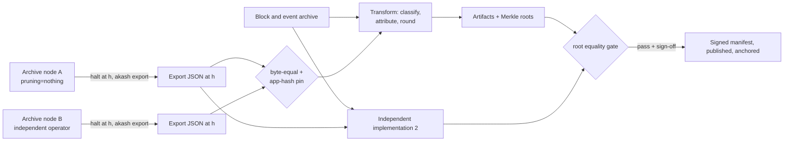

# 06. State & Data Migration

| | |
|---|---|
| **Document** | 06. State & data migration |
| **Doc ID** | AKASH-MIG-06 |
| **Version** | 0.9 (draft for review) |
| **Date** | 2026-08-10 |
| **Owner** | Overclock Labs |
| **Audience** | Vendor engineering |
| **Status** | Normative where marked (MUST/SHALL); informative otherwise |

## Purpose

This document specifies the disposition of every piece of non-token state on `akashnet-2` (the Cosmos chain), the
snapshot/export tooling that produces the migration artifacts, the weekly residual-distribution computation
during the wind-down window, verification and sign-off, the sunset upgrade that restricts the old chain after S1,
validator continuity through halt, archival, and decommission. Token *value* accounting is owned by
[05. Token migration](./05-token-migration.md); this document produces the datasets doc 05 consumes.

## In scope

- Disposition (migrate / re-register / drop / wind down / archive) of every module's state.
- The migration engine: exports at S1, weekly heights, and S2; artifact formats; determinism.
- Weekly residual diff computation and classification rules (D-05, D-08).
- Verification: dual implementations, property checks, public window, sign-off.
- The sunset upgrade (D-18): message allow-list, fee floor, halt mechanics, validator continuity.
- Archives and old-chain infrastructure decommission.

## Out of scope

- AKT/ACT supply equation, claim UX, exchange swaps, unclaimed policy: [05](./05-token-migration.md).
- Target-chain designs consuming these artifacts: [03](./03-solana-architecture.md), [04](./04-ethereum-architecture.md).
- Rehearsal pass criteria and test tooling detail: [09](./09-testing-and-verification.md).
- Cutover runbook timing and operational notifications: [10](./10-rollout-and-cutover.md).

Terminology: **S1** = supply snapshot at cutover **C**; **S2** = residual snapshot at halt **H** = C+90d;
**Wind-down Reserve** = target-chain pool backing old-chain module-held funds (D-05). A **genesis export**
serializes full application state to JSON at a height (`akash export` / `ExportAppStateAndValidators`,
`app/export.go:30`). A **module account** is a protocol-owned keyless account (escrow vault, BME vault,
governance deposits, etc.); the list is wired at `app/mac.go:15-27`.

## 1. State disposition inventory

### 1.1 The five treatments

| Treatment | Meaning | Value carried? |
|---|---|---|
| **Migrated-as-value** | Converted into target-chain token credits (claims, vesting re-creation, Reserve seeding) per doc 05 | Yes |
| **Migrated-as-registration** | The *actor* re-establishes the record on the target chain by signing a fresh transaction; no state is copied | No (identity re-established) |
| **Wound down** | Runs to terminal state on the old chain during C→H under D-08; economic outcomes honored via residual distributions | Via residuals |
| **Dropped** | No successor object on the target chain | No |
| **Archived** | Preserved immutably per §7 | N/A |

**REQ-STA-001** The Vendor SHALL produce a disposition matrix in which every KV store listed in
`app/types/app.go:605-637` and every genesis section of the S1 export maps to exactly one of {migrated-as-value,
migrated-as-registration, wound down, dropped}; completeness is checked mechanically against the export.

**REQ-STA-002** Independently of treatment, ALL state SHALL be archived per §7: "dropped" never means deleted from the historical record.

### 1.2 The supply-fixed-at-S1 principle and the reserved perimeter

Two rules make every later section deterministic:

1. **Supply fixed at S1.** Claim value derives exclusively from (a) state at the S1 height and (b) subsequent
   flows of S1-reserved principal out of module accounts. `uakt`/`uact` minted after S1 (staking inflation,
   BME-minted `uakt` from post-S1 burns) carries **no claim value**; this makes post-S1 bank sends harmless
   (§5.4) and creates the validator-attrition problem solved in §6.
2. **Reserved perimeter.** The accounts whose S1 balances are minted into the Wind-down Reserve rather than
   individually claimed: the `escrow`, `bme`, and `gov` (proposal deposits) module accounts, every ICS-20
   transfer escrow address (one derived account per IBC channel), `fee_collector`, and `distribution`
   (community-pool portion per doc 05). `bonded_tokens_pool` / `not_bonded_tokens_pool` are **not** reserved:
   they back the bonded/unbonding stake credited as liquid at S1 (D-06).

**REQ-STA-003** No `uakt` or `uact` minted on the old chain after the S1 height SHALL appear in any claim set,
residual distribution, or Reserve accounting line.

**REQ-STA-004** The reserved perimeter SHALL be enumerated programmatically at S1 (module accounts from `x/auth`
state + escrow addresses of all open IBC channels), published as the reserved-pool ledger (§2.4), and treated as
a closed catch-all: any module-held balance not explicitly allocated by doc 05 defaults to treasury-at-S2.

**REQ-STA-005** Post-S1 inflows *into* the perimeter (escrow top-ups via `MsgAccountDeposit`, new governance
deposits, post-S1 BME burn escrows) are **claim-inert**: recorded for attribution (§3.3) but never credited,
since those coins were already credited at S1. Cutover comms (doc 10) MUST state this for tenants topping up.

### 1.3 Inventory: Akash modules

Source structures are per [01](./01-current-architecture.md); genesis shapes below are the export sections.

| Module (store) | Source structure (genesis) | Treatment | Verification method |
|---|---|---|---|
| `x/deployment` | `{Params{MinDeposits}, Deployments:[{Deployment, Groups}]}`; per-entity state incl. `pendingDenomMigrations` scratch map | **Wound down** (D-08): active deployments/groups run to close by H; params re-authored in target genesis/config, not copied | All entities terminal at H (S2 export shows zero `active`/`open`); `pendingDenomMigrations` empty (REQ-STA-008); archive checksum |
| `x/market` | `{Params, Orders, Bids, Leases}` | **Wound down** (D-08): no new orders/bids/leases post-C; existing run to close/expiry; reclamation windows (D-24) keep operating | Zero non-terminal orders/bids/leases at H; count reconciliation vs event replay; archive checksum |
| `x/escrow` | `{Accounts, Payments}`: accounts with multi-denom Dec `Funds` + FIFO `Deposits`, payments with per-block `Rate`, `Balance`, `Unsettled`, `Withdrawn` | **Wound down + migrated-as-value**: module balance at S1 → Wind-down Reserve; C→H flows honored via weekly residuals (§3); final virtual settlement at H (§3.4) | Conservation: Reserve = Σ residual credits + inert flows + residue (§4.2); state-vs-replay reconciliation each week |
| `x/bme` | `{Params, State{TotalBurned, TotalMinted, RemintCredits}, Ledger{Records, PendingRecords}}` + module-account vault | **Hybrid**: vault balance → Reserve → seeds target BME vault (doc 05, D-20); params re-authored per D-20; pending ledger wound down (§3.2); counters dropped (target counters start at zero) | Vault balance vs reserved ledger line; pending records all executed/canceled/refunded by S2; archive |
| `x/oracle` | `{Params, GenesisSourceID, GenesisLatestPricesIDs}` + price/TWAP history | **Dropped** (D-13/D-22): target reads Pyth pull feeds directly; price history is ephemeral market data | Archive checksum only; §5.4 keeps the feed *live* until H |
| `x/epochs` | `{Epochs}` (scheduler cursors) | **Dropped**: target epochs are time-based (D-20); cursors meaningless off-chain | Archive checksum only |
| `x/provider` | `{Providers}`: `Provider{Owner, HostURI, Attributes, Info}` | **Migrated-as-registration**: providers RE-REGISTER on the target chain from target-launch day (precedes C, D-08) | Re-registration coverage report from indexer (old↔new linkage, REQ-STA-007); archive |
| `x/audit` | `{Providers: []AuditedProvider}`, auditor-signed attribute sets keyed `(owner, auditor)` | **Migrated-as-registration**: auditors RE-ATTEST on the target chain | Auditor re-attestation report; archive |
| `x/cert` | `{Certificates}`: x509 PEM blobs keyed `(owner, serial)` | **Dropped** (D-10): replaced by JWT + on-chain signing keys ([07](./07-offchain-and-clients.md)) | Archive checksum; no target-side successor to verify |
| `x/awasm` | `{Params{BlockedAddresses}}` | **Dropped** (D-22): the CosmWasm guardrail has no successor | Archive checksum |
| `x/wasm` (wasmd) | Contract code + state: pyth, pyth_pro, pyth_vaa, wormhole (guardian sets, VAA archive) | **Dropped** (D-22): targets read Pyth directly; contracts archived incl. code blobs | Archive checksum; code-hash inventory |
| `x/take` | Not wired; store deleted in v2.0.0 | **Absent**: nothing to migrate; listed for completeness | Assert absent from export |

Why the registration rows cannot be ported trustlessly: provider and audit records are keyed by secp256k1 Cosmos
accounts (bech32 `akash1…`); target identities use different key/address schemes (Solana Ed25519, EVM keccak
addresses), so ownership of a target identity cannot be derived from old-chain state: it requires a fresh
signature by the actor, which *is* a registration transaction. Audit records are additionally *attestations*
("this auditor's key signed these attributes for this provider's key"); with both keys changing, a copied record
attests nothing. Providers must also register new JWT signing keys (D-10) and post collateral (Q-08), neither of
which exists in old-chain state; and `MsgDeleteProvider` was never implemented
(`x/provider/handler/server.go:74-88`), so the registry holds abandoned records unfit for bulk import.

**REQ-STA-006** The Vendor SHALL NOT build any mechanism that mints provider, audit, or certificate records on
the target chain from old-chain state; providers re-register and auditors re-attest via target-chain transactions.

**REQ-STA-007** The migration tooling SHALL support an OPTIONAL linkage attestation: a provider MAY sign its
target-chain address with its old Cosmos key; the indexer ([07](./07-offchain-and-clients.md)) records the link
so reputation/history carries across chains. Linkage is informational and SHALL NOT gate registration.

**REQ-STA-008** The S1 pipeline SHALL assert that `x/deployment.pendingDenomMigrations` (drained by upgrade
v2.1.0) is empty at S1; a non-empty map is a blocking discrepancy escalated per §4.5.

### 1.4 Inventory: Cosmos SDK modules

| Module | Source structure | Treatment | Verification method |
|---|---|---|---|
| `x/auth` | Accounts (base, module, vesting), numbers, sequences | **Dropped**, except vesting schedules → **migrated-as-value** (re-created per D-06/doc 05); numbers/sequences meaningless on target | Vesting inventory cross-check (§2.4); per-account schedule recomputation on sample n≥50 |
| `x/bank` | Balances, supply, denom metadata, SendEnabled | Balances → **migrated-as-value** (S1 claim set: `uakt`; `uact` → ACT ledger seed); metadata/SendEnabled dropped (D-03/D-19 re-author) | Doc 05 conservation equation; dual-implementation root equality |
| `x/staking` | Validators, delegations, unbonding, redelegations | **Migrated-as-value** as liquid credits (D-06); validator objects dropped (no consensus to port) | Σ(delegation tokens)+Σ(unbonding) vs bonded/not_bonded pool balances (documented rounding tolerance) |
| `x/mint` | Inflation params/state (live values on-chain only; Q-19) | **Dropped**; replaced by emissions program (D-12) | Params captured in archive + Q-19 data pull |
| `x/distribution` | Outstanding rewards, commission, fee pool, community pool | Accrued-to-S1 rewards/commission → **migrated-as-value** (doc 05); community pool → Reserve → treasury at S2; post-S1 accruals inert (REQ-STA-003) | Doc 05 reward computation vs module balance reconciliation |
| `x/slashing` | Signing infos, missed-block bitmaps, params | **Dropped**; stays *active* C→H (§6); signing data feeds continuity payouts | §6 uptime dataset cross-check vs raw `LastCommit` |
| `x/gov` | Proposals, deposits, votes, params | Deposits at S1 → reserved; refunds C→H → residual credits (§3.2); history dropped/archived | Deposit ledger reconciliation at S2 |
| `x/authz` | Grants (incl. `DepositAuthorization`) | **Dropped**; delegated-deposit semantics re-implemented natively on target (D-21); grant-restore mapping honored in residuals (§3.3) | Residual granter-attribution audit (§3.3) |
| `x/feegrant` | Fee allowances | **Dropped** (target fee mechanics differ); usable until H | Archive checksum |
| `ibc` core | Clients, connections, channels | **Dropped**; kept operational until H for returns (§5.5) | Archive checksum |
| `ibctransfer` | Per-channel escrow balances, denom traces | Escrows → **reserved** at S1 (per-channel ledger, D-07); returns C→H credited via residuals (§3.2); post-H → doc 05 redemption | Per-channel escrow reconciliation weekly; S2 remainder = redemption budget |
| `x/evidence` | Equivocation evidence | **Dropped**/archived; submission stays allowed C→H (§6.5) | Archive checksum |
| `x/upgrade` | Applied upgrade heights, pending plan | **Dropped**; the halt plan (§5.6) is the final entry | Archive checksum |
| `x/params`, `x/consensus` | Chain-internal config | **Dropped** | Archive checksum |
| `x/crisis` | ConstantFee param (invariants unregistered) | **Dropped** | Archive checksum |

## 2. Snapshot & export pipeline (the migration engine)

### 2.1 Architecture

The migration engine is Go tooling (single repository, `akash-migrate`) layering deterministic transform stages
on the chain's native genesis-export path; it links the node's own codec so decoding cannot drift from mainnet.

**REQ-STA-009** The primary migration engine SHALL be written in Go, import the exact `akashnet-2` release tag
current at C, and consume state exclusively via the genesis-export path (`ExportAppStateAndValidators`,
`app/export.go:30-68`), never via raw IAVL key scraping, with `forZeroHeight=false` (the zero-height path
mutates distribution state, `app/export.go:151-157`, and MUST NOT be used).

**REQ-STA-010** At least two archive nodes (`pruning=nothing`) run by independent operators (Vendor and Overclock
minimum) SHALL produce each export, taken from a stopped filesystem-snapshot copy so the live node keeps syncing.

### 2.2 Inputs

| Input | Source | Notes |
|---|---|---|
| Archive node data dirs (≥2) | Vendor + Overclock operated | Full history of the `akashnet-2` v2 line; sized per [TO-VERIFY: current mainnet archive data-dir size] |
| Export heights | Published schedule (§2.3) | Reached via `halt-height` app config on the export replica, then `akash export`; the `--height` flag on an unpruned node MAY be used instead [TO-VERIFY: `--height` export support in the SDK 0.53 fork] |
| Halted-height app hash | Block header at h+1 (the header at h+1 commits the state root produced by executing block h) | Pin per REQ-STA-013 |
| Block & event archive | CometBFT blockstore + tx index from the archive nodes | Feeds the replay engine (§3.1): bank transfer events, market/deployment lifecycle events, tx bodies |
| Live-state parameters | Q-19 kickoff data pull | Mint params, vesting inventory; not derivable from source code |

### 2.3 Export heights and schedule

- S1 height `h_S1 = h_up − 1`, where `h_up` is the governance-scheduled sunset-upgrade height (§5): the last
  block whose transactions are unrestricted. C is the timestamp of block `h_up`.
- Weekly heights `h_k` (k = 1..12): the first block whose header time ≥ the published UTC timestamp `C + k·7d`
  (deterministic given the chain; ≈ 93,000 blocks apart at the 6.5 s target block time, `util/network/network.go:8`).
- S2 height `h_S2 = H`: the last committed block before the halt plan (§5.6).

**REQ-STA-011** The full export schedule (S1 rule, twelve weekly timestamps, halt plan height) SHALL be published
at least 14 days before C and referenced from the governance proposals scheduling the sunset upgrade and halt.

**REQ-STA-012** For every scheduled height, the genesis exports from the independent archive nodes MUST be
byte-identical; any divergence halts the pipeline and is escalated per §4.5.

**REQ-STA-013** Every artifact manifest SHALL pin chain-id, export height h, block hash of h, app hash from
header h+1, and binary version; the pinned app hash MUST match across both archive nodes before transforms run.

### 2.4 Output artifacts (per run)

| Artifact | Produced at | Schema (canonical CSV unless noted) | Consumer |
|---|---|---|---|
| `s1_claims.csv` + Merkle root | S1 | `row, address_bech32, address_hex, denom{uakt\|uact}, amount_micro, class{liquid\|bonded\|unbonding\|reward}` | Claims program/contract (doc 05) |
| `reserved_pool_ledger.csv` | S1 (restated at S2) | `account, account_kind{module\|ibc_escrow}, denom, amount_micro, disposition_ref` | Wind-down Reserve seeding (doc 05) |
| `act_ledger_seed.csv` | S1 | `uact` liquid holders + reserved `uact` positions | ACT mint seeding (D-19, doc 05) |
| `vesting_inventory.csv` | S1 | `address, type{continuous\|delayed\|base}, original_vesting, start_time, end_time, locked_at_s1` | Vesting re-creation (doc 05) |
| `ibc_escrow_by_channel.csv` | S1, weekly, S2 | `channel_id, counterparty_chain, escrow_address, denom, amount_micro` | D-07 redemption sizing (doc 05, Q-03) |
| `residual_deltas_wk<k>.csv` + root | Weekly k=1..12 (12 weekly cycles + the S2 final distribution = 13 residual payouts total, matching [10 §8.2](./10-rollout-and-cutover.md)) | `address, denom{akt\|act}, delta_micro, class` (§3.5) | Weekly residual distribution (D-05) |
| `s2_final_set.csv` + root | S2 | Same schema as weekly + final-settlement and refund classes | Final residual distribution (D-05) |
| `validator_continuity.csv` | S2 | `valoper, signed_blocks, expected_blocks, uptime_pct, eligible, payout_weight` (§6) | Continuity payout at S2 |
| `dust_ledger.csv` | Every run | Per-source truncation remainders (§2.5) | Conservation accounting |
| `manifest.json` (signed) | Every run | Pins per REQ-STA-013 + SHA-256 of every artifact + tool container digest | Verification & archives |

**REQ-STA-014** Every pipeline run SHALL emit the complete artifact set applicable to its event (S1, weekly, S2)
plus the signed manifest; partial artifact sets MUST NOT be published.

### 2.5 Determinism and rounding

**REQ-STA-015** All artifacts SHALL be byte-stable: UTF-8, LF line endings, header row, rows sorted by (raw
address bytes ascending, denom ascending), amounts as base-10 integer strings of micro-units, no floats anywhere
in the pipeline, stable field order. Two runs over the same inputs MUST produce byte-identical artifacts.

**REQ-STA-016** Conversion of fractional escrow quantities (`LegacyDec` Funds, Depositor balances, payment
`Rate`/`Balance`; 18 decimal places) to integer micro-units SHALL use truncation toward zero, semantically
identical to the escrow keeper's `TruncateInt` usage at deposit, settlement, and withdrawal
(`x/escrow/keeper/keeper.go:1187-1209`), never rounding half-up. Per-source truncation remainders (< 1
micro-unit per row) accumulate in `dust_ledger.csv` so Σ(truncated outputs) + Σ(dust) equals the source total
exactly; dust goes to the community treasury allocation at S2, never to individual claims.

Per-block→per-second rate conversion (D-21.a): wherever a transform or parity artifact expresses a per-block
escrow/market `Rate` on the per-second basis consumed by the target designs, the conversion factor is the exact
rational **×2/13 (= ÷6.5 exactly**; 6.5 s target block time, `util/network/network.go:8`**)**, fixed at S1 and
maintained as a single shared constant with the parity harness ([09](./09-testing-and-verification.md)
REQ-TST-012) and docs [03](./03-solana-architecture.md)/[04](./04-ethereum-architecture.md)/[14](./14-appendix-protocol-mapping.md).

**REQ-STA-017** The pipeline SHALL run in a pinned container whose digest is recorded in the manifest; the
repository at the tagged commit MUST reproduce that image, so third parties can re-derive artifacts from inputs.

**REQ-STA-018** Merkle roots SHALL be computed over the canonical artifacts using the leaf and hash construction
defined by doc 05 for the claims program/contract; this document constrains only determinism (sorted leaves, no
duplicate addresses per set, one root per artifact recorded in the manifest).

### Solana specifics

Leaf hashing uses SHA-256 with the `akash-claims` program's leaf layout (doc 05 / [03](./03-solana-architecture.md));
weekly residual roots are appended to its distribution list by the migration authority (D-11 multisig+timelock).

### Ethereum specifics

Leaves are `keccak256` over ABI-encoded `(index, claimant, denomId, amount)` with sorted-pair hashing
(OpenZeppelin `MerkleProof`-compatible), per `MigrationClaims` in [04](./04-ethereum-architecture.md); weekly
roots are added via a timelocked `addDistribution` call.

### 2.6 Performance budget

**REQ-STA-019** The pipeline SHALL meet: genesis export ≤ 2 h per node; transform + Merkle build +
dual-implementation comparison ≤ 4 h; total compute from S1 height to publishable artifacts ≤ 6 h, with S1
publication ≤ 24 h after C including human review steps (doc 10 runbook); weekly runs ≤ 24 h from export height
to publication. Budgets MUST hold at 2× current mainnet state size, demonstrated during rehearsals (§9).

## 3. Weekly residual diff computation

### 3.1 Method: event-sourced replay with state reconciliation

State snapshots alone cannot attribute intra-week flows (a lease that closes mid-week settles at its close
height, not at the export height). The residual engine therefore replays, for each window `(h_{k−1}, h_k]`:

1. **Bank transfer events** where a perimeter account (§1.2) is sender or recipient: authoritative amounts for
   every escrow payout/refund/deposit, BME escrow/release, gov deposit/refund, and IBC escrow movement.
2. **Protocol lifecycle events** for classification context: `EventLeaseClosed`/`EventBidClosed`/
   `EventDeploymentClosed`/`EventGroupClosed` (x/escrow emits no events; closures surface via the market and
   deployment hook cascade), BME `EventLedgerRecordExecuted`/`Canceled`, gov outcomes, ICS-20 packet events.
3. **Escrow arithmetic replay**: starting from the week `k−1` export, apply the settlement function (accrual =
   `Rate × (height − SettledAt)`, truncated; FIFO deduction over the Depositors list; overdrawn and `Unsettled`
   semantics; AKT-fallback conversion) exactly as specified for `accountSettle`/`deductFromBalance`/
   `settleFromAktFallback` in [01](./01-current-architecture.md), independently deriving each flow.

**REQ-STA-020** Residual accounting SHALL cover exactly the reserved perimeter (§1.2): perimeter→user flows are
candidate credits; non-perimeter flows are ignored; perimeter inflows are claim-inert attribution inputs (REQ-STA-005).

**REQ-STA-021** The replayed terminal state at `h_k` MUST reconcile exactly (per account, per denom, after
documented truncation) with the week-`k` genesis export; any mismatch is a hard failure that blocks publication
of that week's distribution.

### 3.2 Flow classification (normative)

| # | Old-chain flow (C→H) | Classification | Residual credit |
|---|---|---|---|
| F1 | `MsgWithdrawLease` / payment close payout: escrow → provider (Δ in cumulative `PaymentState.Withdrawn`) | Provider earnings | Provider address, `act` (leases price in `uact`), subject to §3.3 attribution |
| F2 | AKT-fallback settlement (BME halted at CR, oracle healthy): escrow → provider in `uakt` | Provider earnings (fallback) | Provider address, `akt`, subject to §3.3 |
| F3 | Account close/overdrawn refund: escrow → each remaining depositor, FIFO order | Tenant refund | Per-depositor entry: credit iff entry `Height < h_up` (§3.3); denom as refunded |
| F4 | Grant-sourced refund (Depositor.Source = grant): refund pays the **granter** and restores the grant's SpendLimits | Granter refund | Granter address (mirror of restore semantics), same entry-height rule |
| F5 | BME pending record (queued at S1) executed | Swap completion | Owner, credited the minted side per the executed `LedgerRecord` amounts |
| F6 | BME pending record (queued at S1) canceled: escrowed coin refunded | Swap refund | Owner, refunded denom |
| F7 | BME record queued **after** S1 (only `MsgBurnACT` possible) | Claim-inert (REQ-STA-005) | None |
| F8 | Gov proposal deposit refunded (proposal concluded C→H, deposit made pre-S1) | Deposit refund | Depositor, `akt` |
| F9 | Gov deposit burned (veto) or deposit made post-S1 | Claim-inert / stays in Reserve | None |
| F10 | ICS-20 voucher return: counterparty burn → transfer-escrow release → recipient | IBC return | Recipient address, `akt`, full credit (voucher balances were never S1-credited) |
| F11 | Pre-S1 outbound ICS-20 packet times out post-S1: escrow refund → original sender | In-flight refund | Sender, `akt`, full credit (in-flight coins were not in the sender's S1 balance) |
| F12 | Post-S1 escrow top-up (`MsgAccountDeposit`) | Perimeter inflow, claim-inert | None (recorded for §3.3) |

**REQ-STA-022** The classification table F1–F12 is normative; the residual engine SHALL classify every perimeter
bank-transfer event into exactly one class or fail the run with an "unclassified flow" error (no best-effort
bucketing).

**REQ-STA-023** IBC returns (F10) SHALL be credited to the on-chain recipient of the return transfer. Note the
consequence: during C→H a voucher is effectively a bearer claim (a voucher bought on a DEX post-S1 and returned
earns the credit). This is supply-conserving (bounded by the S1 escrow reservation) but is a policy exposure; the
claim portal's screening posture applies to residual recipients identically (Q-03, Q-10).

### 3.3 S1-principal FIFO attribution

Escrow consumes deposits strictly FIFO (`deductFromBalance` walks the Depositors list in order) and each
`Depositor` entry records its creation `Height`, so every payout/refund is *exactly* attributable by replay.

**REQ-STA-024** Residual credits for classes F1–F4 SHALL be computed under FIFO attribution: a flow is credited
only to the extent it drains depositor entries with `Height < h_up` (S1 principal); the portion draining post-S1
entries is claim-inert. Cumulative credits per escrow account therefore never exceed that account's S1-reserved
principal, which is what keeps the Wind-down Reserve sufficient by construction.

**REQ-STA-025** Grant-sourced refunds (F4) SHALL credit the granter, mirroring the old chain's
restore-on-refund behavior (`x/escrow/keeper/keeper.go:1050-1075`), so Console-style sponsored deposits are made
whole to the sponsor, not the tenant.

### 3.4 Final virtual settlement at H (feeds S2)

Close messages are owner-/provider-gated, so some leases and escrow accounts will still be open at the halt.

**REQ-STA-026** The S2 pipeline SHALL apply a *final virtual settlement* to every escrow account and payment
still open at `h_S2`: compute accrued provider earnings as `Rate × (h_S2 − SettledAt)` (truncated, overdrawn
semantics identical to `accountSettle`), classify the earned portion as F1/F2 and remaining depositor balances
as F3/F4, all under §3.3 attribution; implemented by both implementations and checked in §4.2.

**REQ-STA-027** After S2, the Reserve SHALL be fully allocated: Σ(weekly credits) + Σ(S2 credits) + IBC
redemption budget (doc 05, D-07) + validator continuity payout (§6) + unallocated residue (claim-inert flows,
dust, burned deposits) = S1 reserved total; the residue's disposition follows doc 05's unclaimed policy (Q-02).

### 3.5 Output format and public recomputability

**REQ-STA-028** Each weekly run SHALL output per-address, per-denom **net deltas** (`akt` and `act` credits) for
the window, with a class breakdown column, as `residual_deltas_wk<k>.csv` (§2.4), plus that week's Merkle root;
negative net positions floor at zero (never enforced against S1 claims).

**REQ-STA-029** All inputs needed to recompute any weekly set (the week's genesis exports, the window's block
and event archive, and the tool release) SHALL be published with it so any third party can reproduce the root.

### 3.6 Cadence, thresholds, timing

**REQ-STA-030** Weekly cadence: publication ≤ 24 h after the export height, public objection window ≥ 48 h
(§4.3), distribution executed on the target chain ≤ 96 h after the export height. Worst-case lag from an
old-chain settlement event to target-chain credit is then ≤ 11 days; the mean is ≈ 7 days, satisfying D-05's
"~weekly" commitment.

**REQ-STA-031** A minimum payout threshold (default 1 AKT-equivalent per address per week, final value per Q-18)
SHALL apply; sub-threshold amounts carry forward to subsequent weeks and unconditionally flush into the S2 final
set, so no address loses value to the threshold.

## 4. Verification

### 4.1 Dual independent implementations

**REQ-STA-032** Two implementations of the entire artifact pipeline (S1 claim sets, weekly residuals incl.
escrow replay and virtual settlement, S2) SHALL be built by different authors with no shared transform code; the
second SHOULD be in a different language (reference: Go per REQ-STA-009; verifier: Rust or TypeScript). Shared
components are limited to proto schema definitions (`pkg.akt.dev/go` generated types or their ports).

**REQ-STA-033** Publication of any claim set or residual distribution is gated on byte-equality of the canonical
artifacts AND equality of every Merkle root across both implementations; on mismatch the run aborts, the cause is
diagnosed, and both implementations re-run; no "pick-the-majority" resolution exists.

### 4.2 Property checks

**REQ-STA-034** Both implementations SHALL evaluate, and the manifest SHALL record, at minimum: (a) conservation
per doc 05's supply equation (liquid claims + stake/reward credits + vesting + reserved = total S1 supply, exact
with dust ledger); (b) every amount ≥ 0, every address valid 20-byte bech32; (c) **no module account, IBC escrow
address, or other perimeter address in any claim set** (list per REQ-STA-004); (d) no duplicate (address, denom)
rows; (e) weekly: replay/state reconciliation (REQ-STA-021) and Reserve non-negativity; (f) S2: full-allocation
identity (REQ-STA-027); (g) vesting: recomputed locked amounts match schedule arithmetic for every account.

### 4.3 Public verification window

**REQ-STA-035** The S1 and S2 artifact sets SHALL each have a public verification window of ≥ 7 days between
publication and on-chain arming of the corresponding claims (root commitment / distribution activation); weekly
residual sets, produced by the same audited tooling, get ≥ 48 h (§3.6). Published tooling (REQ-STA-017,
REQ-STA-029) and a recomputation guide accompany every window; a staffed public objection channel operates
throughout, and any objection reproducing a discrepancy suspends arming until resolved per §4.5.

### 4.4 App-hash pinning

**REQ-STA-036** Every published root SHALL be traceable to consensus via the manifest pins (REQ-STA-013): a
verifier needs only a block header they trust (from any surviving copy of the chain, the archives, or their own
node) plus the published inputs to validate the entire derivation.

### 4.5 Sign-off procedure

**REQ-STA-037** Each S1/weekly/S2 artifact set SHALL be attested before on-chain use by: the Vendor (engineering
sign-off), Overclock Labs (client sign-off), and at least two independent `akashnet-2` community validators who
ran the verifier implementation on their own archive data. Attestations are detached signatures over
`manifest.json`, published alongside it; signer key policy per [08](./08-security-and-audits.md).

**REQ-STA-038** Discrepancy escalation: any REQ-STA-012/021/033/034 failure or substantiated public objection
freezes publication/arming, opens an incident per doc 08, and requires re-run plus re-attestation; for S1 the
fallback is delaying claims-open, never shipping an unverified root (doc 10 carries the schedule contingency).

## 5. Sunset upgrade specification (the final Cosmos upgrade)

Per D-18, cutover C is enforced by one last software upgrade on `akashnet-2` (working name **`v3.0.0-sunset`**)
that (a) installs a message allow-list, (b) raises the fee floor, and (c) caps block gas. It deliberately changes
**no state layout**, so exports remain schema-stable across C→H (A-01).

### 5.1 Implementation route

**REQ-STA-039** The sunset upgrade SHALL be implemented as one additional upgrade in the existing
self-registering plugin system (`upgrades/types/types.go` `RegisterUpgrade`, blank-imported via
`upgrades/upgrades.go`, installed at `app/upgrades.go:34-56`), following ADR-001 conventions
(`_docs/adr/adr-001-network-upgrades.md`): directory `upgrades/software/v3.0.0-sunset/` with `upgrade.go`/
`init.go`, changelog entry, and the e2e upgrade suite run against a testnetified mainnet snapshot
(`script/upgrades.sh`, §9). Urgent post-C fixes use `RegisterHeightPatch` (BeginBlocker, `app/app.go:446-454`).

**REQ-STA-040** The sunset upgrade SHALL NOT add, delete, or re-key any KV store, and SHALL NOT run state
migrations that alter genesis-export schemas; permitted writes are limited to parameter values (consensus MaxGas
per REQ-STA-045), enforced by comparing pre/post store lists in the upgrade test.

The filter is an ante-handler decorator (the ante chain is currently stock, `app/ante.go:46-58`) prepended to the
fee decorators; it applies to every transaction from block `h_up` onward, in both CheckTx and DeliverTx.

### 5.2 Message allow-list (post-S1, C→H)

Default-deny. Type URLs follow the module versions served by the discovery service (deployment `v1beta4`, market
`v1beta5`) [TO-VERIFY: exact type URL strings against `pkg.akt.dev/go` at the release tag current at C].

| Module | Allowed messages | Rationale |
|---|---|---|
| escrow | `MsgAccountDeposit` | Top-ups keep running leases funded (D-08). Claim-inert (REQ-STA-005) |
| market | `MsgCloseBid`, `MsgCloseLease`, `MsgWithdrawLease`, `MsgLeaseStartReclaim` | Wind-down verbs: settle, withdraw, close, reclaim (D-24) |
| deployment | `MsgCloseDeployment`, `MsgCloseGroup`; `MsgPauseGroup` (SHOULD) | Close verbs per D-08; pause is strictly spend-reducing and creates no market state |
| bme | `MsgBurnACT` only | Lets `uact` holders (e.g. escrow refunds) obtain `uakt` for gas; ACT→AKT stays allowed under CR-halt as today |
| bank | `MsgSend`, `MsgMultiSend` | See §5.4 |
| wasm | `MsgExecuteContract` **only** where contract = the Pyth price contract (`akash1nc5tatafv6eyq7llkr2gv50ff9e22mnf70qgjlv737ktmt4eswrqyagled`) | Oracle keep-alive, §5.4 |
| oracle | `MsgAddPriceEntry` | Emitted by the Pyth contract; sole authorized source unchanged |
| staking / slashing / distribution | All (delegate, undelegate, edit/create validator, unjail, withdraw rewards/commission, set withdraw address) | Consensus must keep operating C→H (§6); economically inert post-S1 (REQ-STA-003) |
| gov | `MsgVote`, `MsgVoteWeighted`, `MsgDeposit`; `MsgSubmitProposal` restricted per REQ-STA-043 | Emergency governance only |
| authz | `MsgExec` (recursively filtered), `MsgRevoke`; `MsgGrant` only for `/akash.escrow.v1.DepositAuthorization` | Sponsored top-ups keep working (D-21 seam); everything else revocation-only |
| feegrant | `MsgGrantAllowance`, `MsgRevokeAllowance` | Fee sponsorship eases wind-down UX |
| cert | `MsgRevokeCertificate` only | Security action for certs still used by running-lease mTLS; creation rejected (D-10); tenants whose certs expire C→H use the provider JWT auth path ([07](./07-offchain-and-clients.md)) |
| ibc | Client messages (`MsgUpdateClient`, misbehaviour, upgrade), packet lifecycle (`MsgRecvPacket`, `MsgAcknowledgement`, `MsgTimeout`, `MsgTimeoutOnClose`) | Required for inbound returns and in-flight packet resolution (§5.5) |
| evidence | `MsgSubmitEvidence` | Consensus security through H |
| upgrade (via gov) | `MsgSoftwareUpgrade`, `MsgCancelUpgrade` | Halt scheduling and emergency response |

**Rejected** (anything not allow-listed; notably): `MsgCreateDeployment`, `MsgUpdateDeployment`, `MsgStartGroup`,
`MsgCreateBid`, `MsgCreateLease`, `MsgCreateProvider`, `MsgUpdateProvider`, `MsgCreateCertificate`, audit
`MsgSignProviderAttributes`/`MsgDeleteProviderAttributes`, `MsgMintACT`, `MsgBurnMint`, `MsgFundVault`, ICS-20
`MsgTransfer` (outbound), IBC channel/connection handshakes, wasm store/instantiate/migrate/admin messages,
vesting-account creation, `MsgVerifyInvariant`.

**REQ-STA-041** The allow-list above is normative and default-deny: the ante decorator SHALL reject any
transaction containing a message whose type URL is not explicitly allowed, before fee deduction, with a
deterministic error code and an emitted rejection event carrying the offending type URL.

**REQ-STA-042** The filter SHALL apply recursively to wrapped messages (`authz.MsgExec` inner messages and every
message nested in `gov.MsgSubmitProposal`) with a bounded unwrap depth (≥ 3); a transaction is rejected if *any*
nested message fails the filter.

**REQ-STA-043** `MsgSubmitProposal` SHALL be accepted only when every nested message is one of
`MsgSoftwareUpgrade`, `MsgCancelUpgrade`, or a module `MsgUpdateParams`: emergency parameter and upgrade
governance only; community-pool spends and arbitrary executions are rejected. Expedited proposals SHOULD be used
for emergencies [TO-VERIFY: expedited gov params live on mainnet].

### 5.3 Fee floor and block-gas cap

Minimum gas price on Cosmos is node-local configuration, not consensus; it cannot be relied on for a
network-wide floor. Note also that post-S1 old-AKT tends toward zero market price, so *no* fee level is a strong
economic barrier; the floor is a rate-limiter, and the real spam bound is the allow-list plus block gas.

**REQ-STA-044** The sunset upgrade SHALL enforce a consensus-level global minimum gas price in the ante chain,
compiled in as a constant: provisional **0.5 uakt/gas** (20× the community floor of 0.025 uakt; final value per
Q-17), alongside updated recommended node config; changes to the constant ship via height patch (REQ-STA-039).

**REQ-STA-045** The upgrade handler SHALL set consensus `block.max_gas` to a reduced cap, provisional
**30,000,000** [TO-VERIFY: consensus params currently live on akashnet-2; the SDK default is unlimited],
bounding worst-case spam throughput on a chain whose gas token has lost claim value.

### 5.4 Rationale notes (normative context)

- **Bank sends stay enabled.** (a) Post-S1 transfers are claim-inert (REQ-STA-003): claims were fixed at S1, so
  moving old-AKT cannot move claim value; the exfiltration surface is *leaving the chain*, which is blocked.
  (b) Wallets, exchange consolidation sweeps, and own-account gas top-ups require plain sends; blocking them
  breaks wind-down UX for zero benefit. (c) Module accounts cannot receive external sends anyway (`app/app.go:85`).
- **Oracle keep-alive.** The wind-down path *needs* live AKT/USD prices until H: BME CR computation (a zero price
  forces `halt_oracle`, which blocks even ACT→AKT refunds), the escrow AKT-fallback settlement, and `MsgBurnACT`
  execution all consume the oracle. Hence the pinned `MsgExecuteContract` + `MsgAddPriceEntry` allowance, and:

**REQ-STA-046** Overclock SHALL keep the Pyth price-pusher (Hermes feeder) operating against the old chain until
H, with §6-style monitoring; a stale oracle during C→H is an incident (doc 12 risk), not an acceptable
degradation.

### 5.5 IBC policy: outbound blocked, inbound feeds redemption

Outbound ICS-20 (`MsgTransfer`) is rejected from `h_up` to prevent post-snapshot exfiltration of claim-inert AKT
to DEX venues where it could be sold to buyers unaware that claims are fixed at S1. Inbound remains fully
operational: each returning voucher releases coins from the (reserved) transfer escrow to the recipient, credited
as class F10 (§3.2), the on-chain half of the D-07 redemption design. Returns during C→H are thus honored
*automatically* via weekly residuals; only post-H stragglers need the foundation redemption process (doc 05).

**REQ-STA-047** The filter SHALL reject ICS-20 `MsgTransfer` while allowing client-update and packet lifecycle
messages, so inbound returns complete and outbound packets in flight at S1 resolve (ack or timeout-refund,
credited as F11); relayer operation for the active channels is an Overclock ops obligation until H.

### 5.6 Halt mechanics at H

**REQ-STA-048** The halt SHALL be consensus-enforced via a governance-scheduled upgrade plan (working name
`v3.1.0-halt`) at height `h_S2 + 1` for which **no binary is ever released**: `x/upgrade` halts every node at
that height deterministically; the last committed block is `h_S2 = H`, the S2 export height. Belt-and-braces:
recommended node config for the final week sets `halt-height = h_S2 + 1`, and operators are instructed not to
enable Cosmovisor auto-download. Emergency deferral of H uses `MsgCancelUpgrade` + a new plan (REQ-STA-043).

## 6. Validator continuity C→H

### 6.1 Problem

From `h_up`, block rewards are paid in old-AKT that is excluded from claims (REQ-STA-003): validating
`akashnet-2` earns nothing real for 90 days while costs continue. Unmitigated, validators unbond and shut down,
and the chain loses liveness (> 1/3 voting power offline) before H, stranding running leases, escrow refunds,
and the residual pipeline itself.

### 6.2 Wind-down incentive

**REQ-STA-049** The S1 accounting SHALL reserve a **validator continuity budget** as an explicit Wind-down
Reserve line item (`reserved_pool_ledger.csv`), sized by governance input per Q-13, paid in target-chain AKT at
S2, not weekly, so the incentive binds operators to the full window.

**REQ-STA-050** The S2 payout SHALL be pro-rata by measured participation: default formula
`weight_i = signed_blocks_i × min(power_i, p95_power_cap)` over C→H, with eligibility requiring ≥ 90% of expected
blocks signed while in the active set and active-set membership ≥ 80% of the window; the cap prevents the payout
from simply mirroring stake concentration. Formula constants are Provisional pending Q-13 ratification.

### 6.3 Measurement

**REQ-STA-051** Uptime SHALL be computed from raw block data (`LastCommit` signatures in the archived blockstore)
by both pipeline implementations, cross-checked against `x/slashing` signing-info counters (30,000-block window
per mainnet params), and published as `validator_continuity.csv` (§2.4) with the S2 verification window.

### 6.4 Minimum viable set and monitoring

**REQ-STA-052** Wind-down monitoring (doc 10 runbook) SHALL alert on: active validators < 40; any consecutive
24 h with > 20% of bonded power jailed or offline; or projected voting-power liveness < 45% within 7 days.
Escalation: foundation delegations to healthy validators and/or activation of standby validators operated by
Overclock; these actions are pre-authorized in the cutover runbook.

### 6.5 Slashing stays active; the equivocation gap

Slashing and jailing remain fully active C→H (downtime jailing; 5% double-sign slash), but post-S1 slashed
old-AKT has no claim value: **the continuity payout is the only real economic stake** against equivocation.

**REQ-STA-053** Any validator tombstoned or slashed for equivocation during C→H SHALL forfeit its entire
continuity payout; downtime jailing does not forfeit but reduces `signed_blocks_i` naturally. This forfeiture is
the migration-era replacement for slashing's economic deterrent and MUST be stated in the Q-13 program terms.

## 7. Archives (D-18)

### 7.1 Artifacts

| Archive artifact | Contents | Format |
|---|---|---|
| Genesis exports | S1, all 12 weekly heights, S2 (H) | JSON, zstd-compressed |
| Full node data directory | `application.db`, `blockstore.db`, `state.db`, `tx_index.db` from a `pruning=nothing` archive node at H; complete replayable history | tar + zstd |
| Event archive | Per-block ABCI events and tx results extracted for indexer-independent analysis | JSONL + Parquet |
| Indexer database dump | Full history DB (deployments, leases, settlements), the system of record for history per D-23 | `pg_dump` custom format |
| Static explorer build | Browsable read-only explorer over the archived data | Static site bundle |
| Migration artifact set | Every §2.4 artifact, manifest, signatures, tool releases (source + container digests) | As produced |
| Wasm contract inventory | Code blobs + state for pyth/pyth_pro/pyth_vaa/wormhole | tar + zstd |

**REQ-STA-054** The Vendor SHALL produce the complete artifact table above within 14 days of H, with the
archive-node data directory captured immediately at halt.

### 7.2 Integrity

**REQ-STA-055** A single top-level archive manifest SHALL list SHA-256 checksums of every artifact, be signed by
the REQ-STA-037 attestor set, and be published in the docs repository and on the claim portal.

**REQ-STA-056** The archive manifest hash SHOULD additionally be anchored on the target chain (Solana: a
memo/account written by the D-11 authority; EVM: an event emitted by `MigrationClaims`), making archive integrity
verifiable from the chain that survives.

**REQ-STA-057** A restore drill SHALL validate the archives before decommission: boot a node from the archived
data directory, replay ≥ 1,000 blocks, and restore the indexer dump; results attached to the archive manifest.

### 7.3 Hosting, retention, access

**REQ-STA-058** Archives SHALL be published as (a) public BitTorrent with a foundation-run seed and (b) at least
two independent cloud mirrors (provider and funding per Q-09), retention ≥ 5 years (Q-09 confirms), with
download instructions preserved in the permanent docs.

## 8. Old-chain infrastructure decommission (H → H+90d)

**REQ-STA-059** The following checklist SHALL be executed in order between H and H+90d, each item with an owner
and date recorded in the doc 10 runbook:

| # | Item | Action |
|---|---|---|
| 1 | Public RPC/gRPC/REST endpoints (`rpc.akash.network` et al.) | Serve HTTP 410 + JSON pointer to archives/claim portal for 90 days, then remove |
| 2 | `snapshots.akash.network` | Stop publication; keep the final H snapshot listed, marked terminal |
| 3 | `akash-network/net` repo `mainnet/meta.json` | Mark network halted: final height H, halt timestamp, archive manifest URL |
| 4 | Cosmos chain-registry entry | PR marking `akashnet-2` as killed, pointing to migration docs |
| 5 | Seed/persistent-peer nodes | Shut down after item 3 lands |
| 6 | Monitoring/alerting for old-chain infra | Retire dashboards; export final metrics to the archive |
| 7 | DNS | Repoint chain hostnames to a static sunset page (archives, claim portal, docs) |
| 8 | Docs | Banner every old-chain page; wallet/exchange partners notified to delist the chain (not the token) |
| 9 | Release channels (Homebrew tap, install.sh, container registry) | Mark old-chain binaries archived; do not delete |

**REQ-STA-060** Permanent survivors (never decommissioned): the archives (§7), the claim portal (for the full
claim windows per D-05: 2 years from S1, residuals 2 years from S2), and the migration documentation set.

## 9. Migration rehearsal requirements

The repo ships fork-from-mainnet tooling: `akash in-place-testnet` (testnetify) rewrites a mainnet snapshot into
a locally controlled chain, wiping validator/unbonding stores, injecting test validators, overriding gov periods
(`cmd/akash/cmd/testnetify/`, `app/testnet.go`), and the upgrade test harness (`script/upgrades.sh`) already
downloads a snapshot, testnetifies it, and runs tagged e2e upgrade suites. The rehearsals build on this tooling.

**REQ-STA-061** The Vendor SHALL run **three full dry-runs (R1, R2, R3)** on forked mainnet state before the
production S1, each covering: sunset upgrade execution via the plugin system → S1 export + artifact build +
dual-implementation gate → a time-compressed wind-down (≥ 2 weekly residual cycles exercising classes F1–F12,
including forced overdrawn accounts, AKT-fallback under a simulated BME halt, grant-sourced refunds, and IBC
returns) → halt plan → S2 including the final virtual settlement → archive production and restore drill.

**REQ-STA-062** R3 is the dress rehearsal: production tool versions frozen (the container digests that will be
used at C), the full attestor set signing, and a public verification window on the rehearsal artifacts; pass
criteria (zero root mismatches, zero unclassified flows, budgets per REQ-STA-019 met) are defined and measured
per [09. Testing & verification](./09-testing-and-verification.md).

**REQ-STA-063** No production S1 SHALL occur until R3 has passed with zero discrepancies; a failed rehearsal
restarts the R-count clock for the failed stages (doc 10 gate dependency).

R4 (the final dress rehearsal at S1−14d, defined in [10. Rollout & cutover](./10-rollout-and-cutover.md)
§4.1) re-runs the frozen R3 configuration on fresh mainnet-fork state; its pass criteria are R3's.

## Cross-references

- [05. Token migration](./05-token-migration.md): supply equation, claim mechanics, Reserve seeding, D-07 redemption, unclaimed policy.
- [01. Current architecture](./01-current-architecture.md): module state shapes and escrow mechanics cited throughout.
- [03. Solana architecture](./03-solana-architecture.md) / [04. Ethereum architecture](./04-ethereum-architecture.md): claims program/contract consuming the roots.
- [07. Off-chain & clients](./07-offchain-and-clients.md): indexer (history system of record), JWT auth replacing x/cert, linkage surfacing.
- [08. Security & audits](./08-security-and-audits.md): attestor key policy, incident response.
- [09. Testing & verification](./09-testing-and-verification.md): rehearsal pass criteria, upgrade test harness.
- [10. Rollout & cutover](./10-rollout-and-cutover.md): runbook slots for every schedule in this doc; decommission ownership.
- [13. Open questions](./13-open-questions-and-assumptions.md): Q-02, Q-03, Q-09, Q-10, Q-13, Q-17, Q-18, Q-19; A-01, A-02.

## Feeds into

- **05** consumes: S1 claim sets, ACT ledger seed, vesting inventory, reserved-pool ledger, IBC per-channel ledger, dust ledger.
- **09** consumes: rehearsal scope (R1–R3), dual-implementation gate, property-check list as test oracles.
- **10** consumes: sunset/halt governance sequencing, export schedule, verification windows, decommission checklist, continuity monitoring thresholds.
- **11** consumes: migration-engine, verifier, sunset-upgrade, and archive workstreams as SOW deliverables.
- **12** consumes: oracle keep-alive, validator attrition, equivocation-gap, and root-mismatch risks.
- **14** consumes: the allow-list and disposition tables for the exhaustive mapping appendix.
