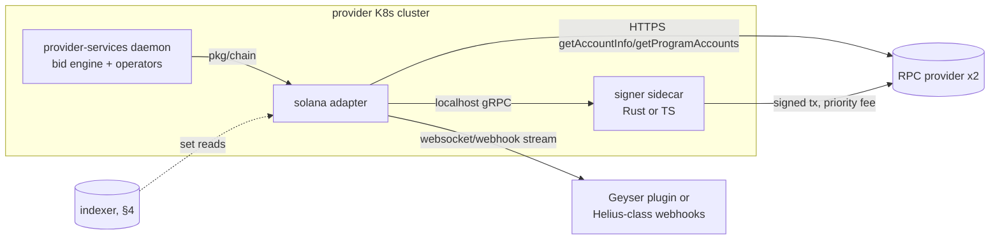

# 07. Off-chain Services & Clients

| | |
|---|---|
| **Document** | 07. Off-chain services & clients |
| **Doc ID** | AKASH-MIG-07 |
| **Version** | 0.9 (draft for review) |
| **Date** | 2026-08-10 |
| **Owner** | Overclock Labs |
| **Audience** | Vendor engineering (off-chain / infrastructure workstream) |
| **Status** | Normative where marked (MUST/SHALL); informative otherwise |

## Purpose

Specify how every off-chain component of the Akash ecosystem (the provider daemon, Console, indexers, SDKs,
CLI, wallets, explorers, RPC infrastructure, and provider/tenant authentication) is adapted to the target
chain selected at Gate 0. On-chain program/contract designs live in [03](./03-solana-architecture.md) /
[04](./04-ethereum-architecture.md); this document defines the client contracts against them.

## In scope

- Blast-radius inventory of all off-chain consumers of `akashnet-2` and their replacements.
- The `pkg/chain` adapter for provider-services, including the Solana signer sidecar (D-17).
- Provider/tenant authentication redesign (D-10) and manifest-flow invariants (D-09).
- Indexer requirements and architecture (D-16); Console/API compatibility (A-11).
- SDKs, CLI command mapping, version negotiation, wallets, explorers, RPC, fee UX, claim tooling.

## Out of scope

- Program/contract instruction-level design: [03](./03-solana-architecture.md), [04](./04-ethereum-architecture.md).
- Token claim mechanics and Merkle tree formats: [05](./05-token-migration.md).
- Archive production and old-chain data export: [06](./06-state-and-data-migration.md).
- Cutover scheduling and governance gates: [10](./10-rollout-and-cutover.md) (§9 here covers off-chain ordering only).

---

## 1. Component inventory & blast radius

Everything below currently speaks to `akashnet-2` through one of four seams: the shared Go type/client contract
(`pkg.akt.dev/go` v0.2.14, pinned in `go.mod`), CometBFT RPC/websocket events, grpc-gateway REST queries, or
the x509/JWT provider-gateway trust root. All four seams change.

| Component | What it is | What breaks | Replacement | Owner | Detail |
|---|---|---|---|---|---|
| provider-services | Go daemon (`akash-network/provider`) on the provider's Kubernetes cluster: bid engine, manifest server, lease operators | All chain I/O: tx submission, queries, CometBFT event subscriptions, x/cert lookups | `pkg/chain` adapter + per-target implementation (§2); JWT-only gateway auth (§3) | Vendor (adapter) + Overclock (release/ops) | §2, §3 |
| Console web + Console API | Tenant web app + REST API (`akash-network/console` monorepo) incl. managed wallets, trials | Wallet layer (Keplr/Leap), tx building, fee grants, indexer backend | Target-chain wallet adapters, chain-sdk v2, sponsorship service (§6) | Overclock (Vendor supplies SDK/indexer) | §5, §6 |
| Chain indexer | Console's chain scraper → Postgres (powers Console API + stats) | CometBFT block/event ingestion, bech32/txhash formats | New indexer per D-16 (§4); old DB imported read-only | Vendor build; ops per Q-07 | §4 |
| `@akashnetwork/chain-sdk` (TS) | Tenant/tooling SDK; negotiates API version via discovery (`testutil/network/rpc.go:12`) | Everything (Cosmos tx/query/proto stack) | chain-sdk v2: Codama client (Solana) / viem (EVM) (§5.1) | Vendor | §5 |
| `pkg.akt.dev/go` + `/cli` | Shared Go contract: proto types, denoms, sdkutil, entire CLI trees (`cmd/akash/cmd/root.go:69-87`) | Everything; the node repo itself consumes it | Go SDK v3 hosting `pkg/chain` types + generated bindings (§5.2) | Vendor | §5 |
| `akash` CLI | User CLI (root `akash`, env prefix `AKASH`) | All `tx`/`query`/`keys`/`events` subtrees | `akash` CLI v3 (§5.3) with command-map parity | Vendor | §5.3 |
| Wallets | Keplr, Leap (+ Ledger via them) | Chain unsupported post-halt | Phantom/Solflare/Backpack/Ledger or MetaMask/Coinbase Wallet/Rabby/Ledger (§6.1); Keplr/Leap retained for claims | Third party; integration Overclock | §6 |
| Explorers | Mintscan et al. | Coverage ends at halt H | Solscan/SolanaFM or Basescan + Console public pages; static archive explorer | Third party / Overclock | §7.1 |
| `akash-network/net` `meta.json` | Chain registry (RPC endpoints, versions, upgrade matrix) at `https://raw.githubusercontent.com/akash-network/net/master/mainnet/meta.json` | Schema is Cosmos-shaped | New schema: program/contract addresses, cluster, indexer + sponsorship URLs; on-chain `akash-config` is authoritative (§5.4) | Overclock | §5.4 |
| snapshots.akash.network | Node snapshot host (`/<network>/latest`) | No sovereign nodes to bootstrap post-halt | Serve old-chain snapshots until H+90d (D-18); then archive per 06 | Overclock | [06](./06-state-and-data-migration.md) |
| Pyth Hermes price-feeder | Off-chain pusher (`_run/node/price-feeder.sh`, `_docs/pyth-integration.md`) feeding the CosmWasm Pyth contract | Obsolete: targets read Pyth pull feeds natively (D-13, D-22) | None; settlement/BME cranks post Pyth updates in-tx (03/04) | none (retired) | [03](./03-solana-architecture.md) |
| Rosetta API | Coinbase Rosetta/Mesh endpoint wired at `cmd/akash/cmd/root.go:79` | Cosmos-specific | Dropped. Exchanges use native target-chain integrations; no Akash-specific Mesh work | none (retired) | [05](./05-token-migration.md) §exchanges |
| Discovery service | `GET /akash/discovery/v1/info` + gRPC `GetInfo`: chain_id, `min_client_version`, per-module API versions | Served by the node; node goes away | `akash-config` on-chain version registry + client-side enforcement (§5.4) | Vendor | §5.4 |

**REQ-OFF-001** Every component in the table above MUST have a named owner and a written migration plan
(issue-tracked) before Gate G2 as defined in [10](./10-rollout-and-cutover.md).

**REQ-OFF-002** After cutover C, no supported client or service may require a Cosmos dependency (bech32
parsing, CometBFT RPC, amino/proto registry) except: (a) the claim portal's old-chain proof flow (§8) and
(b) read-only archive tooling per [06](./06-state-and-data-migration.md).

**REQ-OFF-003** All off-chain components MUST treat the indexer as the only source of *historical* protocol
state, and the chain as the only *authoritative* source of live state (D-23: terminal-state accounts are
closed; events are the system of record for history).

## 2. provider-services adaptation (D-17)

provider-services is the deepest integration and the one whose failure stops the marketplace's supply side.
Design goal: the daemon's Kubernetes orchestration, bid pricing, and manifest logic remain untouched; all
chain awareness moves behind one Go interface.

### 2.1 Integration surface today

- **Reads:** grpc queries for orders/bids/leases/deployments/groups, escrow accounts/payments, provider +
  audited attributes (`x/market`, `x/deployment`, `x/escrow`, `x/provider`, `x/audit`).
- **Writes:** `MsgCreateBid` (with escrow collateral per `BidMinDeposits`), `MsgCloseBid`, `MsgWithdrawLease`
  (settle + payout), `MsgLeaseStartReclaim` (D-24), `MsgCreateProvider`/`MsgUpdateProvider`,
  `MsgAccountDeposit` (collateral top-up).
- **Events:** CometBFT websocket subscription → typed events (`pkg.akt.dev/go/sdkutil/event.go`,
  `EventTypeMessage = "akash.v1"`) → in-process pubsub bus (`pubsub/bus.go`), consumed by
  `bidengine/{service,order}.go`.
- **Auth:** x/cert server cert + client-cert validation, plus JWT (`_run/common-commands.mk:49-84` already
  exercises `--auth-type` JWT and an auth server); see §3.

### 2.2 The `pkg/chain` adapter interface

**REQ-OFF-004** The Vendor SHALL extract a chain-neutral Go package `pkg/chain` in provider-services whose
interface is the *only* path between the daemon and any chain; no target-chain SDK type may appear outside
implementations of this interface.

The normative shape (naming MAY vary; capabilities MUST NOT):

```go
type Client interface {
    Query() QueryClient
    Tx() TxClient
    // StartEvents pumps normalized events into the daemon's pubsub bus
    // (pubsub/bus.go contract) until ctx cancels; performs
    // snapshot-then-stream reconciliation (REQ-OFF-010).
    StartEvents(ctx context.Context, bus pubsub.Publisher) error
    Health(ctx context.Context) (Health, error) // head slot/block, feed lag, signer status
}

type QueryClient interface {
    // Authoritative single-entity reads (direct chain state).
    Deployment(ctx, DeploymentID) (Deployment, error)   // incl. ADR-002 manifest Hash
    Group(ctx, GroupID) (Group, error)
    Order(ctx, OrderID) (Order, error)
    Bid(ctx, BidID) (Bid, error)
    Lease(ctx, LeaseID) (Lease, error)
    EscrowAccount(ctx, EscrowAccountID) (EscrowAccount, error) // funds, depositors, settled-at
    EscrowPayment(ctx, EscrowPaymentID) (EscrowPayment, error) // rate, accrued balance, withdrawn
    Provider(ctx, Address) (Provider, error)
    AuditedAttributes(ctx, Address) ([]AuditedAttributes, error)
    // Set reads (MAY be indexer-served; used for startup reconciliation).
    OpenOrders(ctx, OrderFilter) ([]Order, error)
    OpenBids(ctx, provider Address) ([]Bid, error)
    ActiveLeases(ctx, provider Address) ([]Lease, error)
    MarketParams(ctx) (MarketParams, error) // incl. BidMinDeposits, reclamation bounds
    Balance(ctx, Address, denom string) (Coin, error)
}

type TxClient interface { // every method idempotent under retry (REQ-OFF-017)
    CreateBid(ctx, CreateBidRequest) (BidID, TxRef, error) // price, resources offer, collateral, reclamation window
    CloseBid(ctx, BidID) (TxRef, error)
    StartLeaseReclaim(ctx, LeaseID, Reason) (TxRef, error)
    SettleAndWithdraw(ctx, []LeaseID) ([]TxRef, error)     // batched earnings withdrawal
    DepositEscrow(ctx, EscrowAccountID, Coin) (TxRef, error)
    RegisterProvider(ctx, ProviderRecord, collateral Coin) (TxRef, error)
    UpdateProvider(ctx, ProviderRecord) (TxRef, error)
}
```

**REQ-OFF-005** `QueryClient` single-entity reads MUST be served from chain state (not the indexer) whenever
the result gates a funds-moving or bid decision; set reads MAY be indexer-served but MUST be verified against
chain state before acting (fetch-before-bid).

**REQ-OFF-006** Lease-creation (`MsgCreateLease` analogue) is tenant-side and is intentionally absent from
`TxClient`; the daemon only observes `LeaseCreated`. Tenant write paths live in the SDKs (§5).

**REQ-OFF-007** The adapter MUST expose escrow payment balances with enough fidelity for the daemon to
reproduce today's withdrawal scheduling (accrued-but-unwithdrawn balance per lease, per-second rate per D-21),
and `SettleAndWithdraw` MUST invoke the permissionless settle entrypoint before withdrawal.

### 2.3 Event feed and the pubsub bus contract

The in-process bus (`pubsub/bus.go`) gives the bid engine: asynchronous fan-out (a slow subscriber never
blocks publishers or peers; per-subscriber buffering), per-subscriber FIFO ordering in publish order, and
`Subscriber.Clone()` that inherits not-yet-emitted buffered events (relied on by `bidengine/{service,order}.go`
when spawning per-order monitors). The chain adapter feeds this bus.

**REQ-OFF-008** `StartEvents` MUST preserve the bus contract: events for a given entity ID are published in
on-chain order, and publishing MUST NOT block on subscriber consumption.

**REQ-OFF-009** Delivery is at-least-once; the adapter MUST de-duplicate before publishing, keyed by
`(chain_id, tx_signature|log_id, event_index)`, across reconnects and process restarts within a configurable
window (default 10 minutes).

**REQ-OFF-010** On startup or stream gap, the adapter MUST reconcile: list open orders / own open bids / own
active leases via `QueryClient`, synthesize the corresponding events into the bus, then attach the live stream
from a cursor at or before the snapshot point (overlap de-duplicated per REQ-OFF-009).

**REQ-OFF-011** Event mapping MUST cover at least the following (full protocol event inventory in
[14](./14-appendix-protocol-mapping.md)):

| pubsub bus event (daemon) | Cosmos source today | Solana source | EVM source |
|---|---|---|---|
| `OrderCreated` / `OrderClosed` | `akash.market.v1.EventOrderCreated/Closed` | `akash-market` CPI events `OrderCreated/Closed` | `Marketplace` logs `OrderCreated/Closed` |
| `BidCreated` / `BidClosed` | `EventBidCreated/Closed` | `BidCreated/Closed` | `BidCreated/Closed` |
| `LeaseCreated` / `LeaseClosed` | `EventLeaseCreated/Closed` | `LeaseCreated/Closed` | `LeaseCreated/Closed` |
| `LeaseReclaimStarted` | `EventLeaseReclaimStarted` | `LeaseReclaimStarted` | `LeaseReclaimStarted` |
| `DeploymentUpdated` (manifest hash) | `akash.deployment.v1.EventDeploymentUpdated` | `akash-deployment` `DeploymentUpdated` | `DeploymentRegistry` `DeploymentUpdated` |
| `DeploymentClosed` | `EventDeploymentClosed` | `DeploymentClosed` | `DeploymentClosed` |
| `GroupPaused/Started/Closed` | `EventGroupPaused/Started/Closed` | group events | group events |
| `EscrowPaymentOverdrawn` | none today (x/escrow emits no events; surfaced via market hooks) | `akash-escrow` `PaymentOverdrawn` | `EscrowVault` `PaymentOverdrawn` |
| `ProviderUpdated` | `akash.provider.v1beta4.EventProviderUpdated` | `akash-provider-registry` event | `ProviderRegistry` log |

**REQ-OFF-012** The target programs/contracts MUST emit explicit escrow settlement/overdraw events (closing
today's gap where escrow state changes are only observable via market hooks); the adapter maps them to
`EscrowPaymentOverdrawn`/`EscrowAccountClosed` bus events.

### 2.4 Solana specifics



**Read path.** Indexer-fed stream + webhook/Geyser events for reactivity; direct `getAccountInfo` /
`getMultipleAccounts` (Borsh-decoded via generated layouts) for authoritative checks before any bid or
withdrawal decision; `getProgramAccounts` with discriminator+owner memcmp filters for startup reconciliation
when the indexer is down.

**REQ-OFF-013** The Solana adapter MUST make bid decisions on state read at `confirmed` commitment or stronger
and MUST record the observed slot; funds-withdrawal accounting MUST be confirmed at `finalized` (~12.8 s
pre-Alpenglow as of 2026-08; re-verify under A-13) before being marked complete in daemon state.

**Write path.** Two candidate implementations; decision at Gate G1 after the Q-15 prototype:

1. **Pure Go:** tx assembly/signing via a Go Solana client (`gagliardetto/solana-go` is the de-facto library;
   FROM-TRAINING; `[TO-VERIFY: solana-go maintenance status and current-RPC compatibility at kickoff]`),
   including compute-budget instructions and priority fees.
2. **Signer sidecar (default plan of record):** a co-located Rust or TypeScript service using first-party
   SDKs, running in the daemon pod, speaking gRPC on localhost/UDS.

**REQ-OFF-014** If the sidecar is used, its API SHALL be:

```proto
service AkashSigner {
  rpc SignAndSend(SignAndSendRequest) returns (SignAndSendResponse);
  rpc Simulate(SimulateRequest) returns (SimulateResponse);
  rpc PublicKeys(Empty) returns (PublicKeysResponse);   // operator pubkeys available
  rpc Health(Empty) returns (HealthResponse);           // RPC lag, blockhash freshness, key status
}
message SignAndSendRequest {
  bytes  ix_batch = 1;            // serialized instruction list: (program_id, accounts, data)[]
  string dedup_key = 2;           // caller-generated; result cached >=24h (REQ-OFF-017)
  PriorityFeePolicy fee = 3;      // AUTO_PERCENTILE{percentile, default p75} | FIXED; max_lamports_per_cu cap mandatory
  uint32 cu_limit = 4;            // 0 => simulate and set with 20% headroom
  repeated string lookup_tables = 5;
  Commitment wait_for = 6;        // PROCESSED | CONFIRMED | FINALIZED
}
message SignAndSendResponse { string signature = 1; uint64 slot = 2; Status status = 3; string error = 4; }
// Status: CONFIRMED | FAILED | EXPIRED | DUPLICATE (dedup_key hit)
```

**REQ-OFF-015** Sidecar key custody: private keys MUST never leave the sidecar process; supported backends are
an encrypted file keystore (default) and a remote-signer/HSM backend; the sidecar MUST enforce a program-ID
allowlist (Akash programs + compute-budget + token programs only), MUST reject bare SOL/token transfer
instructions above a configured per-24h budget, and MUST bind to localhost/UDS with an auth token shared with
the daemon.

**REQ-OFF-016** The sidecar MUST implement rebroadcast-until-expiry: re-send the *identically signed*
transaction until the blockhash expires (150-block validity, ~60–90 s), then surface `EXPIRED` rather than
silently re-signing with a fresh blockhash (the daemon decides to retry, engaging REQ-OFF-017).

**Event feed.** Primary: managed webhook/stream service (Helius-class) filtered on Akash program IDs;
secondary: self-run Agave node with a Geyser plugin (shared with the indexer, §4.2). Both normalize Anchor CPI
events (03 mandates `emit_cpi!` so events survive log truncation) into §2.3 bus events.

### 2.5 Ethereum specifics

- **Bindings:** `abigen`-generated Go bindings from the audited ABIs ([04](./04-ethereum-architecture.md)),
  versioned with the contracts and consumed by CI.
- **Reads:** `eth_call` against `latest` for reactive checks; balance/withdrawal accounting at the `safe` tag.
  Some candidate host chains offer sub-second effective confirmations (e.g. ~200 ms on Base via Flashblocks, as of 2026-08).
- **Events:** `eth_subscribe` logs over websocket with an `eth_getLogs` polling fallback; the adapter emits bus
  events only after a configurable confirmation depth (default 4 blocks) and MUST handle reorg rollback by
  re-checking receipts before funds actions (bus events are never retracted; daemon actions stay idempotent).
- **Write path:** a single-sender goroutine per operator key with a nonce manager and stuck-tx gas
  replacement; parallel throughput via multiple registered operator keys (§3.4), not nonce gymnastics.

### 2.6 Retry, idempotency, ordering

Today the chain runs with **unordered transactions enabled** (`authkeeper.WithUnorderedTransactions(true)`,
`app/types/app.go:279`): the daemon can fire parallel txs without sequence contention, using timeout-based
replay protection. Target equivalents:

| Property | Cosmos today | Solana | EVM |
|---|---|---|---|
| Replay protection | account sequence, or unordered+timeout | (message, recent_blockhash) signature uniqueness | strict per-account nonce |
| Parallel submission | native (unordered) | native | needs nonce manager or multiple keys |
| Safe rebroadcast | same tx bytes | same signed tx until blockhash expiry | same nonce, replace-by-fee |
| Duplicate-effect guard | sequence | state-level: PDA per entity | state-level: revert on exists |

**REQ-OFF-017** Every `TxClient` method MUST have at-most-once *effect* semantics under arbitrary retries and
process crashes, achieved by (a) a client-generated `dedup_key` cached by the sidecar/sender, (b) state-level
idempotency (e.g. `CreateBid` derives the bid PDA / storage key from `(order_id, provider)` so a duplicate
lands on "already exists", which the adapter MUST map to success-with-existing-ID) and (c) a durable local
intent journal replayed on startup: journal entry written before first broadcast, resolved by checking chain
state, never by assuming.

**REQ-OFF-018** The bid engine's end-to-end reaction budget (order event on chain to bid transaction
broadcast) MUST be ≤ 2 s p95 on Solana and ≤ 5 s p95 on the host chain under nominal load (verified in
[09](./09-testing-and-verification.md) load tests). The indexer MUST NOT be in this critical path.

### 2.7 Provider hot-key management

**REQ-OFF-019** provider-services MUST support: (a) encrypted file keystore (default; parity with the current
Cosmos keyring file backend), (b) a remote-signer/HSM option via the sidecar backend (REQ-OFF-015), and
(c) split identity: the provider's on-chain owner authority (cold key, used for registration/collateral/key
rotation) MUST be distinct from operational hot keys used for bids/withdrawals, per §3.4.

**REQ-OFF-020** Operational accounts MUST work with a bounded float: earnings withdrawals pay to a configured
payout address (cold), and documentation MUST instruct providers to fund hot keys only with gas/rent working
capital from a treasury account (recommended auto-top-up with a cap, alerting below N days of runway).

## 3. Provider & tenant authentication (D-10)

### 3.1 Today

Two mechanisms coexist. x/cert is NOT ported (D-10); the JWT direction is completed and generalized.

- **On-chain x509 (x/cert) + mTLS.** Tenants and providers publish self-signed certs on chain
  (`MsgCreateCertificate`; detail in [01](./01-current-architecture.md)); the provider gateway presents its
  chain-registered server cert and validates tenant client certs against chain state
  (`x/cert/utils/key_pair_manager.go` `Generate(notBefore, notAfter, domains)`; `x/cert/utils/utils.go`
  `LoadAndQueryCertificateForAccount`). The chain is the trust root; there is no CA.
- **Off-chain JWT.** `akash auth jwt --exp --nbf --access --scope` (`cmd/akash/cmd/auth.go:34-152`) mints
  ES256K tokens signed by the tenant's keyring key via `pkg.akt.dev/go/util/jwt`. Claims: `iss` = tenant
  address, `version: "v1"`, `leases.access ∈ full|scoped|granular`, `leases.scope` from the fixed set
  `send-manifest, get-manifest, logs, shell, events, status, restart, hostname-migrate, ip-migrate,
  attestation`, plus per-deployment `permissions[{provider, access, scope, dseq/gseq/oseq, services}]` for
  granular access. Verification is provider-side only (no on-chain JWT state). A wallet-signed variant already
  exists (`SigningMethodES256KADR36`, `pkg.akt.dev/go/util/jwt/es256kadr36.go`), a precedent for the target design.

### 3.2 Provider gateway identity (server side)

**REQ-OFF-021** The provider gateway MUST serve TLS with one of: (a) an ordinary web-PKI certificate for the
hostname in the provider's registered `host_uri` (e.g. ACME/Let's Encrypt), or (b) a self-signed certificate
whose SPKI SHA-256 hash is registered in the provider's on-chain provider-registry record.

**REQ-OFF-022** Clients (Console, SDKs, CLI) MUST verify provider gateways as follows: fetch the provider
record from chain/indexer; if `tls_spki_hashes` is non-empty, require a pinned match; else require standard
web-PKI validation of `host_uri`'s hostname. Trust-on-first-use is prohibited.

**REQ-OFF-023** The provider-registry record ([03](./03-solana-architecture.md)/[04](./04-ethereum-architecture.md))
MUST support at least 2 concurrently valid `tls_spki_hashes` entries so certificate rotation is hitless
(add new, roll gateway, remove old).

### 3.3 Tenant credentials (client side): wallet-signed JWT

Tenant mTLS client certificates are replaced by bearer JWTs presented to the provider gateway over TLS. The
claims schema carries over from v1 with `version: "v2"` and target-native issuer formats.

**REQ-OFF-024** Providers MUST accept JWTs with: registered claims `iss` (tenant address in target-native
format), `iat`, `nbf`, `exp`; and Akash claims `version`, `leases.access`, `leases.scope`,
`leases.permissions` semantically identical to the current `pkg.akt.dev/go/util/jwt` schema (scope names
unchanged). CLI/SDK flag surface MUST mirror today's `--exp/--nbf/--access/--scope`.

**REQ-OFF-025** Signature algorithms: Solana uses EdDSA (Ed25519) where `iss` is the base58 public key
(address = key, no chain lookup needed). EVM uses EIP-191 `personal_sign` recovery (compact secp256k1 with
recovery id; header `alg: "ES256K-R"`), with ERC-1271 contract-signature verification supported for smart
accounts (EIP-4337/EIP-7702). Providers MUST reject `alg: none` and any alg not in this set.

**REQ-OFF-026** Two issuance modes MUST be supported: (a) **offline-signed token**, in which the CLI/SDK signs the JWT
directly with a local key (headless automation; parity with `akash auth jwt`); (b) **interactive challenge**, in which
the provider gateway (or Console acting for it) issues a SIWS/SIWE-style human-readable challenge (domain,
address, nonce, expiry); the wallet signs it; the verifier accepts the signed challenge as a short-lived
session credential with the same scope fields. Mode (b) exists because browser wallets render raw JWS signing
inputs as opaque bytes.

**REQ-OFF-027** Providers MUST enforce `exp`/`nbf` with ≤ 30 s clock-skew tolerance, MUST bound token lifetime
(accept `exp - iat ≤ 24 h`; default issuance remains 15 m), and MUST scope-check every gateway route against
`leases.access/scope/permissions` exactly as the current JWT middleware does.

**REQ-OFF-028** Authorization derives from on-chain lease state: a token proves key possession; the gateway
MUST additionally verify that `iss` owns the deployment/lease being accessed (live chain read or indexer +
chain confirm), as today.

### 3.4 Provider operator keys: registration and rotation

**REQ-OFF-029** The provider-registry record MUST hold a set of registered operator signing keys (pubkey,
purpose, added-at, revoked-at), authorized to submit bids, withdrawals, and reclamation for that provider;
adding/revoking keys requires the owner authority. At least 2 concurrent active keys MUST be supported
(rotation without downtime); revocation MUST take effect at the next instruction/call that validates the key set.

**REQ-OFF-030** Gateway responses that clients rely on for provider authenticity (e.g. attestation endpoints)
MUST be signed by a registered operator key, and clients MUST verify against the registry.

### 3.5 Manifest flow invariance (D-09, A-10)

The SDL and manifest never lived on chain; only the manifest hash does (`Deployment.Hash`). Flow (tenant
sends manifest to provider gateway (`send-manifest`), provider hashes and compares with the on-chain
deployment hash) is unchanged.

**REQ-OFF-031** Manifest hashing MUST remain byte-identical to ADR-002: version = SHA-256 of the sorted-JSON
manifest serialization (`_docs/adr/adr-002-manifest-v2beta2.md:16`, reference implementation in
`pkg.akt.dev/go` manifest v2beta2). The target chain's deployment record stores the same 32-byte value, and
cross-implementation test vectors (Go, TS, Rust/Solidity where hashes are checked on-chain) MUST pass
identical digests in [09](./09-testing-and-verification.md).

**REQ-OFF-032** SDL parsing MUST continue to use the existing SDL libraries (`pkg.akt.dev/go/sdl` v0.2.2 line
and the TS equivalent) with no schema change (D-09); any serialization change is a breaking protocol change
requiring client sign-off.

## 4. Indexing (D-16)

### 4.1 Requirements (target-neutral)

**REQ-OFF-033** Completeness: the indexer MUST capture 100% of protocol events emitted by Akash
programs/contracts from deployment slot/block zero, with at-least-once ingestion and idempotent upserts keyed
by `(chain_id, tx_signature|log_id, event_index)`; a full re-index from origin MUST be reproducible and MUST
converge to the same database state (checksummed in CI).

**REQ-OFF-034** Correctness: the indexer MUST NOT surface non-canonical data. Solana: ingest at `confirmed`,
mark rows final at `finalized`/rooted, tolerate skipped slots (slot numbers are non-contiguous) and webhook
gaps (backfill via `getSignaturesForAddress`); EVM: track block-hash parent links and roll back on reorg
before re-emitting.

**REQ-OFF-035** Freshness: event-on-chain to queryable-in-API MUST be ≤ 2 s p95 (Solana) / ≤ 4 s p95 (EVM host chain).
This budget serves Console UX and provider set-reads; the bid engine does not depend on it (REQ-OFF-018).

**REQ-OFF-036** The indexer MUST expose (a) the Console API REST shapes (§4.4) and (b) a streaming endpoint
(websocket/SSE) of normalized protocol events for adapter/Console consumption.

### 4.2 Solana specifics

Two interchangeable ingestion frontends, both normatively supported: (a) a Geyser plugin on a self-run Agave
node (account updates + tx notifications filtered to Akash program IDs); (b) a managed webhook/stream provider
(Helius-class). Pipeline: ingestion → Anchor event/account decoder (from IDL) → Postgres. Run (b) primary and
(a) as sovereignty fallback, or inverse per Q-07 operational ownership.

### 4.3 Ethereum specifics

Ponder-class self-hosted indexer over the contract ABIs. **Note:** the Ponder team joined Monad in 2026-02
(roadmap-capture risk, as of 2026-08); the Vendor MUST evaluate Subsquid and Envio as alternates at kickoff
and pick per maintenance status. The Graph is acceptable only for public composability, not as the Console
backend (self-hosted requirement, Q-07).

### 4.4 Schema & API compatibility (A-11)

**REQ-OFF-037** The new indexer MUST serve the existing Console API response shapes (endpoints, field names,
pagination) for all marketplace resources, with exactly two sanctioned deltas: address format and tx-hash
format. Chain-specific endpoints without a successor concept (validators, staking, Cosmos gov,
blocks-by-height) are frozen on the archive API and excluded from the new API.

**REQ-OFF-038** Format versioning strategy: the API is namespaced `/v1` (frozen, old-chain archive, bech32
`akash1…` + uppercase-hex tx hashes) and `/v2` (target-native: base58 addresses + base58 signatures on Solana;
EIP-55 `0x…` + `0x` tx hashes on EVM). Every `/v2` record carries a `chain_id` discriminator. Clients MUST NOT
be required to parse both formats within one namespace.

### 4.5 Historical continuity across the migration

**REQ-OFF-039** The old-chain indexer database (exported per [06](./06-state-and-data-migration.md)) MUST be
imported read-only so Console renders continuous history: a tenant or provider sees `akashnet-2`
deployments/leases (badged as archived) alongside target-chain activity. Old records retain old identifiers;
no address rewriting.

**REQ-OFF-040** Cross-chain identity join: because S1 claims publicly bind old→new addresses on chain
([05](./05-token-migration.md)), the indexer MAY offer an opt-in mapping so "my history" spans both chains for
claimed addresses; the join table MUST be rebuildable from on-chain claim events only.

## 5. SDKs & CLI

### 5.1 TypeScript: `@akashnetwork/chain-sdk` v2

**REQ-OFF-041** chain-sdk v2 (same package, breaking major) MUST provide: for Solana, a Codama-generated client
from the Anchor IDLs on `@solana/kit`; for EVM, `viem` with generated typed ABIs. The high-level API (create/close
deployment from SDL, list bids, create lease, send manifest, JWT issuance per §3.3) MUST be preserved so
Console's migration is primarily dependency injection. Historical list operations route to the indexer `/v2`
API (REQ-OFF-003); SDL handling is unchanged.

### 5.2 Go SDK

**REQ-OFF-042** A successor Go module to `pkg.akt.dev/go` MUST host: the chain-neutral protocol types and IDs,
the `pkg/chain` adapter interfaces (§2.2, shared verbatim with provider-services), the Solana implementation
(generated Borsh account/event codecs from the IDL; instruction builders; `[TO-VERIFY: anchor-go generator
maturity at kickoff]`), the EVM implementation (abigen), the JWT package (§3.3 algorithms), and the SDL
package unchanged.

### 5.3 `akash` CLI v3 command mapping

Today's `query`/`tx`/`keys`/`events` trees live in `pkg.akt.dev/go/cli` v0.2.4 (`cmd/akash/cmd/root.go:69-87`).
CLI v3 keeps verbs and UX (dseq/gseq/oseq flags, SDL input) per D-09.

| # | Today (akashnet-2) | CLI v3 | Notes |
|---|---|---|---|
| 1 | `akash keys add <name>` | `akash keys add <name>` | target-chain keystore; Ledger supported |
| 2 | `akash tx deployment create <sdl>` | `akash deployment create <sdl>` | builds create + escrow deposit; SDL unchanged |
| 3 | `akash tx deployment update <sdl>` | `akash deployment update <sdl> --dseq N` | re-hashes manifest per ADR-002 |
| 4 | `akash tx deployment close --dseq N` | `akash deployment close --dseq N` | |
| 5 | `akash tx escrow account deposit` (`MsgAccountDeposit`) | `akash escrow deposit --dseq N --amount X` | AKT or ACT; `--from-allowance` for delegated deposits (D-21) |
| 6 | `akash query deployment list --owner A` | `akash deployment list [--owner A]` | indexer-served (D-23: closed entities off-chain) |
| 7 | `akash query market order list --state open` | `akash market order list` | live from chain; historical from indexer |
| 8 | `akash query market bid list --provider P` | `akash market bid list --provider P` | |
| 9 | `akash query market lease list --provider P` | `akash market lease list --provider P` | |
| 10 | `akash tx market lease create --dseq --gseq --oseq --provider` | `akash market lease create` (same flags) | sequence UX preserved (D-09, Q-12) |
| 11 | `akash tx market lease close` | `akash market lease close` | |
| 12 | `akash tx market lease withdraw` | `akash market lease withdraw` | invokes permissionless settle first (D-21) |
| 13 | `akash tx cert generate/publish client` | **removed** | replaced by JWT (§3, D-10) |
| 14 | `akash auth jwt --exp --nbf --access --scope` | `akash auth jwt` (same flags) | EdDSA (Solana) / ES256K-R (EVM) |
| 15 | `akash tx provider create provider.yaml` | `akash provider register provider.yaml --collateral X` | plus `akash provider migrate` wizard (§8) |
| 16 | `akash events` | `akash events tail [--filter ...]` | indexer stream, not CometBFT websocket |
| 17 | `akash status` | `akash net status` | reads `akash-config` + RPC health |

**REQ-OFF-043** CLI v3 MUST implement the table above; removed commands MUST exit non-zero with a migration
message naming the replacement, not fail with "unknown command", for one major release.

### 5.4 Version negotiation: discovery-service replacement

Today clients negotiate against the node's Discovery service (`GET /akash/discovery/v1/info`, gRPC
`akash.discovery.v1.Discovery/GetInfo`, CometBFT RPC method `"akash"`): `chain_id`, `node_version`,
**`min_client_version`**, per-module API version maps; chain-sdk hard-depends on it (`testutil/network/rpc.go:12,26`).

**REQ-OFF-044** The `akash-config` program/contract MUST publish: schema version, program IDs/contract
addresses, protocol API version, `min_client_version`, and feature flags; mutable only via governance (D-11).

**REQ-OFF-045** All first-party clients (chain-sdk, Go SDK, CLI, provider-services) MUST read `akash-config`
at startup and refuse to operate (hard fail with upgrade instructions) when their own version is below
`min_client_version`, preserving today's forced-upgrade lever client-side, since no node exists to reject old
clients.

**REQ-OFF-046** Off-chain mutable metadata (RPC endpoints, indexer URL, sponsorship URL, claim-portal URL)
MUST be published as a versioned JSON schema in `akash-network/net` (successor to `mainnet/meta.json`);
`akash-config` prevails on conflicts for on-chain facts.

## 6. Console & fee UX

### 6.1 Wallet support matrix (launch targets; re-verify per [13](./13-open-questions-and-assumptions.md) §4)

| Wallet | Path | Tx signing | Message signing (JWT/SIWx, §3.3) | Ledger | Tier |
|---|---|---|---|---|---|
| Phantom | Solana | yes | `signMessage` | passthrough | 1 |
| Solflare | Solana | yes | yes | passthrough | 1 |
| Backpack | Solana | yes | yes | `[TO-VERIFY: Backpack Ledger passthrough status]` | 2 |
| Ledger (native app) | Solana | yes; program txs may require blind signing | via host wallet | none | 1 |
| MetaMask | EVM | yes | `personal_sign`/EIP-712 | passthrough | 1 |
| Coinbase Wallet | EVM | yes | yes (ERC-1271 for smart wallet) | no | 1 |
| Rabby | EVM | yes | yes | passthrough | 2 |
| Keplr / Leap | old chain only | wind-down ops until H | ADR-36 (claim proofs, §8) | yes | claims only |

**REQ-OFF-047** Console MUST integrate wallets via the standard discovery layers (Wallet Standard on Solana;
EIP-6963 on EVM) rather than per-wallet adapters, with Tier-1 wallets explicitly QA'd each release.

### 6.2 Managed-wallet users (Q-14)

**REQ-OFF-048** Console's managed/custodial wallet balances (keys operated by Overclock) SHALL be migrated
custodially at S1 exactly like an exchange swap ([05](./05-token-migration.md)): Overclock claims in bulk from
its custodial addresses and credits users on new-chain custodial wallets, with no user action and an audit
trail reconciling per-user balances pre/post swap. Mechanics and comms are Q-14 (owner: Console team, needed
by G2).

### 6.3 Fee sponsorship service (Q-07) and trials

Today Console sponsors trial/UX costs via `feegrant` (tx fees) and authz deposit grants (escrow deposits,
`x/escrow/keeper/keeper.go:190-280`). Targets:

- **Solana:** a fee-payer relayer (Octane-style; FROM-TRAINING): Console API co-signs transactions as
  `fee_payer` when policy passes. The Solana base fee is 5,000 lamports/signature (≈ $0.00075 as of 2026-08), so cost is
  dominated by abuse control, not fees.
- **EVM:** an ERC-4337 verifying paymaster (plus EIP-7702 delegation for EOAs) with the same policy service;
  generic ERC-20 and issuer stablecoin paymasters (e.g. Circle Paymaster for USDC) are production-normal as of 2026-08.

**REQ-OFF-049** The sponsorship service MUST enforce: instruction/call allowlist (Akash programs/contracts
only, no bare transfers), per-address and per-IP rate limits, per-address daily spend caps, global budget
circuit breaker, and denylist hooks; every sponsored tx MUST be attributable in logs for ≥ 90 days.

**REQ-OFF-050** Escrow deposit sponsorship MUST use the on-chain delegated-deposit allowance (D-21) so refunds
restore the sponsor's allowance (preserving today's grant-restore-on-refund semantics that Console trial
economics depend on).

**REQ-OFF-051** The existing trial flow (no-crypto start, sponsored deployment, upgrade to self-funded) MUST
be preserved end-to-end on the target chain using the above primitives; settlement-stablecoin payment
paths (D-14) MUST be first-class in Console pricing and top-up UX.

## 7. Explorers & public infrastructure

### 7.1 Explorer strategy

**REQ-OFF-052** Generic chain explorers suffice for transactions/balances: Solscan/SolanaFM (Solana) or
the host chain's canonical explorer (e.g. Basescan on Base or Arbiscan on Arbitrum One); all programs MUST
publish IDLs on-chain and all contracts MUST be source-verified so explorer
decoding works. Domain objects (deployments/orders/leases/providers) are served by public, unauthenticated
Console pages backed by the indexer; the "marketplace explorer" is a Console surface, not a separate product.
Mintscan coverage ends at halt H; the static archive explorer is specified in
[06](./06-state-and-data-migration.md) (D-18).

### 7.2 RPC strategy

**REQ-OFF-053** Production services (Console, indexer, sponsorship, claim portal) MUST run against ≥ 2
independent commercial RPC providers with client-side failover and per-provider health metrics;
provider-services documentation MUST ship the same dual-endpoint guidance. Solana SHOULD additionally run one
self-operated Agave node with the Geyser plugin (indexer sovereignty, §4.2); EVM equivalently MAY run a
host-chain full node. Vendor selection and SLAs are a kickoff task (volatile facts,
[13](./13-open-questions-and-assumptions.md) §4); operational ownership is Q-07.

### 7.3 Status page & public API limits

**REQ-OFF-054** A public status page MUST cover: RPC providers (per-provider), indexer ingest lag, Console
API, sponsorship relayer, claim portal, and (until H) old-chain wind-down services.

**REQ-OFF-055** Public indexer/Console API endpoints MUST publish documented rate limits (anonymous + keyed
tiers) and return standard rate-limit headers; limits MUST at least match today's Console API tiers.

## 8. Claim portal & migration UX tooling

Claim mechanics (Merkle trees, S1/S2, residuals) are in [05](./05-token-migration.md); this covers the tooling.

**REQ-OFF-056** A web claim portal MUST support: prove old-chain ownership by ADR-36 offline signature via
Keplr/Leap (Ledger included) over a challenge that binds the target-chain recipient address; submit the Merkle
claim on the target chain (sponsored via §6.3 so claimants need no gas); show claim status/history per
address, including weekly residual distributions during C→H (D-05).

**REQ-OFF-057** A headless CLI claim path (`akash claim`) MUST exist for providers, exchanges, and scripted
treasuries: reads the old key from a Cosmos keyring, signs the same challenge format as the portal, submits
via RPC; supports multisig owners `[TO-VERIFY: ADR-36 multisig signing support in current Keplr/CLI tooling]`.

**REQ-OFF-058** Provider re-registration wizard: `akash provider migrate` MUST, in one command: read the
operator's provider record and audited attributes from the [06] archive (or live old chain pre-halt), prefill
the target `ProviderRecord` (attributes, `host_uri`, contact info), prompt for collateral (Q-08) and operator
keys (§3.4), register on the target chain, and print the §3.2 TLS anchoring choices. It MUST be idempotent
(safe re-run resumes). Audit attestations do NOT carry over automatically: auditors re-sign on the target
chain; the wizard MUST emit a re-audit request artifact.

## 9. Off-chain cutover choreography

Authoritative schedule and gates in [10](./10-rollout-and-cutover.md); off-chain ordering constraints:

| Stage | Off-chain actions |
|---|---|
| Pre-launch | Indexer + RPC contracts live against testnet, then mainnet programs at launch L; claim portal and sponsorship staged; chain-sdk v2 / CLI v3 / Go SDK released |
| L → C (launch → cutover) | provider-services GA (adapter + JWT auth); providers re-register (§8 wizard) and serve the new chain; Console dual-stack: both chains visible, new chain becomes the default deploy target, old-chain deploys behind an end-of-life warning |
| C (=S1) | Old chain enters sunset (D-18): Console switches old chain to read-only + wind-down actions (close/withdraw/deposit top-up only); claims open; old-chain indexer keeps ingesting |
| C → H | Dual-stack steady state: wind-down dashboard (old leases, residual distributions); weekly residual claims surfaced in portal |
| H (=S2) | Old-chain reads flip to the imported archive (§4.5); old RPC/indexer/snapshots decommission per D-18 at H+90d |

**REQ-OFF-059** Deploy order MUST be: indexer + RPC infra → programs/contracts (mainnet launch L) →
provider-services GA and provider re-registration → Console target-chain default. No stage may go live before
its predecessor passes the [09](./09-testing-and-verification.md) acceptance gate.

**REQ-OFF-060** During L→H, provider-services MUST support one daemon instance per chain running concurrently
against the same Kubernetes cluster with disjoint cluster resource naming (namespaces/ingress derived from
lease IDs MUST NOT collide across chains; verified in 09 dual-stack tests).

**REQ-OFF-061** Console MUST render old-chain data read-only from C onward, with wind-down actions (close,
withdraw, top-up) as the only old-chain writes, matching the sunset msg allow-list (D-18, Q-17).

**REQ-OFF-062** All first-party clients released for the migration MUST carry both-chain configuration until
H, selected via the `akash-config`/net-registry metadata (§5.4), so a single release serves the full wind-down
window.

---

## Cross-references

- [01. Current architecture](./01-current-architecture.md): module/state detail behind §1–§3.
- [03. Solana architecture](./03-solana-architecture.md) / [04. Ethereum architecture](./04-ethereum-architecture.md): programs/contracts, event emission, `akash-config`.
- [05. Token migration](./05-token-migration.md): claims consumed by §8; exchange/custodial swaps (§6.2).
- [06. State & data migration](./06-state-and-data-migration.md): archives imported in §4.5; provider record source for §8.
- [10. Rollout & cutover](./10-rollout-and-cutover.md): gates and calendar for §9.
- [13. Open questions](./13-open-questions-and-assumptions.md): Q-07, Q-12, Q-14, Q-15, Q-16, Q-18; volatile-fact list.
- [14. Appendix: protocol mapping](./14-appendix-protocol-mapping.md), the full event/msg/query mapping backing §2.3 and §5.3.

## Feeds into

- [08. Security & audits](./08-security-and-audits.md): sidecar custody (REQ-OFF-015), JWT verification (§3), sponsorship abuse controls (REQ-OFF-049).
- [09. Testing & verification](./09-testing-and-verification.md): every REQ-OFF acceptance test; latency budgets (REQ-OFF-018/035), hash vectors (REQ-OFF-031), dual-stack tests (REQ-OFF-060).
- [10. Rollout & cutover](./10-rollout-and-cutover.md): §9 stage ordering constraints.
- [11. Scope of work](./11-scope-of-work.md): off-chain workstream deliverables (adapter, sidecar, indexer, SDKs, CLI, portal).
