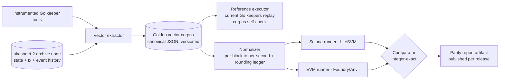

# 09. Testing & Verification

| | |
|---|---|
| **Document** | 09. Testing & verification |
| **Doc ID** | AKASH-MIG-09 |
| **Version** | 0.9 (draft for review) |
| **Date** | 2026-08-10 |
| **Owner** | Overclock Labs |
| **Audience** | Vendor engineering, Vendor QA, Akash core team, auditors |
| **Status** | Normative where marked (MUST/SHALL); informative otherwise |

## Purpose

Define the complete verification program for the migration: layered test strategy, the differential
("parity") harness against current-chain behavior, property/fuzz/invariant suites, integration
environments, the public testnet program, migration rehearsals, load/performance targets, CI/release
engineering, and the acceptance/traceability machinery that gates every milestone. The central
thesis: this program migrates a live economy, so **behavioral equivalence with `akashnet-2` is the
primary acceptance criterion**, proven by replaying recorded history, not argued from code review.

## In scope

- Test layers, tooling, and ownership for both candidate target paths (D-01; selected at Gate 0).
- The golden-vector differential harness against recorded `akashnet-2` behavior.
- Integration localnet definition and the numbered scenario catalog (PR gate).
- Public testnet phases, migration rehearsals, load/perf targets, CI/release gates, traceability.

## Out of scope

- Audit scope, bug-bounty terms, incident response: [08. Security & audits](./08-security-and-audits.md).
- Snapshot/export/transform pipeline design: [06. State & data migration](./06-state-and-data-migration.md) (this doc verifies it).
- Gate definitions and the cutover runbook: [10. Rollout & cutover](./10-rollout-and-cutover.md) (this doc supplies their testing exit criteria).
- Team sizing and QA workstream staffing: [11. Scope of work](./11-scope-of-work.md).

---

## 1. Test strategy overview

The current chain ships test infrastructure the Vendor should mine, not discard: Go keeper unit
tests (`make test`), tagged integration tests (`make test-integration`, tag `e2e.integration` over
`tests/e2e/...`), full-app simulations (`make test-sims`), an upgrade-rehearsal harness that
testnetifies real mainnet snapshots (`tests/upgrade`, `script/upgrades.sh`, tag `e2e.upgrade`;
`akash in-place-testnet` from `cmd/akash/cmd/testnetify/`, `app/testnet.go`), and a scripted
localnet under `_run/`. Keeper tests and testnetify tooling feed layers L4 and L7 directly.

**REQ-TST-001** The Vendor MUST implement the nine-layer verification program in Table 1; no layer
MAY be skipped for the target selected at Gate 0 (gates per [10](./10-rollout-and-cutover.md)).

Table 1. Test layers, tooling, ownership:

| # | Layer | Purpose | Solana tooling | EVM tooling | Owner | Cadence |
|---|---|---|---|---|---|---|
| L1 | Unit | Instruction/function correctness, error paths | LiteSVM (in-process SVM) + Mollusk (instruction harness, CU metering); Anchor test suites | Foundry `forge test` | Vendor protocol team | Every PR |
| L2 | Property / fuzz / invariant | Randomized state machines against invariants (§3) | proptest/cargo-fuzz driving LiteSVM/Mollusk state machines | Foundry fuzz + invariant testing | Vendor protocol team | PR (bounded) + nightly + weekly deep |
| L3 | Integration (full-stack localnet) | Cross-program flows + off-chain stack (§4) | solana-test-validator / Surfpool localnet + cranks + indexer + provider adapter | Anvil + keeper automation mocks + indexer + provider adapter | Vendor QA | Every PR (subset), nightly (full) |
| L4 | Differential vs current chain | Golden-vector replay of recorded `akashnet-2` behavior (§2) | Vector runner over LiteSVM | Vector runner over Foundry/Anvil | Vendor QA + Overclock counterpart | PR (core subset) + nightly (full corpus) |
| L5 | Fork / mainnet-sim | New programs against real deployed dependencies (Pyth, the settlement stablecoin, Squads/Safe, Realms/Governor) on forked target-chain state | Surfpool mainnet fork; bankrun for fast fork-level JS tests | Anvil `--fork-url` (host chain) | Vendor QA | Nightly + pre-release |
| L6 | Public testnet | Real providers, real hardware, real wallets (§5) | Solana devnet/testnet deployment | Host-chain public testnet (e.g. Base Sepolia or Arbitrum Sepolia) | Vendor + community providers | Continuous from M-phase per [11](./11-scope-of-work.md) |
| L7 | Migration rehearsals | Full dry-runs of S1/S2 pipeline + cutover runbook on forked mainnet state (§6) | testnetify (`in-place-testnet`) old chain + target-chain rehearsal deploys | same | Vendor + Overclock, observed by community | R1–R3 pre-G3, plus R4 final dress at S1−14d ([10](./10-rollout-and-cutover.md)) |
| L8 | Chaos / load | Throughput, latency, congestion, fault injection (§7) | Load generator + Surfpool/testnet congestion sims | Load generator + Anvil/testnet fee sims | Vendor infra + QA | Weekly from feature-complete; pre-gate |
| L9 | Audits as verification | External audits + bounty converted into executable regressions | per [08](./08-security-and-audits.md) | per [08](./08-security-and-audits.md) | Auditors + Vendor | Per audit window |

**REQ-TST-002** All test code, vectors, harnesses, and CI definitions MUST live in the protocol
monorepo (or pinned submodules) and MUST be deliverables of the engagement: reviewable, runnable by
Akash without Vendor infrastructure.

**REQ-TST-003** Each layer MUST have a named owner on the Vendor side; the Vendor MUST staff a test
lead (see [11](./11-scope-of-work.md) RACI) accountable for the traceability matrix (§9).

**REQ-TST-004** Layers L1–L4 artifacts (vector corpus, scenario catalog, invariant definitions) MUST
be target-neutral in specification form so that the non-selected path's suites remain executable
until Gate 0 ratifies D-01; after Gate 0 only the selected target's suites are maintained.

**REQ-TST-005** Every externally reported defect (audit finding, bounty submission, testnet bug)
MUST gain a failing regression test before its fix is merged, tagged with the finding ID from
[08](./08-security-and-audits.md).

---

## 2. Differential (parity) testing against the current chain

This is the signature element of the program. Rewriting ~10 modules of settled economic logic
(escrow streaming, FIFO refunds, overdrawn debt, BME queue/circuit-breaker; see
[01](./01-current-architecture.md)) invites silent divergence. The defense is a **golden-vector
harness**: recorded input→outcome traces from the current implementation and from `akashnet-2`
mainnet itself, replayed through the new programs/contracts, asserting identical integer outcomes.

A **golden vector** is a self-contained, canonical-JSON record: `{vector_id, family, source,
pre_state, ops[] (each with height/timestamp), expected_post_state, expected_transfers[],
expected_events[]}`; schema versioned, byte-deterministic, committed to the repo.

### 2.1 Vector sources

**Source (a): keeper-derived vectors.** The existing Go keeper test suites already encode the
protocol's hardest edge cases; the Vendor MUST instrument them (with Overclock support) to emit
vectors rather than re-derive scenarios by hand.

| Family | Extracted from (current code) | Representative cases |
|---|---|---|
| VEC-ESC-SETTLE | `x/escrow/keeper` settle paths (`accountSettle`, `accountSettleFullBlocks`) | multi-payment accrual, zero-height delta, settle-at-close |
| VEC-ESC-FIFO | `deductFromBalance` FIFO over `Deposits` | multi-depositor ordering, partial depletion, zero-balance pruning |
| VEC-ESC-OVER | overdrawn transitions (negative funds, `Unsettled` debt, frozen `SettledAt`) | shortfall mid-stream, deposit-while-overdrawn, close-while-overdrawn |
| VEC-ESC-FALLBACK | `settleFromAktFallback` | ACT debt settled in AKT at oracle price under BME CR-halt; blocked under oracle-halt |
| VEC-ESC-REFUND | close/refund paths incl. grant-restore (`saveAccount` grant refund) | balance vs grant sources, allowance restoration amounts |
| VEC-BME-QUEUE | `x/bme` EndBlocker epoch execution | batch cap (MaxEndblockerRecords=50), retry→cancel at MaxPendingAttempts=3, spread application |
| VEC-BME-CR | `calculateCR` + `mintStatusUpdate` | healthy↔warning↔halt_cr↔halt_oracle transitions, backoff schedule, refund-under-CR-halt |
| VEC-MKT-MATCH | market bid/lease handlers | price ceiling, max-bids, attribute matching, losing-bid closure |
| VEC-DEP-LIFE | deployment/group state machine + escrow hooks | close cascade, pause/start, insufficient-funds group state |

**Source (b): mainnet-derived vectors.** Real escrow account and payment lifecycles exported from
`akashnet-2` archive data: for a sampled entity, the full op sequence (create, deposits, settles,
withdrawals, close) with the chain's actual recorded outcomes (transfer amounts, final balances,
state transitions) as the expected values. Sampling MUST cover: long-lived leases (>30d), multi-denom
accounts (uakt+uact), grant-funded multi-depositor deployments, overdrawn closures, BME swap epochs
around the v2.x activations, and high-frequency-withdrawal providers. Addresses MAY be pseudonymized
via a deterministic mapping (chain data is public; anonymization is a presentation/legal option per
Q-10, not an integrity mechanism).

**REQ-TST-006** The Vendor MUST build the golden-vector harness: extractor(s), normalizer,
per-target runners, integer-exact comparator, and report generator, runnable offline and in CI.

**REQ-TST-007** The corpus MUST be self-validated: replaying every vector through the current Go
keeper code (reference executor) MUST reproduce the recorded expected outcomes bit-exactly; vectors
failing self-validation MUST be excluded and the extraction defect fixed.

**REQ-TST-008** Source (a) MUST cover every family in the table above, with ≥5 vectors per family at
G1 and full keeper-test coverage (every keeper test case that touches funds emits a vector) by G2.

**REQ-TST-009** Source (b) MUST deliver ≥250 complete mainnet lifecycles by G2, meeting the sampling
coverage list above; the extraction tool and sample manifest are deliverables of
[06](./06-state-and-data-migration.md)'s export pipeline.

**REQ-TST-010** The vector schema MUST be versioned; any schema change MUST re-run corpus
self-validation (REQ-TST-007) before merge.

### 2.2 Tolerance and normalization rules

The old and new implementations differ in two documented, deliberate ways; vectors are normalized for
exactly these, and nothing else:

1. **Time basis (D-21).** Current rates are per-block on a 6.5 s target (`util/network/network.go:8`,
   `AverageBlockTime = 6500ms`). Vectors record heights; the normalizer converts rate and elapsed
   time to per-second using the single conversion factor fixed at S1, storing both raw and normalized
   forms, so both implementations compute accrual over identical time deltas.
2. **Rounding rules.** The current chain computes in 18-decimal fixed point (`LegacyDec`) and
   truncates to integer micro-units at transfer boundaries (deposit fetch, `paymentWithdraw`).
   [03](./03-solana-architecture.md)/[04](./04-ethereum-architecture.md) define the target's integer
   math. Every place the target's rounding provably differs MUST be recorded as a numbered entry
   (`ROUND-nn`) in a **Rounding Ledger** with worst-case bound analysis and client sign-off; the
   normalizer applies only signed-off ledger entries.

**REQ-TST-011** After normalization per the Rounding Ledger, all integer micro-unit outcomes
(transfer amounts, balances, debt, spread) MUST match exactly (zero tolerance); any divergence is a
release-blocking defect or requires a new signed-off `ROUND-nn` entry.

**REQ-TST-012** The per-block→per-second conversion factor MUST appear exactly once in the harness
(shared constant with the [05](./05-token-migration.md)/[06](./06-state-and-data-migration.md)
transform pipeline), never re-derived per test.

**REQ-TST-013** Harness and comparator MUST use integer/fixed-point arithmetic exclusively; binary
floating point MUST NOT appear anywhere in vector generation, normalization, or comparison.

### 2.3 Parity report

**REQ-TST-014** Every tagged release MUST publish a **parity report** artifact: corpus version and
size per family, pass/fail counts per target, the complete Rounding Ledger, every open divergence
with disposition, and reproduction instructions. The report is public (published with release
assets) and is an input to gate reviews.

**REQ-TST-015** The parity suite (core subset on PR, full corpus nightly) MUST be a merge gate for
any change touching escrow, BME, market matching, claims, or token programs/contracts.

**REQ-TST-016** Corpus milestones: ≥10 vectors running end-to-end at G1 (≥6 escrow-family); ≥500
total vectors (≥250 mainnet-derived) all green at G2; corpus frozen (additions only for defects
found) from G3.

---

## 3. Property, fuzz & invariant suites

The current chain registers **no** invariants (crisis module effectively unwired; see
[01](./01-current-architecture.md)); correctness rests on keeper tests alone. The target MUST be
strictly stronger: the protocol invariants defined in [08 §6](./08-security-and-audits.md) are the
contract, enforced as fuzz properties (L2) and as runtime monitors in integration/testnet (L3/L6).

| Invariant (from 08 §6) | Property encoding (what the fuzzer asserts) |
|---|---|
| Conservation | Σ(deposits) = Σ(withdrawals + refunds + held funds + recorded debt) per escrow account and globally; BME vault + supplies conserve value net of spread |
| No-negative | No token balance, allowance, or fund entry below zero except the documented overdrawn marker semantics, which MUST be internally consistent |
| One-claim-per-leaf | A Merkle claim leaf can be consumed at most once, under concurrent/replayed submission |
| CR-gating | No ACT mint executes while CR < halt threshold; ACT→AKT refunds allowed under CR-halt, blocked under oracle-halt |
| FIFO order | Refunds consume depositors strictly in deposit order; grant refunds restore exactly the unspent allowance |
| Settle idempotency | settle(t); settle(t) ≡ settle(t); and settle(t1); settle(t2) ≡ settle(t2) for t1<t2 |
| Close-always-refunds | Account close in any reachable state returns every residual balance to the correct depositor |
| Rent-refund-on-close (Solana) | Closing any terminal-state entity account refunds rent lamports to the designated payer; no orphaned accounts |

**REQ-TST-017** Every invariant listed in [08 §6](./08-security-and-audits.md) MUST be encoded (a) as
a fuzz/invariant property over a randomized operation state machine and (b) as a runtime monitor
executed continuously against localnet and testnet state; the two encodings MUST share one
declarative invariant definition.

**REQ-TST-018** Line coverage MUST be ≥85% across all protocol programs/contracts, measured by
`cargo llvm-cov` over host-executed program crates (Solana) and `forge coverage` (EVM), reported per
release.

**REQ-TST-019** Branch coverage MUST be 100% on three subsystems: Merkle claims verification, escrow
settlement math (accrual, FIFO deduction, overdrawn transitions, fallback), and BME collateral-ratio
computation and status transitions; CI MUST fail on regression below 100%.

**REQ-TST-020** Fuzz budgets: every PR runs the bounded seeded suite (persisted corpus + regression
seeds, ≤10 min wall clock); nightly ≥4 h per protocol program/contract suite; weekly ≥24 h with
corpus persistence. Every fuzz-found defect adds its input to the regression seed set permanently.

### Solana specifics

**REQ-TST-021** Compute-unit budgets: the per-instruction CU budgets defined in
[03](./03-solana-architecture.md) MUST be enforced as Mollusk CU-metering tests; CI MUST fail if any
instruction exceeds its budget or regresses >5% against the last tagged baseline without an approved
budget change.

**REQ-TST-022** Property suites MUST execute the real compiled programs via LiteSVM/Mollusk (not
extracted pure functions alone), so account-model concerns (signer/writable flags, PDA seed
collisions, account-close/revival, CPI depth) are inside the fuzzed surface.

### Ethereum specifics

**REQ-TST-023** Foundry invariant testing MUST run with ≥256 runs × depth ≥15 nightly (bounded PR
config documented in CI), with handler-based state machines covering the full escrow/BME/market
operation set including adversarial actors (non-owner callers, reentrant tokens where interfaces
allow).

**REQ-TST-024** Gas snapshots (`forge snapshot`) MUST be committed; CI MUST fail on >5% gas
regression for any externally callable function against the budgets defined in
[04](./04-ethereum-architecture.md) without an approved change.

---

## 4. Integration environment & scenario catalog

The PR gate is a **full-stack migration localnet**: one command brings up the target chain, all
protocol programs/contracts, the off-chain stack, and deterministic test actors, the successor to
the current `_run/` localnet as the day-to-day development environment.

| Component | Solana form | EVM form |
|---|---|---|
| Chain | `solana-test-validator` or Surfpool localnet, deterministic genesis | Anvil, deterministic genesis/chain-id |
| Protocol programs/contracts | all `akash-*` programs per [03](./03-solana-architecture.md) | all contracts per [04](./04-ethereum-architecture.md) |
| Tokens | AKT (Token-2022), ACT (NonTransferable), test settlement-stablecoin mint | AKT/ACT ERC-20s, test settlement stablecoin |
| Oracle | fake Pyth feed: price simulator with scriptable modes (fixed, step, ramp, stale, deviation-spike) writing pull-oracle updates | MockPyth-style contract, same scriptable modes |
| Cranks/automation | permissionless crank runner (Tuk Tuk-style) for settle/BME epochs/residuals | keeper automation mock (Gelato/Chainlink-style scheduler) |
| Indexer | Geyser/webhook → Postgres indexer serving Console API shapes (D-16) | Ponder-class indexer, same API shapes |
| Provider | `provider-services` with chain adapter (D-17) against kind/k3d or mock-cluster mode | same |
| Console | Console dev build pointed at localnet indexer + RPC | same |
| Claims | `akash-claims` / `MigrationClaims` with a fixture Merkle distribution (synthetic S1) | same |
| Invariant monitor | runtime monitor per REQ-TST-017 | same |

**REQ-TST-025** The migration localnet MUST start from a single command (containerized), reach ready
state in ≤5 min on a developer workstation, and be fully deterministic (fixed keys, fixed genesis,
scriptable clock/oracle).

**REQ-TST-026** CI MUST run the PR-gate scenario subset (marked ▲ below) on every PR and the full
catalog nightly; a red scenario blocks merge.

**REQ-TST-027** The fake Pyth feed MUST support scripted staleness and deviation injection so oracle-
halt paths (S-08, S-21) are exercised deterministically.

**REQ-TST-028** The Vendor MUST implement every scenario in Table 2 as an automated test; the
catalog MAY grow but MUST NOT shrink without client sign-off.

Table 2. Scenario catalog (▲ = PR gate subset). "Verifies" lists the owning docs/decisions; exact
REQ-ID bindings live in the traceability matrix (§9).

| ID | Scenario | Key assertions | Verifies |
|---|---|---|---|
| S-01 ▲ | Happy path: create deployment (ACT deposit) → order → bid → lease → stream → withdraw → tenant close | escrow accrual exact; provider paid 100% (no take); refunds on close | 03/04 market+escrow; D-09, D-21 |
| S-02 ▲ | Multi-group deployment: 2 groups, independent leases; close one group, other unaffected | per-group orders; close cascade scoped | 03/04; D-09, D-23 |
| S-03 | GPU attributes + audited attributes: order requires audited attrs; only audited provider matches | attribute + audit matching parity | 03/04 provider/audit; D-09 |
| S-04 | Max-bids rejection: bids up to OrderMaxBids (default 20) accepted, next rejected | param-driven cap enforced | 03/04 market params |
| S-05 ▲ | Losing-bid refunds: N bids, 1 wins; losers closed and collateral refunded at match | bid escrow close-on-lost; refund exactness | 03/04; D-23 |
| S-06 ▲ | Grant-funded deposit: delegated-deposit allowance funds deployment; close restores unspent allowance | allowance decrement/restore-on-refund | D-21; 03/04 escrow |
| S-07 ▲ | Insufficient funds → overdrawn cascade: funds drain; permissionless settle flags overdrawn; lease→insufficient_funds; group→insufficient_funds; debt recorded | overdrawn semantics + hook cascade parity | D-21; 01 hooks; 03/04 |
| S-08 ▲ | AKT-fallback settlement: BME at CR-halt, account holds AKT → ACT debt settled in AKT at oracle price; blocked under oracle-halt | fallback conversion math; halt-mode gating | D-20, D-21 |
| S-09 ▲ | BME mint/burn epochs: queued swaps execute in time-based epoch batches with spread; batch cap honored | queue order, spread, epoch timing via crank/keeper | D-20 |
| S-10 ▲ | BME breaker trip/recovery: drive CR <9000 bps → halt; ACT→AKT refunds still allowed; recover above warn → epochs resume with backoff | CR transitions + backoff parity | D-20 |
| S-11 | BME retry/cancel: failing record retried to MaxPendingAttempts (3) then canceled, funds returned | cancel reason + refund | D-20 |
| S-12 | Reclamation: provider starts reclaim → early close rejected → deadline elapses → close succeeds | 1h–720h window bounds; deadline math | D-24 |
| S-13 | Provider registration + key rotation: rotate on-chain signing key; JWTs from old key rejected, new accepted | registry as JWT trust root | D-10; 07 |
| S-14 ▲ | JWT auth to provider gateway: tenant claims lease → wallet-derived JWT → gateway grants scoped access; expired/mis-scoped rejected | end-to-end auth chain | D-10; 07 |
| S-15 ▲ | Claim (single wallet): S1 leaf → claim → balance credited; second claim rejected | Merkle proof + one-claim-per-leaf | 05; 08 §6 |
| S-16 | Claim (multisig): Squads (Solana) / Safe (EVM) executes claim for a multisig leaf | multisig claim path | 05 |
| S-17 | Claim (vesting): vesting account re-created with identical remaining schedule; release curve asserted over simulated time | D-06 vesting fidelity | 05 |
| S-18 | Residual distribution: old-chain wind-down settlement → weekly Merkle drop from Wind-down Reserve → provider claims | D-05 residual cycle mechanics | 05/06 |
| S-19 | Escrow top-up: deposit AKT and ACT into a live account; deposit while overdrawn settles and clears debt per current semantics | top-up + overdrawn-deposit parity | D-21; 01 escrow |
| S-20 | Stablecoin settlement: lease priced/settled in the natively-issued settlement stablecoin end-to-end | D-14 first-class stable settlement | 03/04 |
| S-21 | Oracle degradation: stale/deviant price → oracle-halt: BME swaps rejected both directions, AKT-fallback blocked; recovery restores service | D-13/D-20 oracle gating | 03/04 |
| S-22 | Governance param update: DAO+timelock changes a protocol param (e.g. min deposit); takes effect after delay; direct/unauthorized update rejected | D-11 governance path | 03/04; 08 |
| S-23 | Emissions epoch: scheduled mint to provider-incentives pool + community treasury; hard cap enforced | D-12 mechanism (curve per Q-01) | 03/04 |
| S-24 | Indexer integrity: kill/restart indexer mid-flow; catches up with no gaps; Console API shapes unchanged; (EVM) reorg replay correct | D-16, D-23 events-as-history | 07 |
| S-25 | Deployment update: manifest hash update on-chain; provider fetches/validates new manifest; mismatch rejected | D-09 manifest pointer flow | 03/04; 07 |
| S-26 | Crank/keeper outage: automation down 1 h; lazy accrual stays correct; on resume settlement catches up; (Solana) closing terminal entities refunds rent | D-21 laziness; D-23 close/rent-refund | 03; 08 §6 |

**REQ-TST-029** Each scenario MUST assert on indexer-reported state as well as chain state, so the
indexer (the system of record for history per D-23) is inside the tested surface.

---

## 5. Public testnet program

| Phase | What | Entry criteria | Exit criteria |
|---|---|---|---|
| P1 Internal devnet | Continuous deployment target for Vendor + Overclock; synthetic actors only | Localnet PR gate green; CD pipeline live (§8) | 14 consecutive days uptime; full scenario catalog green on devnet; invariant monitors clean |
| P2 Incentivized provider testnet (≥6 weeks) | Public testnet with real providers on real hardware, incentives program, Console testnet UI, claims dress-rehearsal distribution | P1 exit; provider onboarding docs + adapter GA-candidate; bounty scope extended to testnet ([08](./08-security-and-audits.md)) | Participation targets met (REQ-TST-031); ≥500 real deployments cumulative; load targets demonstrated (§7); zero open sev-1/sev-2 |
| P3 Migration dress rehearsal (community-open) | Rehearsal R3 (§6) run in public: claims portal, residual cycle, provider re-registration, exchange sandbox | P2 exit; rehearsals R1/R2 complete; audit fixes merged | R3 pass criteria met (§6); community-reported blocker count = 0 for 14 days |

**REQ-TST-030** The three phases MUST run in order; each exit MUST be evidenced in a signed-off
report attached to the corresponding gate package (§9).

**REQ-TST-031** P2 MUST reach: ≥25 independent provider operators, spanning ≥3 geographic regions,
including ≥5 providers offering GPUs, each sustaining leases for ≥2 consecutive weeks.

**REQ-TST-032** P2 MUST include a claims dress-rehearsal distribution whose Merkle tree is generated
by the real [06](./06-state-and-data-migration.md) pipeline from a testnetified `akashnet-2` export
(not synthetic fixtures) so claim UX meets realistic leaf shapes (single, multisig, vesting).

**REQ-TST-033** The bug-bounty program defined in [08](./08-security-and-audits.md) MUST include the
public testnet and the claims portal in scope no later than P2 start.

**REQ-TST-034** Testnet deployments MUST be continuously deployed from `main` (§8) with an on-chain
version registry (`akash-config` / `AkashConfig`) so clients can negotiate versions, preserving the
current chain's discovery/`min_client_version` contract per [07](./07-offchain-and-clients.md).

---

## 6. Migration rehearsals

Rehearsals execute the [06](./06-state-and-data-migration.md) snapshot/transform pipeline and the
[10](./10-rollout-and-cutover.md) cutover runbook end-to-end on **forked mainnet state**, using the
in-repo testnetify tooling (`akash in-place-testnet`; the `tests/upgrade` + `script/upgrades.sh`
pattern: download real snapshot → testnetify → run the sunset upgrade under automation).

| Rehearsal | Anchor | Scope | Pass criteria (all MUST hold) |
|---|---|---|---|
| R1 | During program phase P3 ([10](./10-rollout-and-cutover.md) §1); first dry-run | Pipeline shakeout: fork mainnet, run sunset upgrade, export S1, build distribution, deploy claims to rehearsal env, sample claims | Root reproducibility (REQ-TST-036); pipeline completes within 2× timing budget; ≥100 sampled claims verified incl. vesting |
| R2 | During program phase P3, after R1 passes | Full runbook: T-minus schedule executed verbatim; wind-down simulation with live-fire providers from P2; residual cycle ×2; rollback drill | Timing budget met (REQ-TST-037); claims E2E incl. Ledger + multisig (REQ-TST-038); residual ×2 (REQ-TST-039); rollback drill pass (REQ-TST-040) |
| R3 | G3 evidence (run within testnet phase P3, §5) | Dress rehearsal on candidate release + frozen runbook, community-observed; exchange sandbox swaps; G3 evidence | All R2 criteria on frozen artifacts; zero manual interventions outside runbook; exchange sandbox pass (REQ-TST-041) |
| R4 | S1−14d (per [10](./10-rollout-and-cutover.md) §4.1) | Final dress on fresh mainnet-fork state: frozen R3 release + runbook re-run | All R3 criteria re-confirmed on the frozen artifacts; failure routes to the [10](./10-rollout-and-cutover.md) §6.1 abort review |

**REQ-TST-035** The Vendor MUST execute ≥3 full rehearsals (R1–R3) before G3; R3 MUST run on the frozen
release candidate and frozen runbook; any material change after R3 requires a repeat rehearsal. R4, the
final dress at S1−14d per [10](./10-rollout-and-cutover.md) §4.1, re-runs the frozen R3 configuration.

**REQ-TST-036** Merkle distribution roots (S1 and each residual) MUST be reproduced bit-identically
from the same export by two independent implementations of the transform pipeline (per
[06](./06-state-and-data-migration.md)'s dual-implementation requirement) in every rehearsal.

**REQ-TST-037** The S1 pipeline (halt-marker → export → transform → root) MUST complete within the
budget allocated in [10](./10-rollout-and-cutover.md)'s T-minus schedule; for planning this doc assumes
≤6 h export-to-root and attested root published ≤24 h after C (REQ-ROL-029). Rehearsals MUST additionally
drill claims-open at the rehearsed C+8–10 d offset (after the 7-day public verification window per
D-05.b, compressed on the rehearsal clock with every step executed in full); reconcile with 10 at G2.

**REQ-TST-038** Claims MUST be exercised end-to-end in R2 and R3 with real wallet vectors: hot
wallets, Ledger hardware wallets (current firmware), a Squads (Solana) or Safe (EVM) multisig, and a
re-created vesting account; each claim verified against the expected leaf to the micro-unit.

**REQ-TST-039** The weekly residual-distribution cycle (D-05) MUST be simulated at least twice
within a rehearsal: old-chain wind-down events → weekly export → residual Merkle drop from the
Wind-down Reserve → provider claim, asserting conservation (Reserve debits = old-chain entitlements)
each cycle.

**REQ-TST-040** The pre-S1 rollback plan defined in [10](./10-rollout-and-cutover.md) MUST be
drilled in at least one rehearsal: abort at the latest allowed T-minus step, old chain resumes
normal operation, target-chain artifacts safely quarantined; drill timed and reported.

**REQ-TST-041** Before G3, ≥2 exchange venues (from the Q-04 coordination list) MUST complete
sandbox integration tests: test swap of custodial balances against a rehearsal distribution,
deposit/withdrawal pause/resume choreography, and address-format validation; results recorded per venue.

**REQ-TST-042** Each rehearsal MUST produce a published report: timings per runbook step, root
hashes, claim samples, defects found, runbook deltas; R-report sign-off is a gate input (§9).

---

## 7. Load & performance

Design targets derive from the live-chain operation mix. The Q-19 kickoff data pull (archive/indexer
analysis of tx and query volumes by type, peak bid-storm shapes, settlement cadence) is the
methodological basis; the prior shared-security RFP cited ≈30M marketplace operations/day, which
this program treats as an **upper-bound planning figure**: it includes read/query traffic, not
on-chain writes [TO-VERIFY: decompose the 30M ops/day figure into writes vs reads from Q-19 data].

Methodology: an open-source load generator replays the Q-19-derived op mix (scaled) against testnet
(L6) and fork (L5) environments; every target below is measured under the sustained profile with the
invariant monitor (REQ-TST-017) running, and with real provider daemons for REQ-TST-047.

**REQ-TST-043** The system MUST sustain ≥50 marketplace tx/s (mixed op profile) for ≥60 min with
zero protocol-level failures.

**REQ-TST-044** The system MUST absorb bursts of ≥500 tx/s for ≥60 s (bid-storm profile) with no
lost protocol operations beyond the documented client retry policy.

**REQ-TST-045** Under the sustained profile, settlement-due→settlement-executed lag
(crank/keeper-driven) MUST be ≤60 s p95.

**REQ-TST-046** Chain-event→API-visible indexer lag MUST be ≤2 s p95 / ≤10 s p99 under sustained load.

**REQ-TST-047** Provider bid-engine end-to-end latency (order seen → bid landed) MUST be ≤5 s p95
under sustained load.

**REQ-TST-048** The load generator (op-mix replay, configurable scale, seeded randomness) MUST be a
delivered artifact with the derivation from Q-19 data documented.

**REQ-TST-049** A chaos suite MUST run weekly against testnet: crank/keeper outage (≥1 h), oracle
staleness injection, RPC brownout, indexer restart, (EVM) reorg replay, asserting recovery within
documented RTOs and zero invariant violations.

### Solana specifics

**REQ-TST-050** Congestion simulation: under synthetic fee pressure on a Surfpool/testnet
environment, the priority-fee escalation policy defined in [03](./03-solana-architecture.md)/[07](./07-offchain-and-clients.md)
MUST land ≥99% of protocol transactions within its fee ceiling and bounded retries; policy
parameters validated against 2026 congestion profiles.

**REQ-TST-051** Hot-account contention: a dedicated test MUST drive concurrent load against the BME
queue and other shared PDAs to demonstrate epoch execution sustains target throughput within
Solana's 12M CU per-writable-account per-block cap (as of 2026-08), and that market-state sharding
(D-23) keeps marketplace throughput unaffected by BME contention.

### Ethereum specifics

**REQ-TST-052** Host-chain fee-spike simulation (blob-fee-driven): replay historical host-chain/L1 blob-fee spike profiles against
the fee-management policy; assert per-op fee ceilings hold, batch operations (settlement sweeps,
residual publications) defer per the documented degradation policy, and no correctness-critical
operation is ever skipped, only delayed within REQ-TST-045's bound or a documented degraded-mode bound.

**REQ-TST-053** Performance MUST be tracked per release against all §7 targets with dashboards;
regression >10% on any target triggers a release-blocking review.

---

## 8. Release & CI engineering

Table 3. CI matrix:

| Suite | PR | Nightly | Weekly | Release tag |
|---|---|---|---|---|
| L1 unit + lint + coverage delta | ✔ | ✔ | ✔ | ✔ |
| L2 fuzz (bounded seeded) | ✔ (≤10 min) | ≥4 h | ≥24 h | ✔ |
| L3 localnet scenarios | ▲ subset | full catalog | full + chaos | full |
| L4 parity vectors | core subset | full corpus | full | full + report |
| L5 fork tests | none | ✔ | ✔ | ✔ |
| CU/gas budgets (REQ-TST-021/024) | ✔ | ✔ | ✔ | ✔ |
| IDL/ABI drift (REQ-TST-056) | ✔ | ✔ | ✔ | ✔ |
| Verifiable build (REQ-TST-055) | none | ✔ | ✔ | ✔ (gate) |

**REQ-TST-054** The Vendor MUST implement the CI matrix above; PR wall-clock budget ≤30 min for the
required-to-merge set.

**REQ-TST-055** Releases MUST be reproducible and verifiable: for Solana, deterministic builds with
published hashes matching on-chain bytecode (solana-verify/Anchor verifiable-build flow, as of
2026-08); for EVM, pinned compiler/settings with on-chain source verification; a release that fails
verification MUST NOT be deployed.

**REQ-TST-056** CI MUST regenerate the program IDL (Solana) / contract ABI (EVM) on every build and
diff it against the artifacts consumed by chain-sdk/client codegen ([07](./07-offchain-and-clients.md));
drift without a version bump and changelog entry MUST fail the build, with a breaking/non-breaking
classification in the diff output.

**REQ-TST-057** Continuous deployment: merges to `main` MUST auto-deploy to the internal devnet
within 1 h; promotion to public testnet MUST be a tagged, signed release through the same pipeline
used for mainnet (no snowflake deploy path).

**REQ-TST-058** Versioning: semantic versions per program/contract suite with `-rc.N` release
candidates; every deployed environment MUST expose its versions via the on-chain version registry
(REQ-TST-034); git tags MUST be signed.

**REQ-TST-059** Every release MUST complete a sign-off checklist recorded in the repo: all Table 3
suites green; coverage report ≥ targets; parity report published (REQ-TST-014); CU/gas budget report;
verifiable-build hashes; IDL/ABI diff disposition; traceability delta (§9); open-findings list with
severities; upgrade-authority/timelock state verified against [08](./08-security-and-audits.md)'s
key-management spec.

---

## 9. Acceptance & traceability

**REQ-TST-060** The Vendor MUST maintain a machine-readable **requirement traceability matrix**
(committed to the repo, CI-validated) mapping every `REQ-*` in documents
[03](./03-solana-architecture.md)–[08](./08-security-and-audits.md) and [10](./10-rollout-and-cutover.md)
to one or more concrete test IDs (vector families, scenario IDs, property IDs, rehearsal criteria),
including the REQ-TST set itself.

**REQ-TST-061** At G3 there MUST be zero orphan requirements: every in-scope `REQ-*` maps to at
least one passing test or an explicit client-approved waiver; CI MUST list orphans on every run.

**REQ-TST-062** Waivers MUST be individually approved by the client, time-boxed or gate-boxed, and
logged in the traceability matrix with rationale; waivers MUST NOT apply to requirements tagged
security-critical in [08](./08-security-and-audits.md).

Testing exit criteria contributed to the program gates (gates themselves defined in
[10](./10-rollout-and-cutover.md); payment linkage in [11](./11-scope-of-work.md)):

| Gate | Testing exit criteria (all MUST hold) |
|---|---|
| G1 | Parity harness operational end-to-end on ≥10 golden vectors (≥6 escrow-family) on the selected target (REQ-TST-016); migration localnet one-command boot (REQ-TST-025); S-01 green; CI matrix live for L1/L2-bounded/L3-subset |
| G2 | Full suite green across Table 3; coverage targets met (REQ-TST-018/019); full vector corpus ≥500 green (REQ-TST-016); scenario catalog complete (REQ-TST-028); P1 exit achieved; timing-budget reconciliation with 10 done (REQ-TST-037) |
| G3 | Rehearsal R3 passed on frozen artifacts (REQ-TST-035..042); audits complete with fixes merged + regressions added (REQ-TST-005, per [08](./08-security-and-audits.md)); load/perf targets met (REQ-TST-043..052); P2 exit incl. provider targets (REQ-TST-031); zero orphan REQs (REQ-TST-061); exchange sandbox complete (REQ-TST-041) |
| G4 | Mainnet smoke passed (REQ-TST-064); claims E2E live check passed; parity report for the deployed release published; §7 dashboards live against mainnet |

**REQ-TST-063** Each gate review MUST receive an evidence package: current traceability matrix,
parity report, coverage/CU/gas reports, rehearsal and testnet-phase reports, open-defect list by
severity, all published to the community alongside the gate decision.

**REQ-TST-064** Mainnet smoke test: after mainnet deployment and before public cutover announcement,
the Vendor MUST execute on mainnet with real funds: one canary deployment→bid→lease→settle→close
cycle (provider operated by Overclock), one BME swap round-trip, and ≥3 live claims from a
rehearsal-reserved test allocation (hot wallet, Ledger, multisig), all verified to the micro-unit
and reported in the G4 package.

---

## Cross-references

- [01. Current architecture](./01-current-architecture.md): behavior being preserved; escrow/BME mechanics referenced by vector families.
- [03. Solana architecture](./03-solana-architecture.md) / [04. Ethereum architecture](./04-ethereum-architecture.md): CU/gas budgets, fee policies, program/contract surfaces under test.
- [05. Token migration](./05-token-migration.md): Merkle distribution format, claim flows, residual cycle verified here.
- [06. State & data migration](./06-state-and-data-migration.md): export/transform pipeline and dual-implementation root verification exercised by §6 rehearsals.
- [07. Off-chain & clients](./07-offchain-and-clients.md): indexer, provider adapter, JWT auth, chain-sdk codegen consumed by §4/§8.
- [08. Security & audits](./08-security-and-audits.md): invariant list (§6 there) imported by §3; audits/bounty as layer L9.
- [10. Rollout & cutover](./10-rollout-and-cutover.md): gate definitions, T-minus schedule, rollback plan drilled in §6.
- [11. Scope of work](./11-scope-of-work.md): QA workstream, test lead role, milestone/payment linkage.
- [13. Open questions](./13-open-questions-and-assumptions.md): Q-04 (exchanges), Q-19 (op-mix data pull), Q-01 (emissions curve).

## Feeds into

- [10. Rollout & cutover](./10-rollout-and-cutover.md): gate exit evidence (§9), rehearsal results (§6).
- [11. Scope of work](./11-scope-of-work.md): test deliverables, ownership, and acceptance criteria bound to payment gates.
- [12. Risk register](./12-risk-register.md): residual risks from waived/orphan requirements and unmet load targets.
- [08. Security & audits](./08-security-and-audits.md): regression-test obligations for findings (REQ-TST-005).
