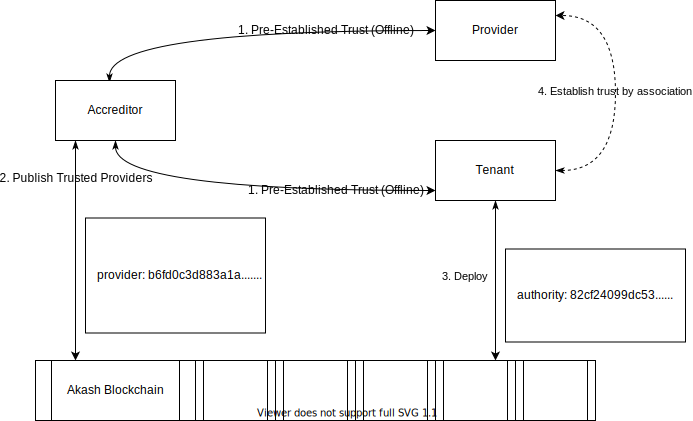

## Summary

Improve Provider trust and reduce spam by accreditation using a Web of Trust (WoT) System for Providers.

## Motivation

Akash is a permission-less network where any tenant (with a valid key) can consume computing services from any provider that has sufficient computing power in a peer-to-peer manner disintermediating a broker. This brings a challenge for filtering out bad actors. We propose a mechanism where tenants can delegate the attestation to a trusted third-party -- using a PGP inspired, Web of Trust (WoT) system -- with an ability for Tenants to selectively deploy to such trusted providers.

## Rationale

Akash is a permission-less network where any tenant (with a valid key) can consume computing services from any provider that has the sufficient computing power in a peer-to-peer manner disintermediating a broker. This provides a challenge for filtering out bad actors. We propose a system where the Tenant can delegate the attestation to a trusted third-party (Oracle) with an ability for tenants to deploy to such trusted providers selectively. 

## Specification

1. The Accreditor is a publicly trusted third-party where there is pre-established trust with the Provider and Tenant. Anyone with enough public trust can be an accreditor on Akash without needing permission. A PGP web of trust model could be adopted.
2. The Accreditor publishes a signed map of trusted providers and attributes on to the chain.
3. The Tenant specifies the authority (public key of Accreditor) in deployment manifest along with attributes to be verified.
4. The system then limits the auction only to the trusted providers verified by the Accreditor (authority).

## Copyright

All content herein is licensed under [Apache 2.0](https://www.apache.org/licenses/LICENSE-2.0).
